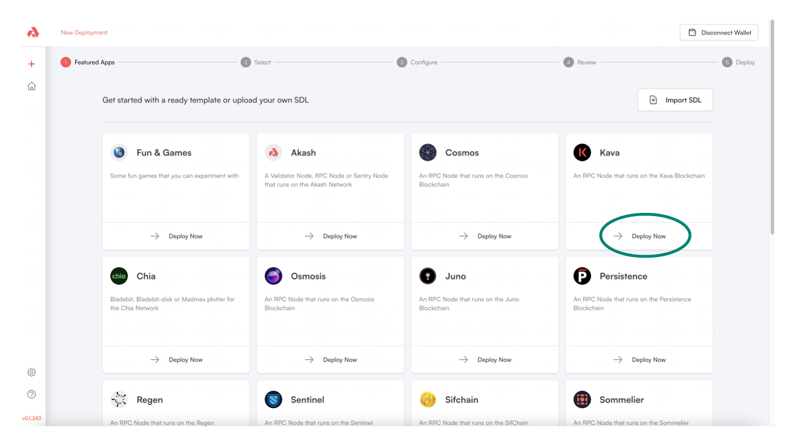
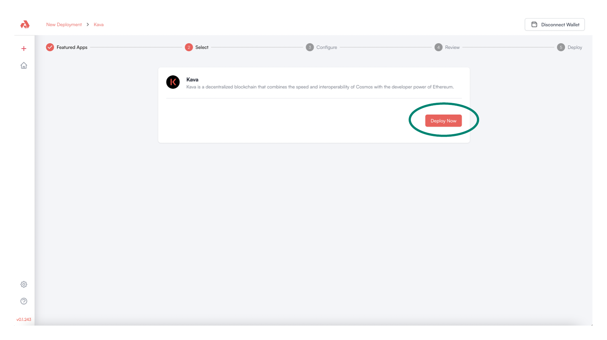
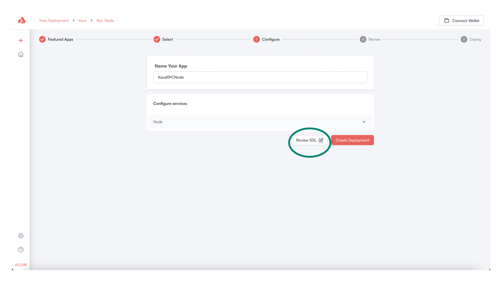
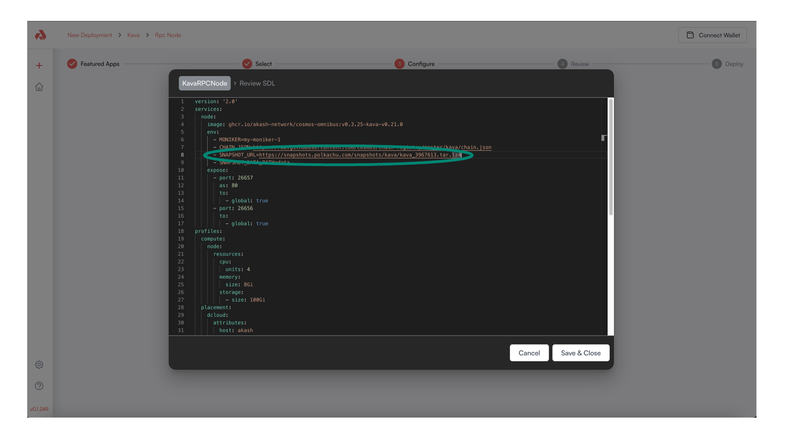
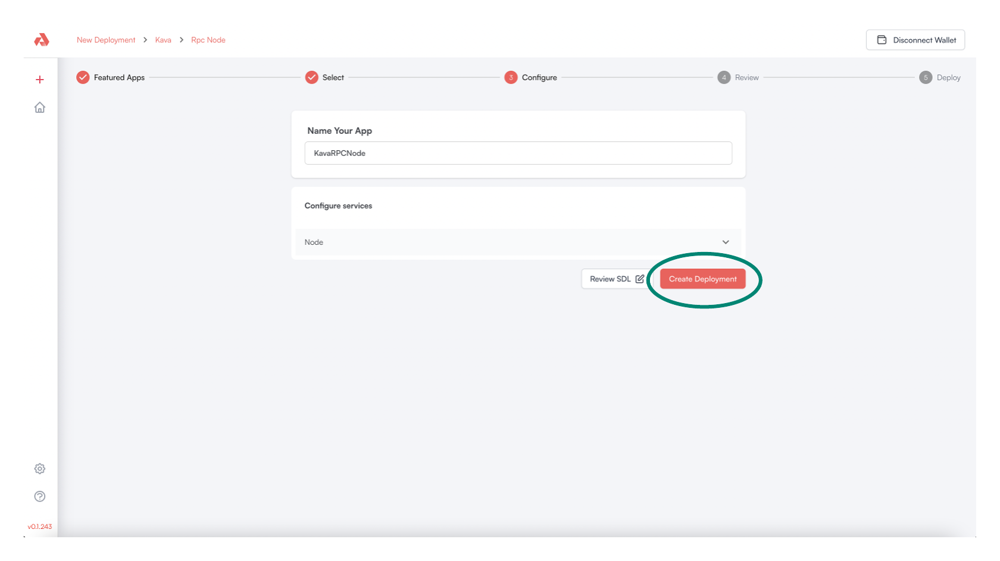
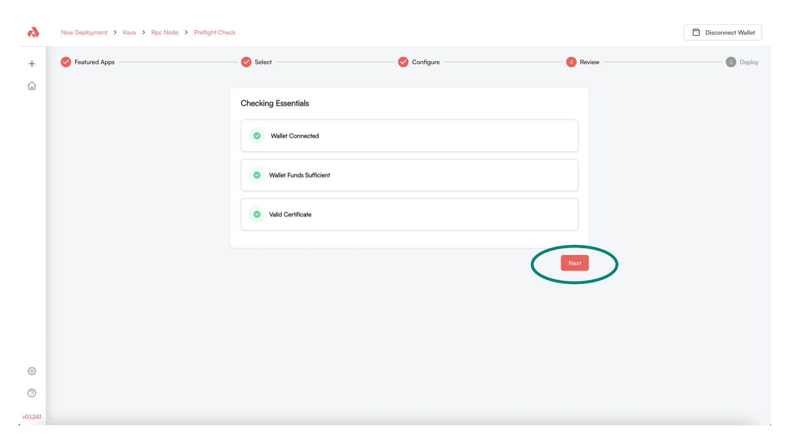
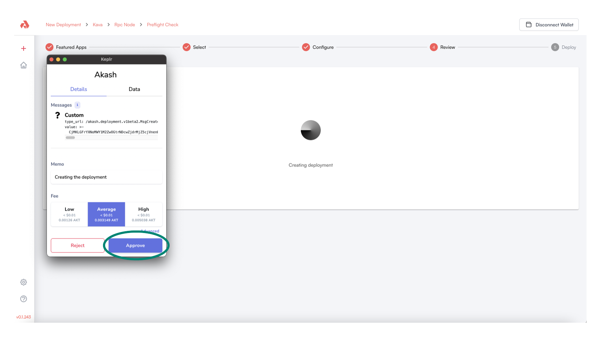
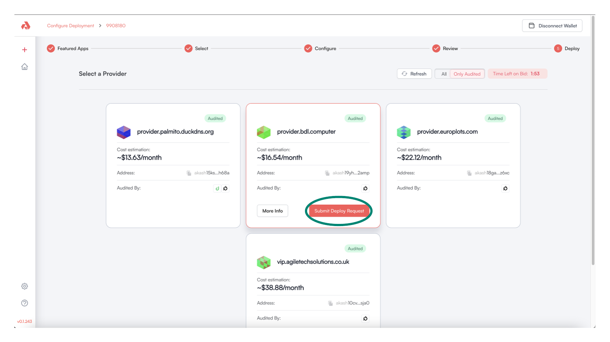
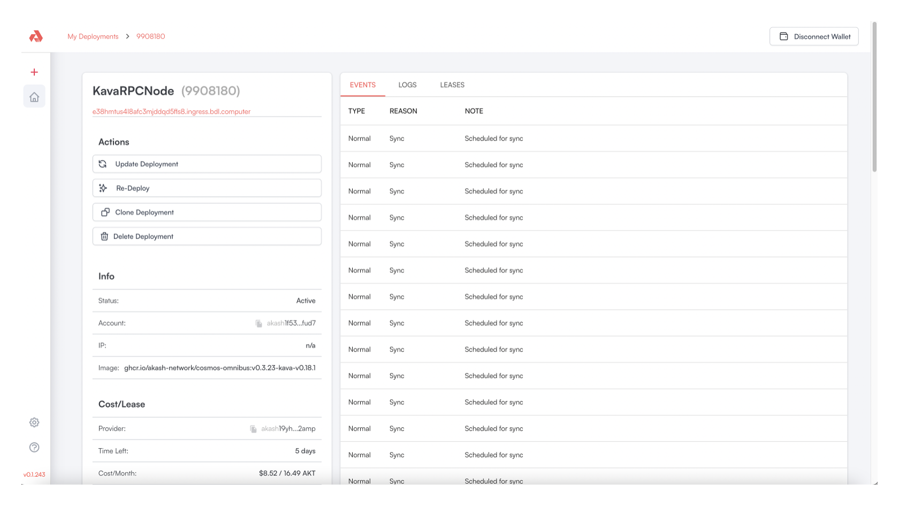

# Kava RPC Node Deployment

## Create a Kava RPC Node as an Akash Deployment

* Within the Akash Console template gallery, locate the Kava card and select the `Deploy Now` option

<figure><figcaption></figcaption></figure>

* Proceed with the deployment of the Kava Node by selecting the `Deploy Now` option

<figure><figcaption></figcaption></figure>

* Assign the Deployment an appropriate name and then click `Review SDL`

<figure><figcaption></figcaption></figure>

* The Kava RPC Node snapshot is updated every 24 hours and must be changed in the Akash SDL
* Obtain the latest snapshot URL [here](https://polkachu.com/tendermint\_snapshots/kava).  Find the `DOWNLOAD` hyperlink > right click > and Copy Link Address.
* Replace the snapshot URL in the field highlighted in the depiction below with the new URL.  Ensure the `- SNAPSHOT_URL=` portion of the field is left in place followed by the actual URL such as:

`- SNAPSHOT_URL=https://<CURRENT_SNAPSHOT_URL>`

* Select `Save & Close` when this single Akash SDL update is in place.

<figure><figcaption></figcaption></figure>

* Proceed by selecting `Create Deployment`&#x20;

<figure><figcaption></figcaption></figure>

* The Akash Console will conduct necessary pre-deployment verifications to ensure that a wallet is connected with sufficient funds and that a certificate exists to communicate with the deployment
* If all pre-deployment checks pass, select the `Next` option to proceed

<figure><figcaption></figcaption></figure>

* A Keplr wallet prompt will display requesting approval of a small blockchain fee to proceed with deployment creation
* Select the `Approve` option to proceed

<figure><figcaption></figcaption></figure>

* The Akash open marketplace displays available cloud providers to deploy your Kava RPC Node on
* Select the cloud provider of your preference
* Once the cloud provider is selected, select the `Submit Deploy Request` option

> _**NOTE -**_ the cloud providers available for your deployment may be different than those shown in the example below

<figure><figcaption></figcaption></figure>

* Accept the Keplr prompt to approve small blockchain fee for lease creation with the selected cloud provider

<figure><figcaption></figcaption></figure>

## Kava RPC Node Deployment Complete

* When the deployment of the Kava RPC Node is complete and live on the selected cloud provider, a verification screen will display
* Proceed to the [Kava RPC Node Health Check](kava-rpc-node-health-check.md) section to conduct a health/status check of the node

<figure><figcaption></figcaption></figure>
