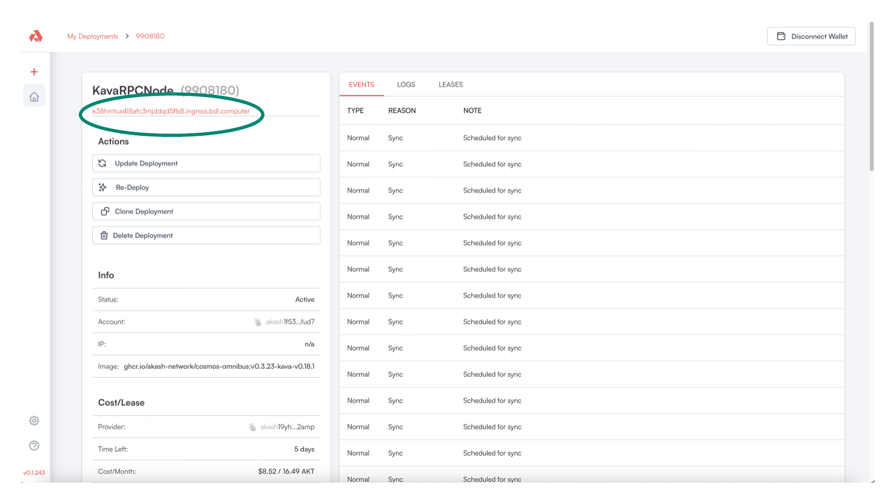
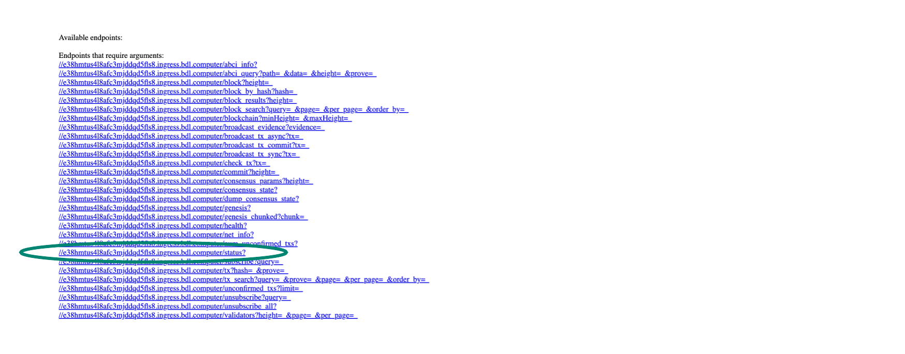

# Kava RPC Node Health Check

## Kava RPC Node Status Page

* In the Akash Console a URL for the deployment is displayed
* Click on the URL hyperlink

<figure><figcaption></figcaption></figure>

* From the displayed web page, select the `status` link to view the current state of the Kava RPC Node

<figure><figcaption></figcaption></figure>

### Expected Status When Node is in Sync

* When the Kava RPC node is in sync the following, example status should be displayed when the status hyperlink is visited
* Specifically look for `"catching_up":false` status indicating that the node is in full sync

> _**NOTE**_ - following the snapshot download the RPC Node may take a couple of hours to catch up on blocks that were written between the time of the snapshot capture and the current state

> _**NOTE**_ - the status output provided below is an example and the block height/other attributes will be different in your use

```
{"jsonrpc":"2.0","id":-1,"result":{"node_info":{"protocol_version":{"p2p":"8","block":"11","app":"0"},"id":"070d39ea8b993b887f817b3fe6dcfd49cdb4bdf4","listen_addr":"tcp://0.0.0.0:26656","network":"kava_2222-10","version":"v0.34.24","channels":"40202122233038606100","moniker":"my-moniker-1","other":{"tx_index":"on","rpc_address":"tcp://0.0.0.0:26657"}},"sync_info":{"latest_block_hash":"E7069706908F8122C96D87CBBB116DE5AA47503FF468F145411B3871D77320E9","latest_app_hash":"580AE91330C0ADA05FA759C5F8C9B57359275EC494C784C8C4018F921A39C856","latest_block_height":"3974035","latest_block_time":"2023-03-14T19:01:21.683269884Z","earliest_block_hash":"17FD31C78361C31ABDA818174062E72D4094E799E90C82996194C6EAC89AAD35","earliest_app_hash":"CCD5D5D23E985B5DDCE0446662EAF26DEBF26DD4EA322DA1789991C9B974B5B0","earliest_block_height":"3967596","earliest_block_time":"2023-03-14T07:28:43.971699061Z","catching_up":false},"validator_info":{"address":"B45D70839692CE2F731906753A71B867C2B1E7D0","pub_key":{"type":"tendermint/PubKeyEd25519","value":"s0xP4O/qscJ7Ez2KTiNAANkHNAUToWEETwvh6Oq0oAw="},"voting_power":"0"}}}
```
