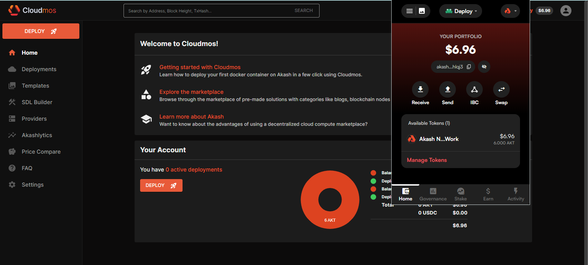

# Cloudmos Deploy Access

## **Before Getting Started**

The Keplr and Leap browser extensions must be installed and with sufficient funds (5AKT minimum for a single deployment plus a small amount for transaction fees).

Follow our [Keplr Wallet](../../tokens-and-wallets/keplr.md) and [Leap Cosmos Wallet](../../tokens-and-wallets/leap.md) guides to create your first wallet if necessary.

## **Cloudmos Deploy Access**

The Cloudmos Deploy web app is available via the following URL:

* [https://deploy.cloudmos.io/](https://deploy.cloudmos.io/)

## Keplr Account Selection

Ensure that an Akash account with sufficient AKT balance is selected in Keplr prior to proceeding with subsequent steps.

<figure><figcaption></figcaption></figure>

## Leap Account Selection

Ensure that an Akash account with sufficient AKT balance is selected in Leap prior to proceeding with subsequent steps.

<figure><figcaption></figcaption></figure>
