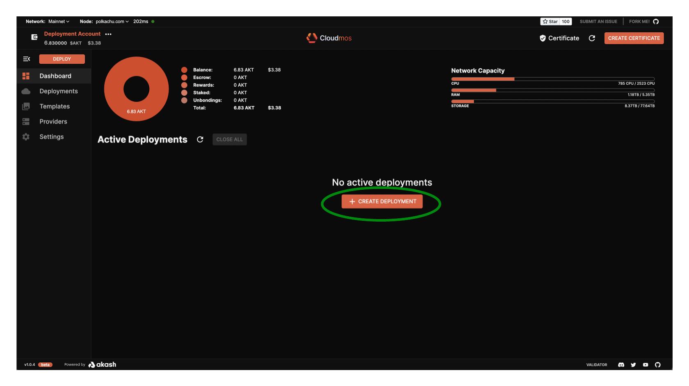
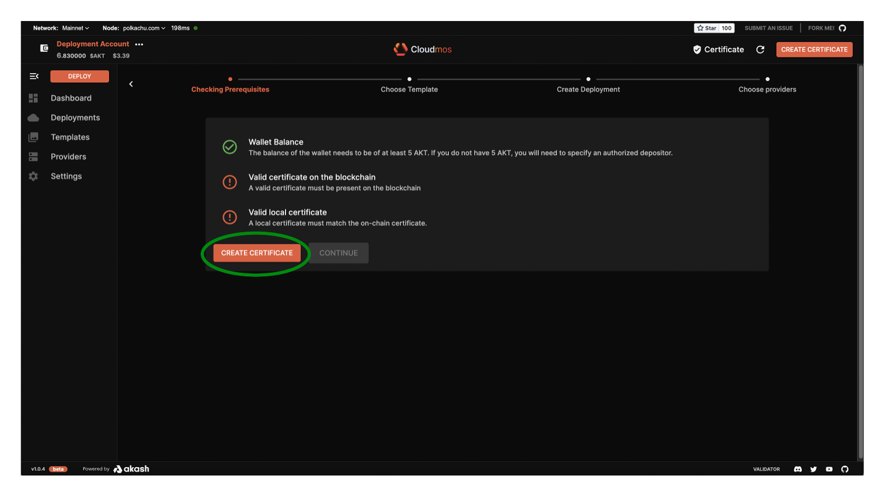
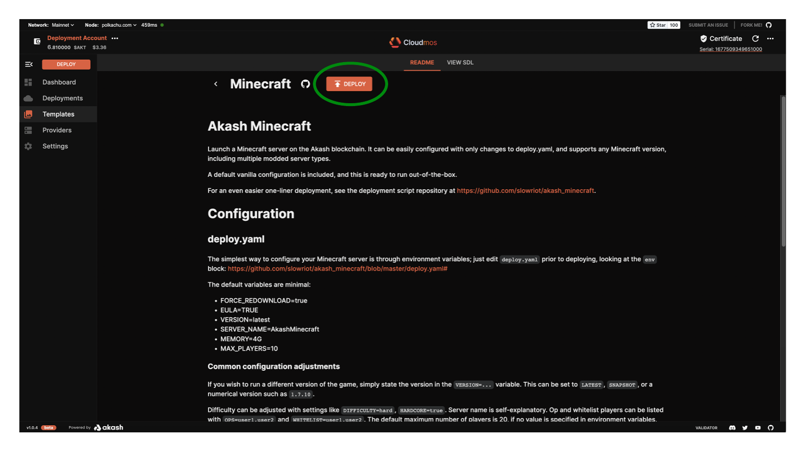
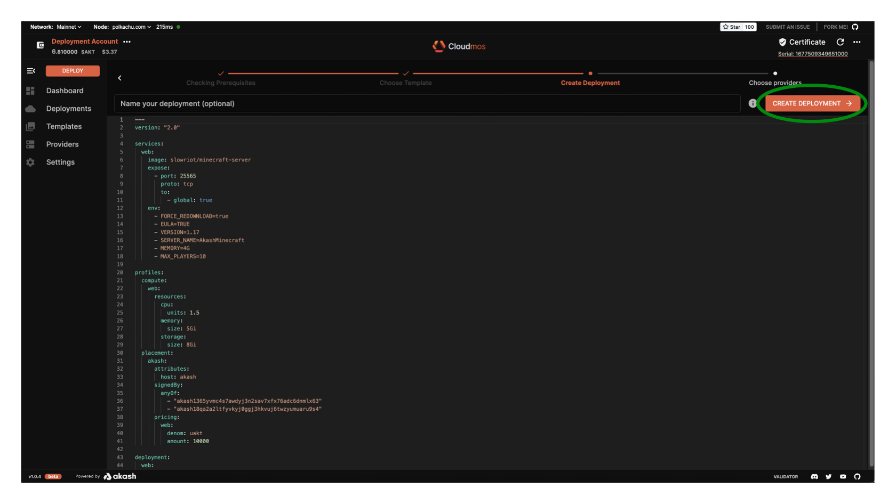
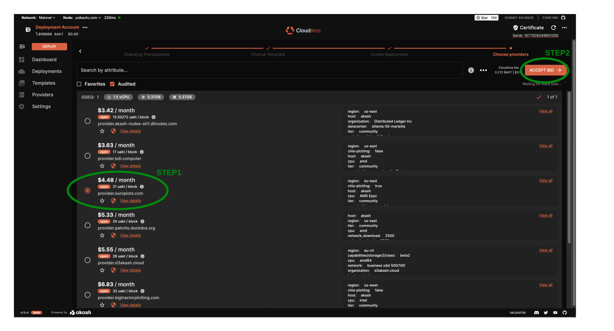
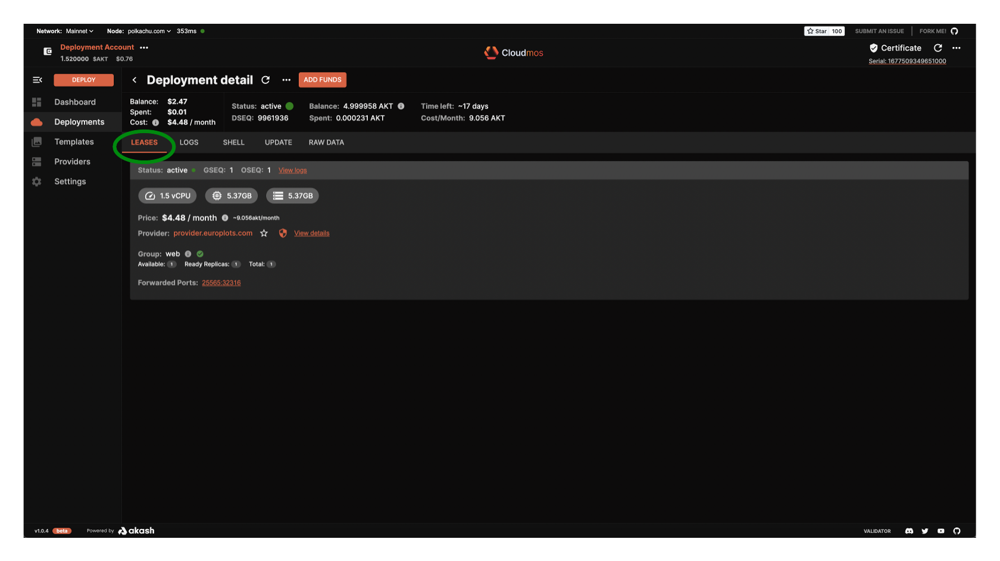

# Minecraft Deployment Example

In this section we will use Cloudmos Deploy to launch an example Minecraft deployment on the Akash Network. You can follow the same process for any other workload so long as it is containerized and you have an appropriate SDL.

#### **STEP 1 -  Create the Deployment**

* From the Dashboard/primary pane click the `CREATE DEPLOYMENT` button

<figure><figcaption></figcaption></figure>

#### **STEP 2 - Create Certficate**

* A number of checks are performed to ensure necessary funds and certificates are available to launch a deployment.
* If this is your first deployment with Cloudmos Deploy a `CREATE CERTIFICATE` prompt will be displayed.  Select the `CREATE CERTIFICATE` button and accept transaction fee prompt from Keplr to proceed.

<figure><figcaption></figcaption></figure>

**STEP 3 -  Choose Deployment Template**

* The tool provides several sample templates launch of popular applications
* Select the `Minecraft` template for our initial deployment

<figure><figcaption></figcaption></figure>

#### **STEP 4 - Proceed with Deployment**

* At this stage we could review/customize the Akash SDL deployment template if desired but in this example we will proceed with the default settings and by pressing the `DEPLOY` button

<figure><figcaption></figcaption></figure>

#### **STEP 5 - SDL Verification**

* Screen will appear which provides an additional opportunity to customize the SDL but we will again proceed with no edits by pressing the `CREATE DEPLOYMENT` button
* Subsequently accept the Deployment Deposit pop up which specifies that 5AKT will be placed into an escrow account for deployment cost and then the Keplr transaction fee prompt

<figure><figcaption></figcaption></figure>

#### **STEP 6 -  Review/Accept Bid**

* After a minute or so a list of bids will display.&#x20;
* Select the most affordable, preferred provider and then press `ACCEPT BID`

> _**NOTE**_ - list of bids and providers may be different in your deployment

* Accept the Keplr transaction fee prompt to proceed

<figure><figcaption></figcaption></figure>

#### **STEP 7 -  Post Deployment**

* While the deployment is becoming active the `LOGS` tab is displayed.
* When the deployment appears to be complete, select the `LEASES` tab.
* The `LEASES` tab confirms the successful deployment of our example Minecraft application

<figure><figcaption></figcaption></figure>
