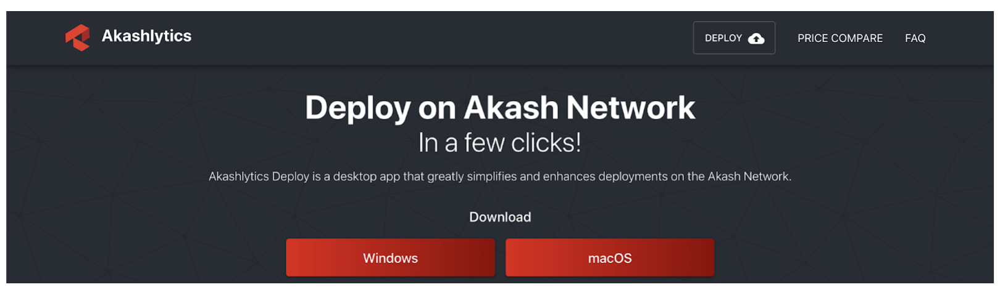
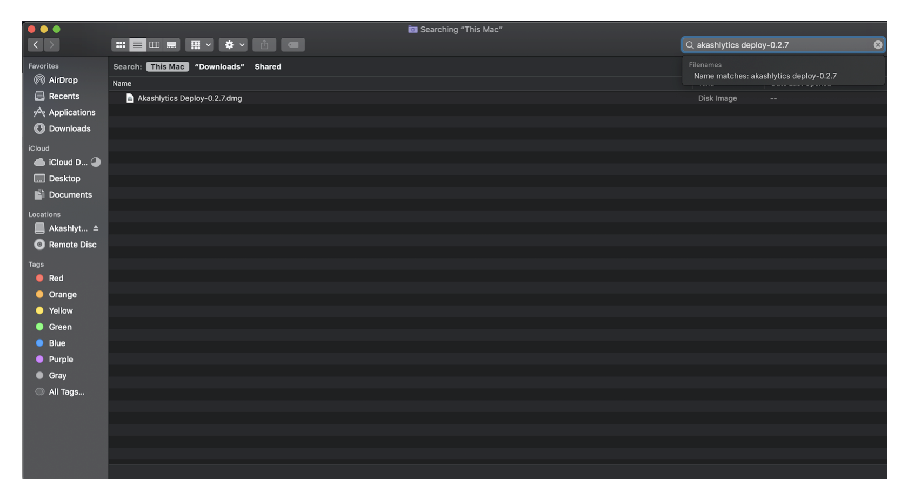
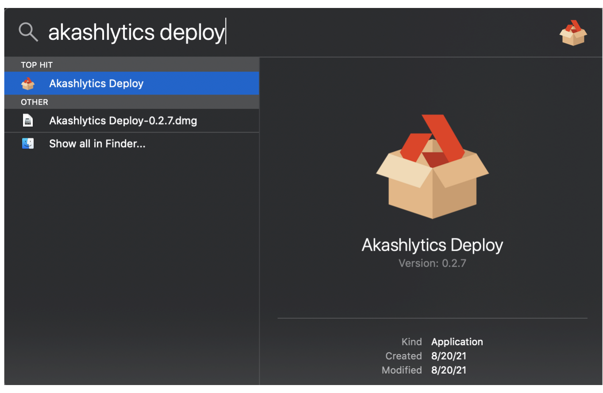
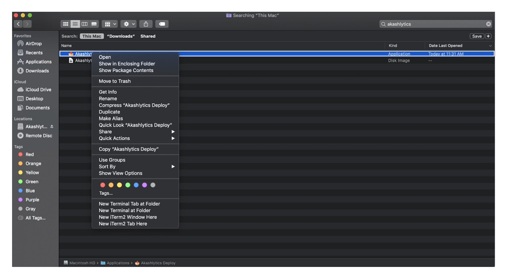
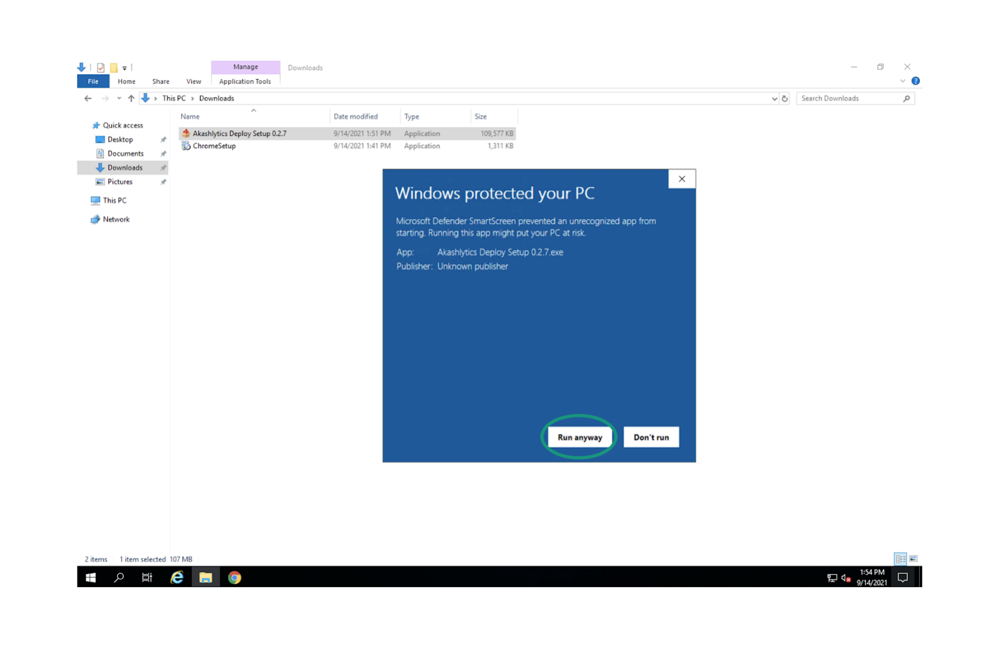

# Desktop App

## **Akashlytics Deploy Overview**

The Akashlytics Deploy Tool is a desktop application which simplifies the deployment process on the Akash Network.  Post deployment the tool provides a dashboard to view the status and details of workloads.  The dashboard also has the ability to perform administrative tasks including closing the deployment, updating the deployment, redeploying, and increasing the funding available to the deployment.

This guide will cover the following topics:

* Akashlytics Deploy Installation and Initial Configuration
  * Installation package download instructions
  * Installation on MacOS
  * Installation on Windows
  * Configuration
* Walkthrough of a example WordPress deployment using the tool
* Teardown and cleanup of the example app

## **Akashlytics Deploy Installation**

### **Software Access and Download Instructions**

The Akashlytics Deploy software may be found at the project’s documentation here.

[**https://www.akashlytics.com/deploy**](https://www.akashlytics.com/deploy)



### MacOS Installation

#### STEP1 - Locate the Downloaded DMG File

* After completing the download find the MacOS DMG in the Downloads directory.
* Locate the DMG and double-click.

#### STEP2 - Move Akashlytics Deploy to the Applications Directory

* After installation - MacOS will prompt the user to move the Akashlytics Deploy shortcut to the Applications directory
* Drag and drop the Akashlytics Deploy icon into the Applications folder from the prompt

#### STEP3 - Launching the Tool

* With the installation completed - open MacOS Finder and type “akashlytics deploy”
* Double click the Akashlytics Deploy icon

#### STEP4 - Override MacOS Unidentified Developer Warning

When first launching Akashlytics Deploy your mac will have an “unidentified provider” warning preventing the application from launching.  As this software is created, maintained by the Akash community and can be trusted as such.  To get past this prompt do the following:

* Click the Question Mark (“?”) icon provided on the warning message.

.png>)

* Press “Ok” to exit the warning message dialog box and follow the instructions that pop up.

* Locate App within the MacOS Finder utility and Control-Click the icon
* Select “Open”

* You will be prompted with an “unidentified developer” dialog box
* Click the “Open” button




### Windows Installation

Note: The installation steps captured in the steps and screenshots that follow were conducted on a Windows Server instance but the application install should be nearly identical on other Windows Platforms (I.e. Windows 10).

#### STEP1 - Launch the Installer

* Find the installer on your computer and double click

#### STEP2 - Windows Defender Warning

Depending on the Operating System version and installed/enabled security tools - Windows Defender may pop up with an “unrecognized app” message.  As this software is created, maintained by the Akash community and can be trusted as such.  We can get past this with the following steps.

* Expand the available options on the warning prompt and select “Run anyway”

* Feel free to use the default install options and follow the prompts.

* On the last step of the install in the “Completing Akashlytics Deploy Setup” section - check the “Run Akashlytics Deploy” option (likely selected by default) and select “Finish”.




### Initial Configuration

In this section we will configure the following:

* Import an existing wallet
* Create a certificate to interact with the Blockchain

#### **STEP1 - Import Existing Wallet**

* The first thing you will need is a wallet with a mnemonic phrase you have access to.
* In the tool you can choose a name for this wallet. This will not affect the functionality of the tool but is just an easy way to track what wallet is currently in use.
* Next choose a password that you will remember for the wallet.

Note: The funds available in the pre-existing wallet instance should now be available to Akashlytics and displayed in the upper left corner of the application (52.943 AKT in the provided example)

Should a need arise to delete the wallet click the ellipsis (triple dot icon) to the right of the wallet instance on this screen and select the delete option

#### **STEP2 - Certificate Creation**

When first launching the tool there will not be a valid certificate.  To fix this select the ellipsis to the right of the Certificate status and click “Create Certificate”

## **Create a Deployment**

In this section we will use the tool to deploy our own example WordPress page on the Akash Network. You can follow the same process for any other workload so long as it is containerized and you have an appropriate SDL.

#### **STEP1 -  Create the Deployment**

* From the Deployments pane click the “CREATE DEPLOYMENTS” button.

#### **STEP2 -  Checking Deployment Pre-Reqs**

* Before getting started make sure you have met the following requirements:
  * 5AKT are available in wallet/escrow account.&#x20;
  * Valid certificate (on chain and matching cert locally)
* If everything is in order click the “CONTINUE” button

#### **STEP3 -  Choose Template**

* The tool provides several sample templates including Games (Supermario, Minecraft, etc), and some more general (WordPress, Hello-World, etc)
* To deploy a custom application select the Empty template option
* Press “CONTINUE” with the WordPress template selected

#### **STEP4 -  Create Deployment**

* If you select a empty template now would be the time to paste in your SDL
* For this example we will be making a small change to the example SDL file. Change the domain name in the SDL’s “expose” section.
  * In a production system we would want a real domain name. Since this is an example we can use something fake.

* Once you have changed the domain name, enter a name for your deployment in the bottom pane and press “CREATE DEPLOYMENT”

#### **STEP5 -  Create Deployment Transaction**

* Once the process has kicked off a screen will appear asking for a selection of Gas Fees and to add the request for bids on chain. Feel free to use the defaults and select the “APPROVE” button.

Note: The process to write the transaction to the chain may take a couple of minutes to complete. This is true of every step that results in a on chain transaction.

#### **STEP6 -  Review/Accept Bids**

* After a minute or so a list of bids will display. Select the most affordable lease for this example deployment and then press “ACCEPT BID”

#### **STEP7 -  Create Lease Transaction**

* Just as before leave the default selection for Gas Fees and click “APPROVE”

#### **STEP8 -  Post Deployment**

Once the process is complete you can click the Deployments tab and select the new deployment. This is where you can interact with and retrieve information about the deployment.

* To easily navigate to the page you spun up click the icon to the right of the Akash URL

Note: The Wordpress site may take a couple of minutes to load depending on the status of the deployment

## **Manage Deployments**

There are a couple important management operations you can do with the deploy tool.

* Add funds to existing deployment’s Escrow Account
* Close an active deployment
* Update an active deployment

### **Deployment Dashboard Overview**

* To get an overview of what you have deployed click the Dashboard button on the left hand side of the screen

* From the Active Deployments window you can see the resources that are dedicated to each deployment.

### **Add Funding to Active Deployment**

If your escrow for a deployment is running low you will need to add some funds.

* Navigate to Deployments in the left hand navigation pane and select the deployment in need of updating

* At the top of the screen click “ADD FUNDS”

* A dialog box will pop up allowing you to add tokens to the deployment’s escrow account
* Select the DEPOSIT button once you have put in the correct amount

* As always you must confirm the gas fees and transaction to the blockchain by clicking “APPROVE”

* Notice the balance change in the escrow account for the deployment

### **Close Active Deployment**

Closing a deployment is very simple.

* Visit the Deployments pane and click the deployment you want to close
* Select the ellipsis to the right of the “ADD FUNDS” button
* Select the close button that appears.

* Confirm the transaction to the blockchain

The deployment should now be gone from the list.
