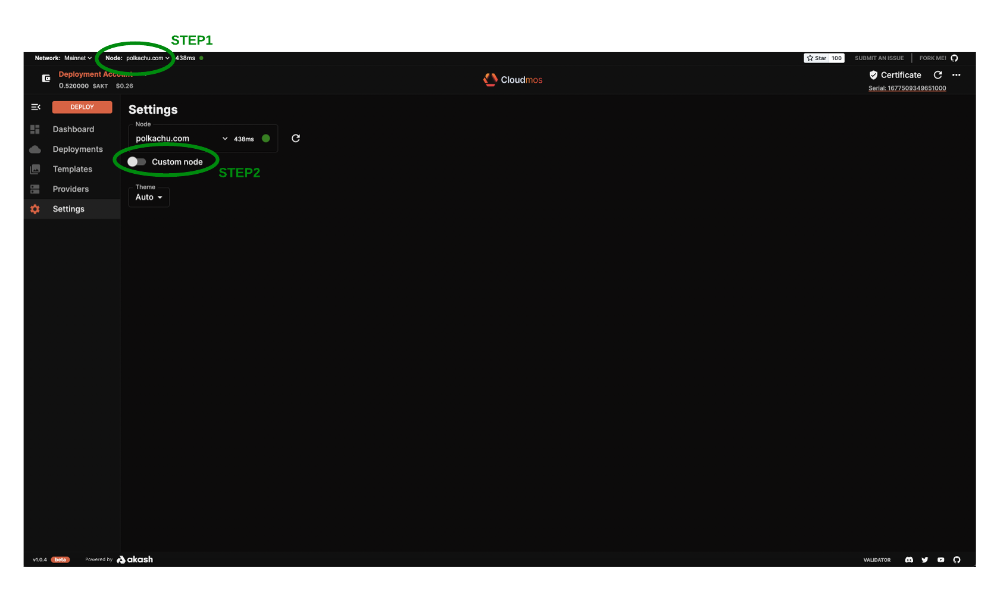
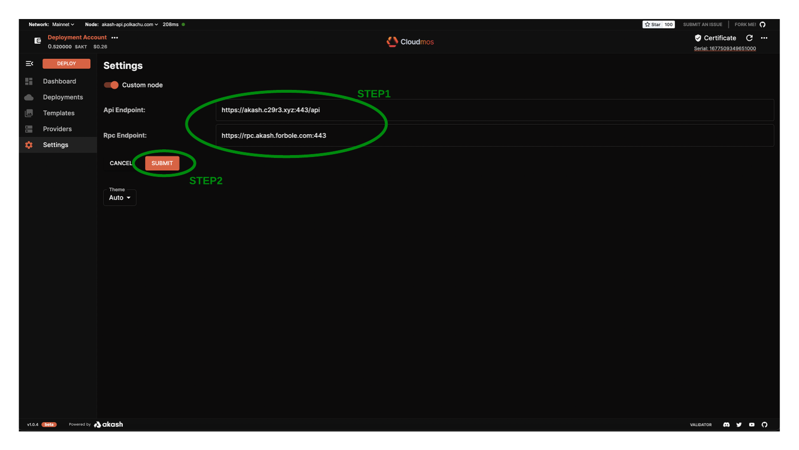

# Custom RPC Node

Specify a custom RPC or API node within Cloudmos Deploy by using the steps outlined in this section.&#x20;

The custom node option can point to a RPC node we have created and manage ourselves. Or we can point to an alternative public RPC node that was not selected by Cloudmos Deploy auto selection.

### STEP 1 - Enable Custom Node Use

* Begin by selecting the drop-down next to the current Node and then click the `Custom node`radio button

<figure><figcaption></figcaption></figure>

### STEP 2 - Edit the RPC and API Nodes

Press the `EDIT` button to enter the screen where we can enter our preferred nodes

<figure><figcaption></figcaption></figure>

### STEP 3 - Specify Preferred RPC and API Nodes

Use the `Api Endpoint` and `Rpc Endpoint` fields to define your own managed nodes or preferred public nodes.\
\
If you do not maintain your own nodes and want to select from a list of popular public nodes, choose from the RPC node list [here](https://github.com/akash-network/net/blob/master/mainnet/rpc-nodes.txt) and the API node list [here](https://github.com/akash-network/net/blob/master/mainnet/api-nodes.txt).

<figure><figcaption></figcaption></figure>
