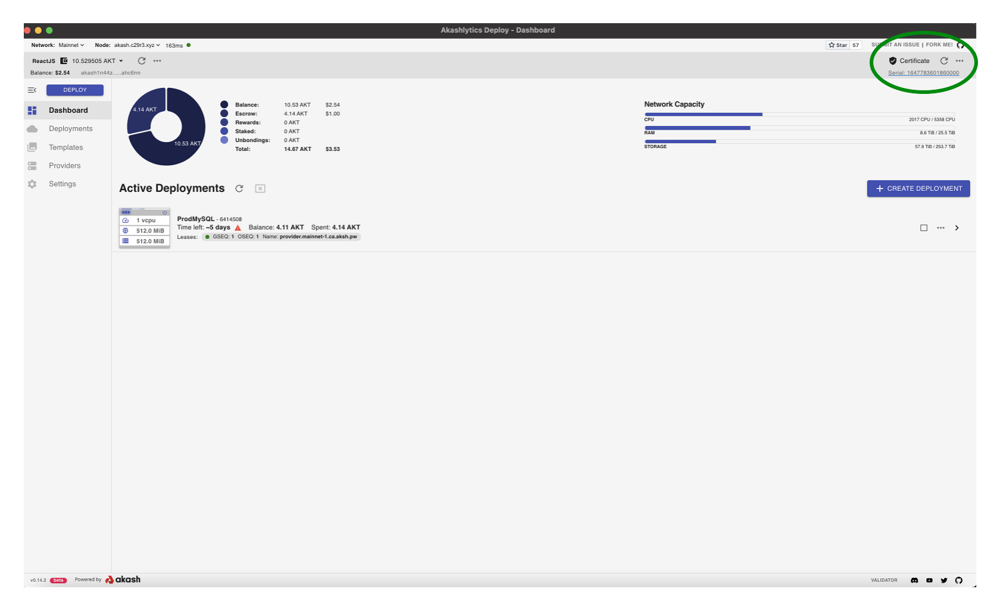

# Initial Configuration

In this section we will configure the following:

* Import an existing wallet
* Create a certificate to interact with the Blockchain

**STEP1 - Import Existing Wallet**

* The first thing you will need is a[ wallet ](../../tokens-and-wallets/keplr.md)with a mnemonic phrase you have access to.
* In the tool you can choose a name for this wallet. This will not affect the functionality of the tool but is just an easy way to track what wallet is currently in use.
* Next choose a password that you will remember for the wallet.

Note: The funds available in the pre-existing wallet instance should now be available to Cloudmos and displayed in the upper left corner of the application (52.943 AKT in the provided example)

_**Wallet Funding Note**_

If you are just getting started with Akash and need funds to experiment, please visit the [Akash Faucet](https://drip.akash.network/login) to receive initial AKT funds. An active GitHub account will be needed to grab funds from the faucet.

_**Wallet Deletion Note**_

Should a need arise to delete the wallet click the ellipsis (triple dot icon) to the right of the wallet instance on this screen and select the delete option.

#### **STEP2 - Certificate Creation**

When first launching the tool there will not be a valid certificate. To fix this select the ellipsis to the right of the Certificate status and click “Create Certificate”.

