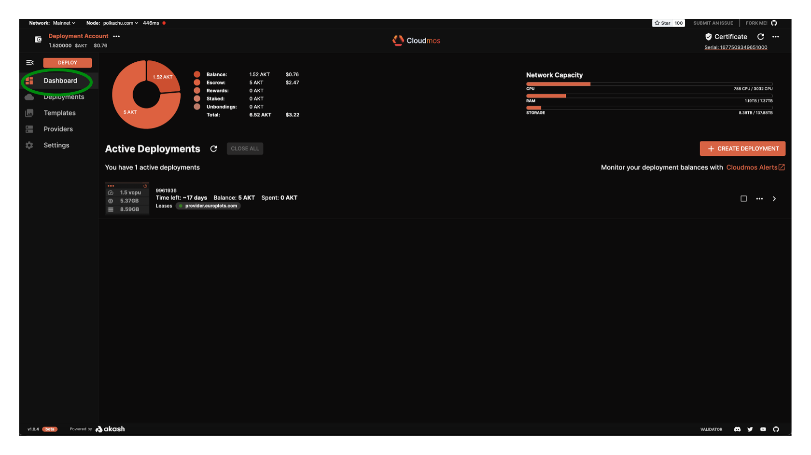
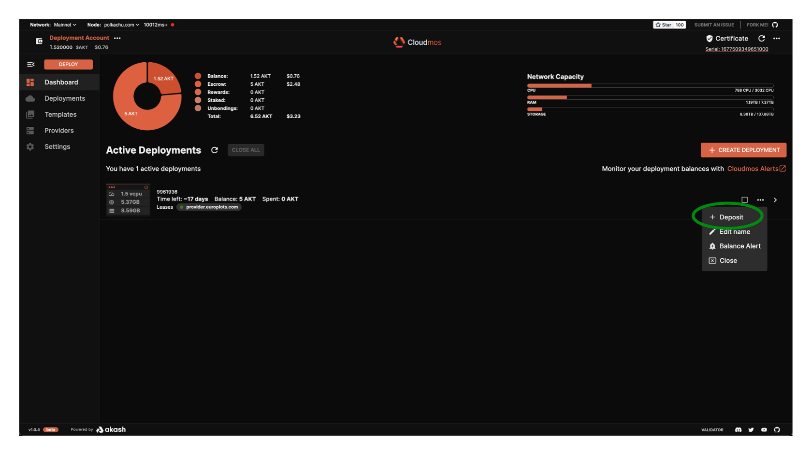
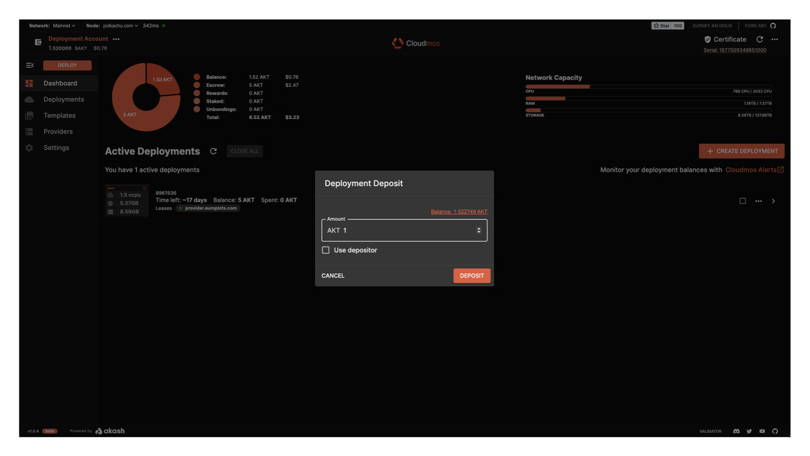
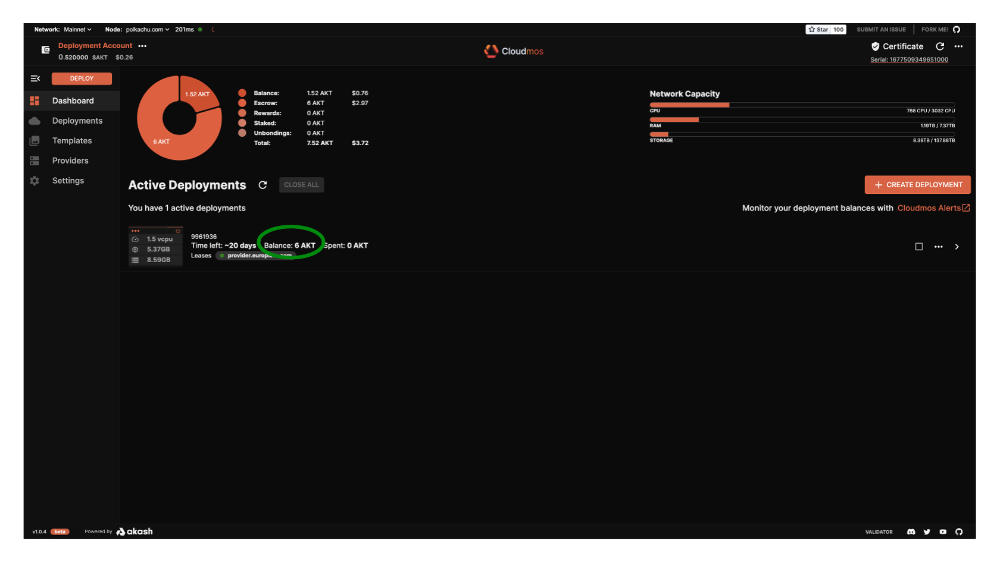
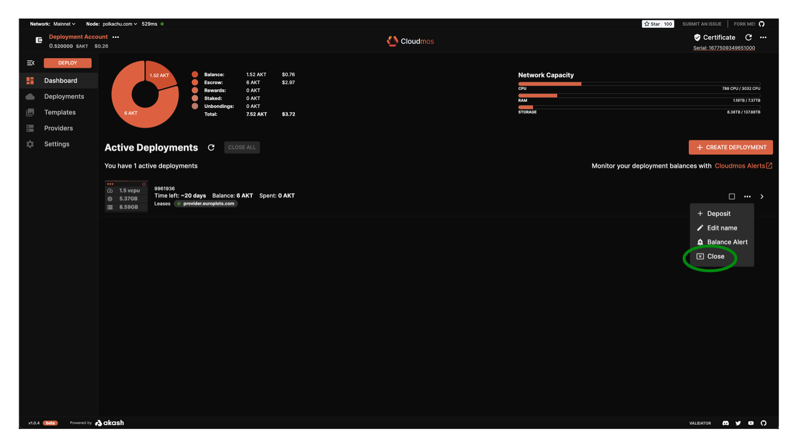

# Manage Deployments

There are a several important management operations you can do with the Cloudmos Deploy tool including:

* [Add funds to existing deployment’s Escrow Account](manage-deployments.md#add-funding-to-active-deployment)
* [Close an active deployment](manage-deployments.md#close-active-deployment)

### **Deployment Dashboard Overview**

* To get an overview of what you have deployed click the `Dashboard` button on the left hand navigation pane
* From the Active Deployments window you can see the resources that are dedicated to each deployment.

<figure><figcaption></figcaption></figure>

### **Add Funding to Active Deployment**

* If your escrow for a deployment is running low you will need to add some funds.
* Within the `Dashboard` pane, isolate the deployment of interest, select the `...` option to expand options, and select `Deposit`

<figure><figcaption></figcaption></figure>

* A dialog box will pop up allowing you to add tokens to the deployment’s escrow account
* Select the `DEPOSIT` button once you have put in the correct amount
* As always you must confirm the gas fees and transaction to the blockchain by clicking “APPROVE”

<figure><figcaption></figcaption></figure>

* Notice the balance change in the escrow account for the deployment

<figure><figcaption></figcaption></figure>

### **Close Active Deployment**

Closing a deployment is very simple.

* Visit the `Dashboard` pane and click the deployment you want to close
* Within the `Dashboard` pane, isolate the deployment of interest, select the `...` option to expand options, and select `Close`
* Confirm the transaction to the blockchain
* The deployment should now be removed from the list

<figure><figcaption></figcaption></figure>
