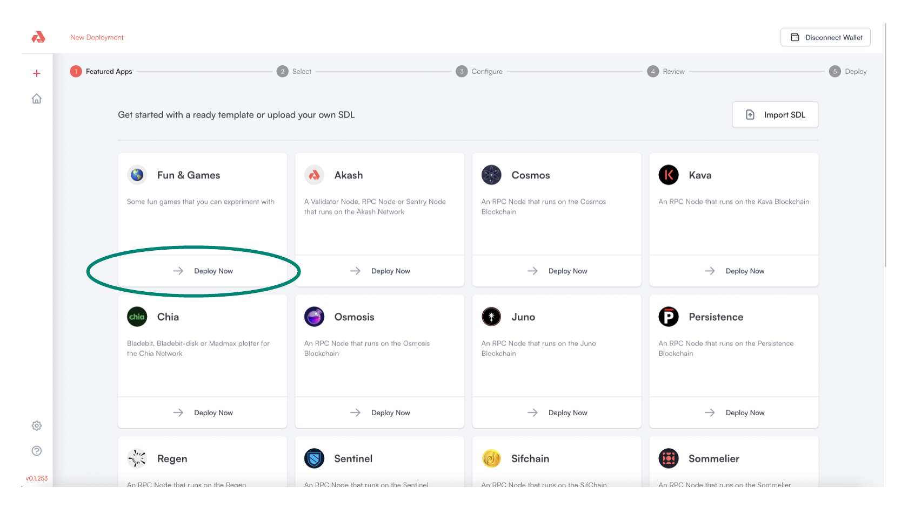
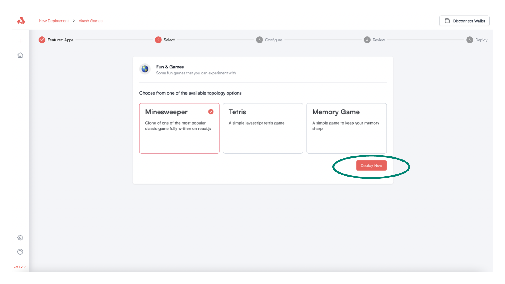
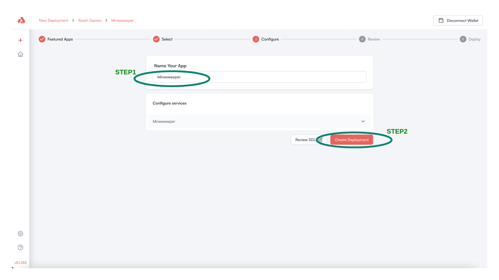
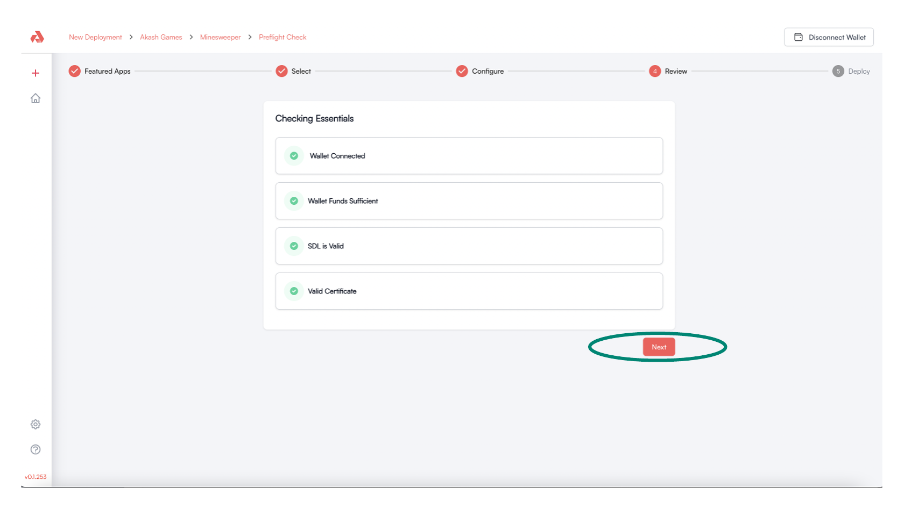
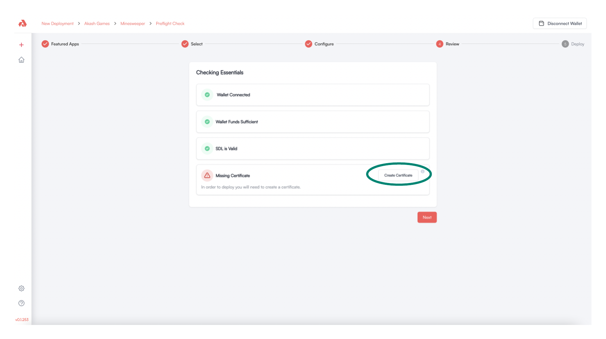
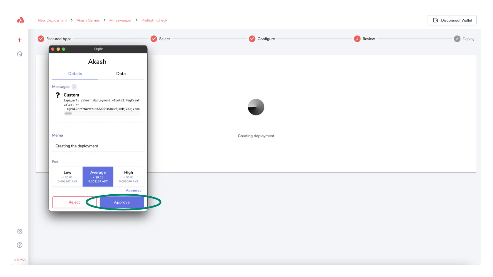
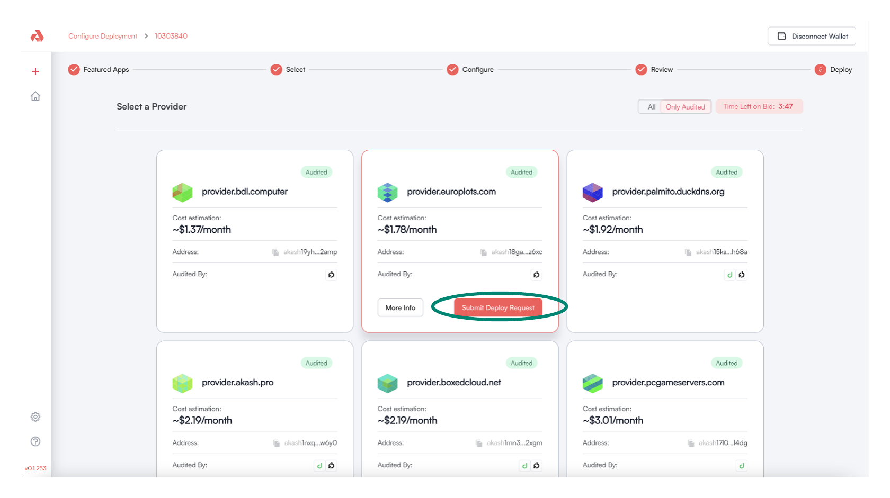
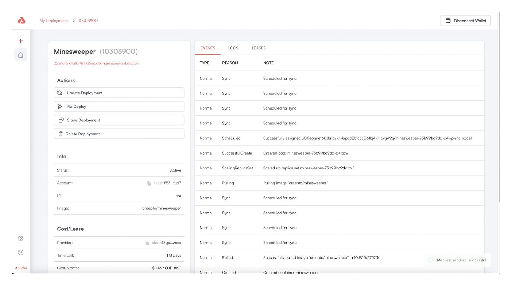
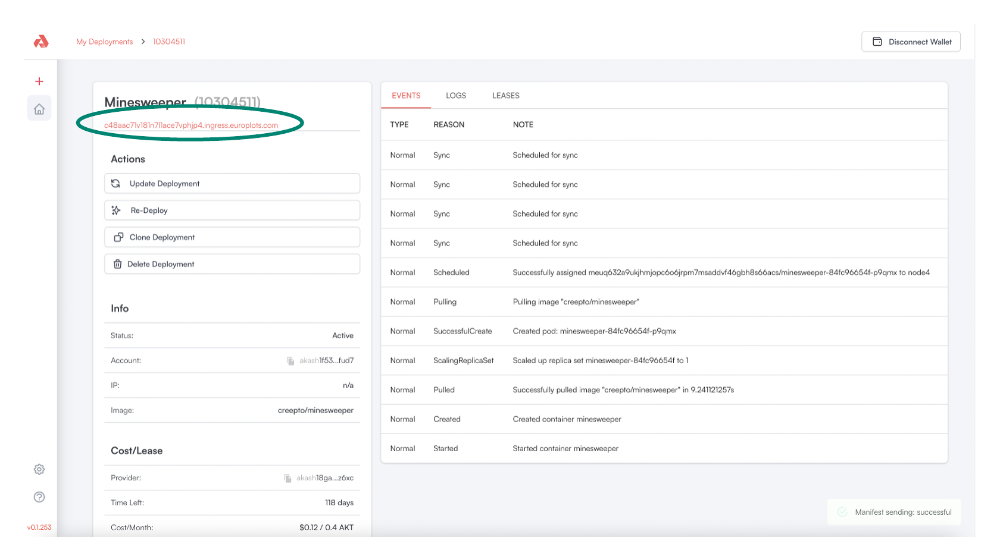

# Minesweeper Deployment Example

In this section we will use the Akash Console to launch an example Minesweeper deployment on the Akash Network. You can follow the same process for any other workload so long as it is containerized and you have an appropriate SDL.

### STEP 1 - Create the Deployment

From the `New Deployment` page click the `Deploy Now` button in the  `Fun & Games` section.

<figure><figcaption></figcaption></figure>

### STEP 2 - Select the Minesweeper Template

Select the `Minesweeper` template and the proceed with the deployment by clicking `Deploy Now`.

<figure><figcaption></figcaption></figure>

### STEP 3 - Assign Deployment Name/Edit SDL

Proceed with the deployment by specifying a useful name to your application.  This step is optional and without explicit naming the Akash Console will assign a randomly generated name.

Click  `Create Deployment` to proceed when satisfied with application naming/settings..

> _**NOTE**_ - the Configuration section additionally allows the edit of the following application specifications.  In our example - with the goal being the simple launch of an initial application via the Akash Console - these settings are left at defaults and are not changed.\
> \
> \- **Configure services** - allows edit of application specs including CPU, memory, storage, and exposed ports.\
> \
> \- **Review SDL** - allows direct edit of the applications SDL (Stack Description Language) YAML file.  Further details on Akash SDL files can be found [here](../../readme/stack-definition-language.md).

<figure><figcaption></figcaption></figure>

### STEP 4 - Pre-Flight Verifications

A number of verifications are made prior to proceeding with application deployment.

Amongst the verifications made are assurances that the connected wallet has sufficient funds and a valid certificate exists which is used for Akash provider communications.

If all verifications are successful - as shown in the example below - proceed by clicking the `Next` button.

> _**NOTE**_ - if `Wallet Connected` check fails, ensure the `Connect Wallet` step from the [Akash Console Access](akash-console-access.md) section of this document is completed.

> _**NOTE**_ - if this is your first time using the Akash Console it is likely the `Valid Certificate` check will fail.  Use the instructions in the subsequent step ([STEP 5 - Certificate Creation](minesweeper-deployment-example.md#step-5-certificate-creation)) should this be the case.

<figure><figcaption></figcaption></figure>

### STEP 5 - Certificate Creation&#x20;

Use the guidance in this step if a valid certificate does not exist.

A valid certificate is necessary to proceed with deployments of apps onto the Akash network.  If the `Checking Essentials` screen reports `Missing Certificate` there are two ways to proceed.

* Simply click the `Create Certificate` button presented in the `Checking Essentials` pane as highlighted in the display below.  _**NOTE**_ - following the selection of this button it may take a couple of minutes before the `Missing Certificate` warning disappears.
* Manage the Akash Console certificates from the [Settings](settings.md) page.  Following the cert creation/activation - as covered in the [Settings](settings.md) documentation - return to the deployment creation process  and `Checking Essentials` should no longer display a `Missing Certificate` warning.

<figure><figcaption></figcaption></figure>

### STEP 6 - Accept Gas Fees for Deployment Creation

The Keplr wallet will prompt to `Approve` gas fees for the creation of the deployment.  Click the `Approve` button to proceed.

Subsequent steps in the Deployment process may also prompt for Gas fee accept.  Follow this same step to approve any subsequent such prompts.

<figure><figcaption></figcaption></figure>

### STEP 7 - Select Provider

Select a preferred Akash Provider for your deployment.

Click the `Submit Deploy Request` button following preferred Provider selection to continue with the deployment.

<figure><figcaption></figcaption></figure>

### STEP 8 - Deployment Complete

Upon successful completion of the Akash Deployment the following screen is presented.

The Deployment management pane allows actions including:

* _**EVENTS**_ - view of the related application launch events
* _**LOGS**_ - view of the logs from the application's container instance
* _**LEASES**_ - review of the deployment's specifications including exposed ports and assigned resources
* _**Update/Delete Deployment**_ - ability to manage the active deployment by updating application image or closing the deployment.

<figure><figcaption></figcaption></figure>

### STEP 9 - Access Deployment

Access the Deployment's URL via the exposed link.

<figure><figcaption></figcaption></figure>

Example display of the Minesweeper web app within the Akash Deployment.

<figure><figcaption></figcaption></figure>
