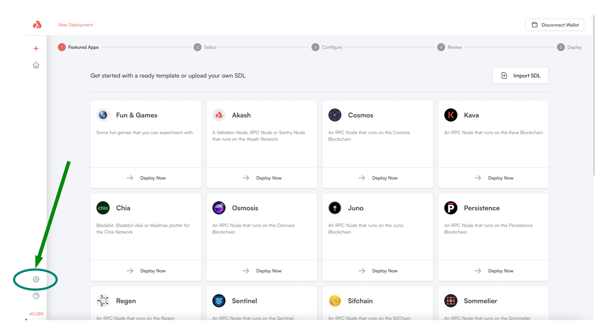
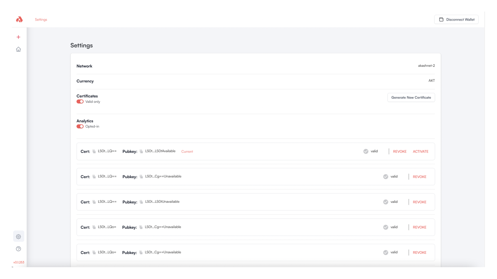
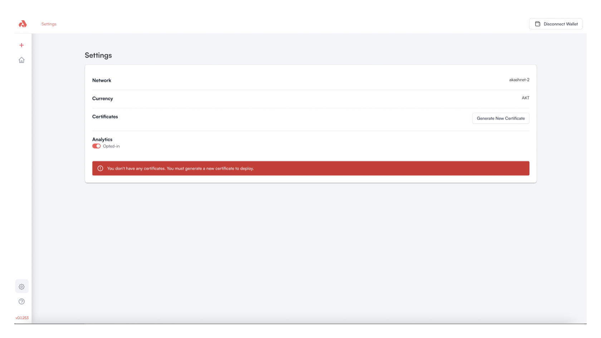
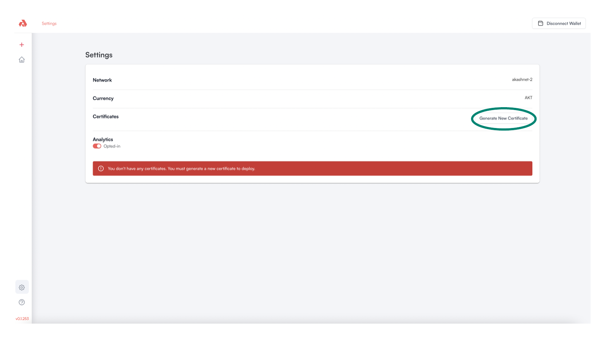
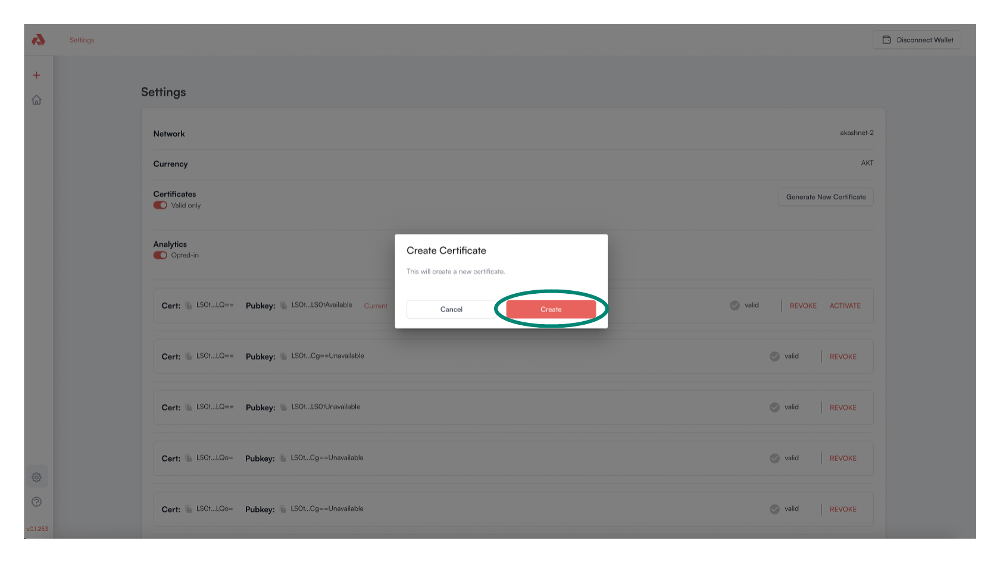
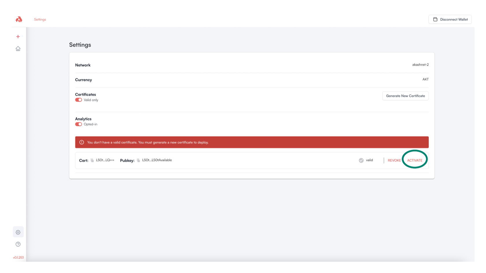
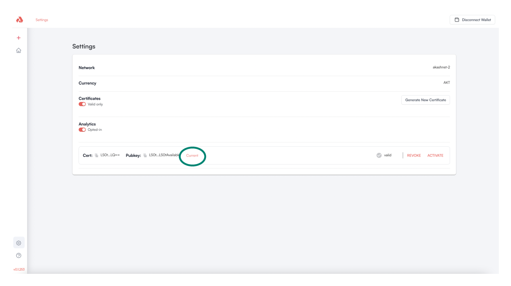
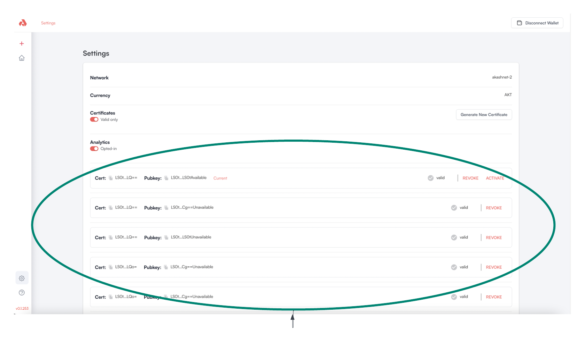
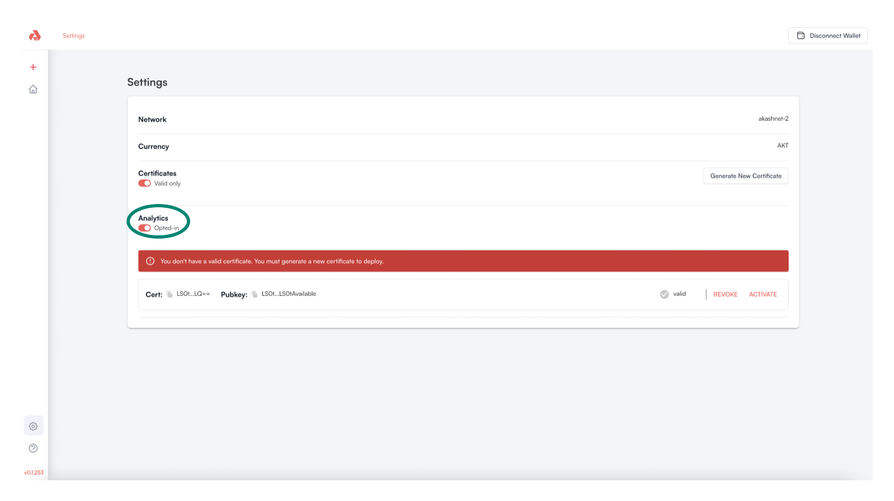

# Settings

The Akash Console Settings page is used primarily for certificate management.  This guide describes cert management and other activities available from the Settings page.

### Settings Access

The Akash Console Settings page can be accessed from the left-hand navigation bar and from any page within the app.

<figure><figcaption></figcaption></figure>

### Settings Overview

The Akash Console Settings page currently allows three types of actions.  Drill into the link for each action type for additional detail.

* [Generate New Cert](settings.md#generate-new-cert)
* [Certificate Management](settings.md#certificate-management)
* [Analytics Opt In](settings.md#analytics-opt-in)

<figure><figcaption></figcaption></figure>

### Generate New Cert

The primary activity in the Settings page involves certificate management.  A valid, active certificate must exist to proceed with Akash deployment activities (create deployment, delete deployment, etc).

If no certificate currently exists the Akash Console displays the message - `You don't have any certificates. You must generate a new certificate to deploy.` - as per example below.

Follow the steps in the remainder of this section to create a new certificate when necessary.

<figure><figcaption></figcaption></figure>

Click the `Generate New Cert` button to begin the process of new certificate creation.

<figure><figcaption></figcaption></figure>

Click the `Create` button to proceed with new certificate creation.

<figure><figcaption></figcaption></figure>

Following successful certificate creation, click the `ACTIVATE` option.

<figure><figcaption></figcaption></figure>

Following certificate creation and activation a `Current` status should display.

If the `Settings` page now list the newly created certificate with a status of `Current` - you should be all set to proceed with Akash deployment creations and management within the Console.

<figure><figcaption></figcaption></figure>

### Certificate Management

The Settings page can be used for certificate management purposes.&#x20;

When several certificates exist for the current account - as selected in Keplr - use the available management actions to activate a specific cert if needed.

We can additionally use the certificate management pane to determine what certificate is currently active and revoke certificates if desired.

<figure><figcaption></figcaption></figure>

### Analytics Opt In

The Akash Console development team utilizes analytics received from the application to improve usability and performance.  By default Analytics are enabled (`Opted-In` is active) meaning statistics from your browser will be collected and sent to the Akash team.  No private information is stored or sent as part of this analytics collection.

To change the status of Analytics Opt In use the toggle highlighted below.

<figure><figcaption></figcaption></figure>
