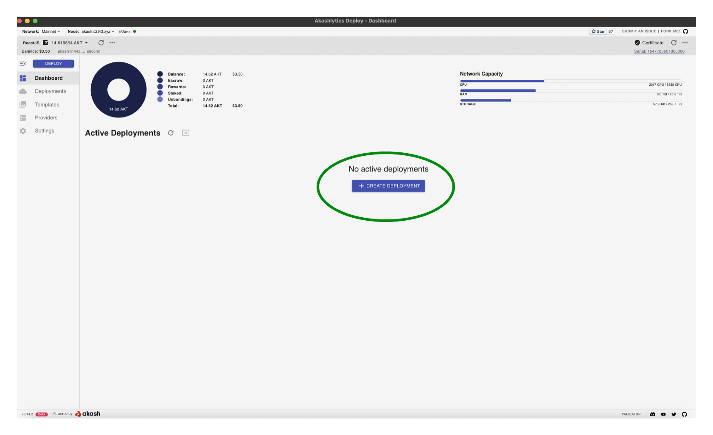
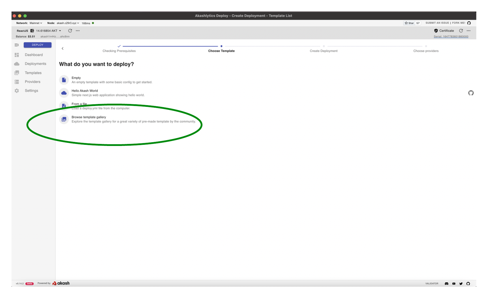
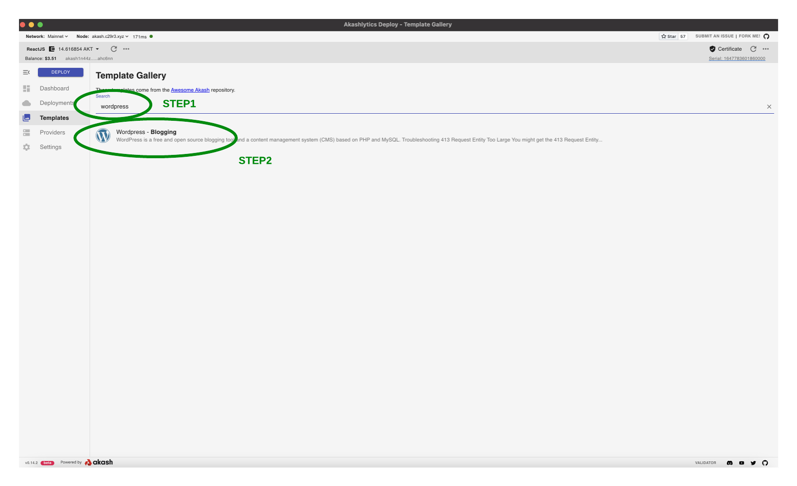
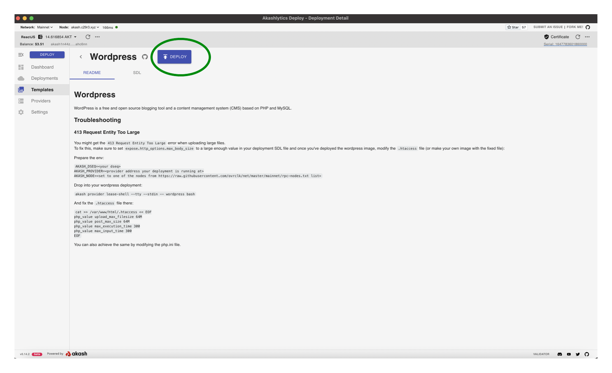
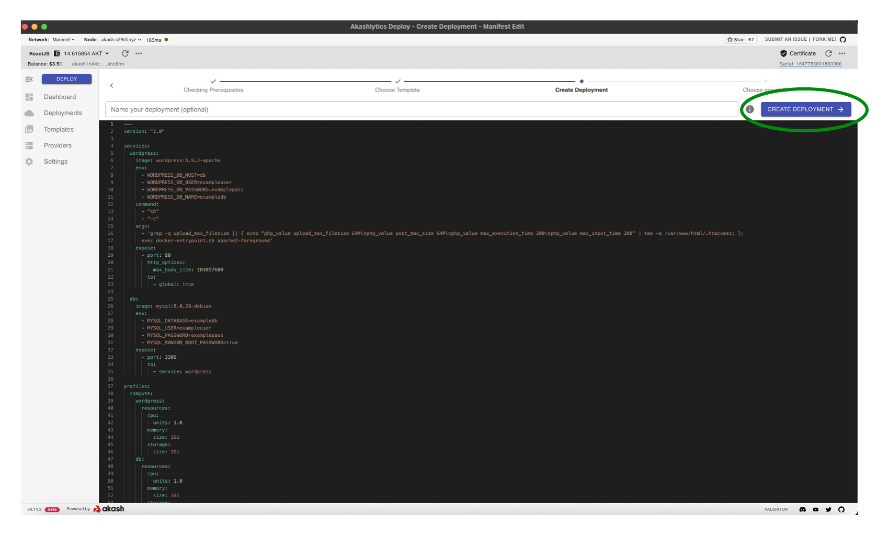
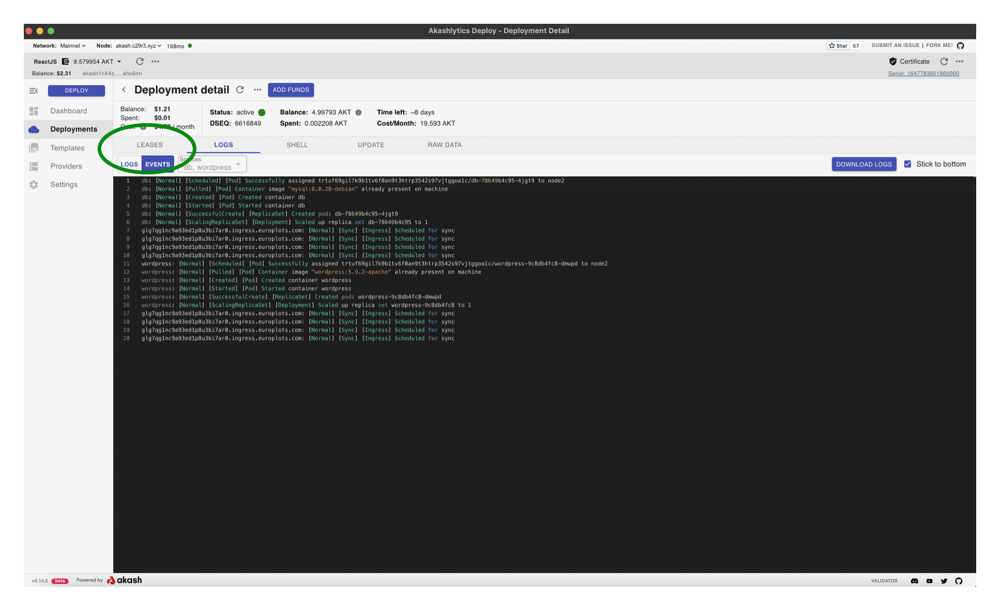
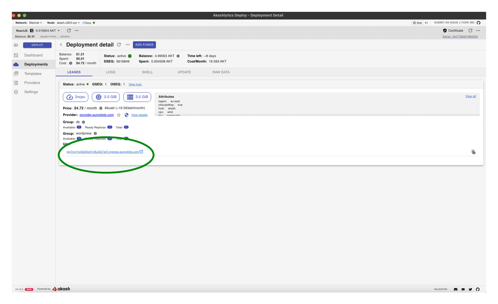
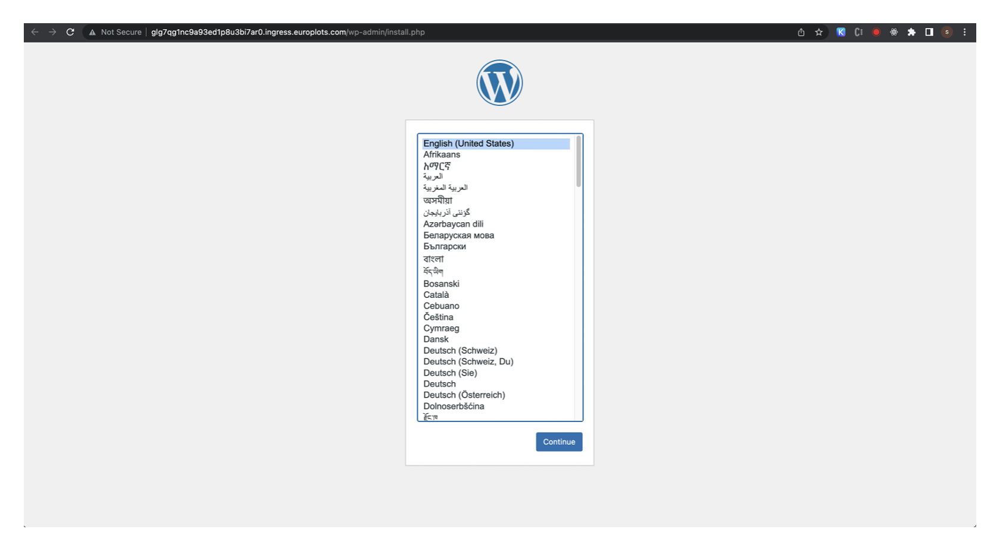

# WordPress Deployment Example

In this section we will use the tool to deploy our own example WordPress page on the Akash Network. You can follow the same process for any other workload so long as it is containerized and you have an appropriate SDL.

#### **STEP1 -  Create the Deployment**

* From the Deployments pane click the “CREATE DEPLOYMENTS” button.

#### **STEP2 -  Choose Template**

* The tool provides several sample templates including Games (Supermario, Minecraft, etc), and some more general (WordPress, Hello-World, etc)
* To deploy a custom application select the `Browse template gallery` option
* Then search for the `wordpress` template and select the template from the search results

#### **STEP3 - Proceed with Deployment**

* At this stage we could review/customize the Akash SDL deployment recipe if desired but in this example we will proceed with the default settings and press the `DEPLOY` button

#### **STEP4 - SDL Verification**

* Screen will appear which provides an additional opportunity to customize the SDL but we will again proceed with no edits by pressing the `CREATE DEPLOYMENT` button
* Accept the Deployment Deposit pop up as which specifies that 5AKT will be placed into an escrow account for deployment cost

#### **STEP5 -  Create Deployment Transaction**

* Once the process has kicked off a screen will appear asking for a selection of Gas Fees and to add the request for bids on chain. Feel free to use the defaults and select the “APPROVE” button.

Note: The process to write the transaction to the chain may take a couple of minutes to complete. This is true of every step that results in a on chain transaction.

#### **STEP6 -  Review/Accept Bids**

* After a minute or so a list of bids will display. Select the most affordable lease for this example deployment and then press “ACCEPT BID”

.png>)

#### **STEP7 -  Create Lease Transaction**

* Just as before leave the default selection for Gas Fees and click “APPROVE”

#### **STEP8 -  Post Deployment**

While the deployment is becoming active the `LOGS` tab is displayed. &#x20;

When the deployment appears to be complete, select the `LEASES` tab.

#### STEP9 - Navigate to the Deployment URI

* To easily navigate to the page you spun up click the icon to the right of the Akash URL

Note: The Wordpress site may take a couple of minutes to load depending on the status of the deployment

