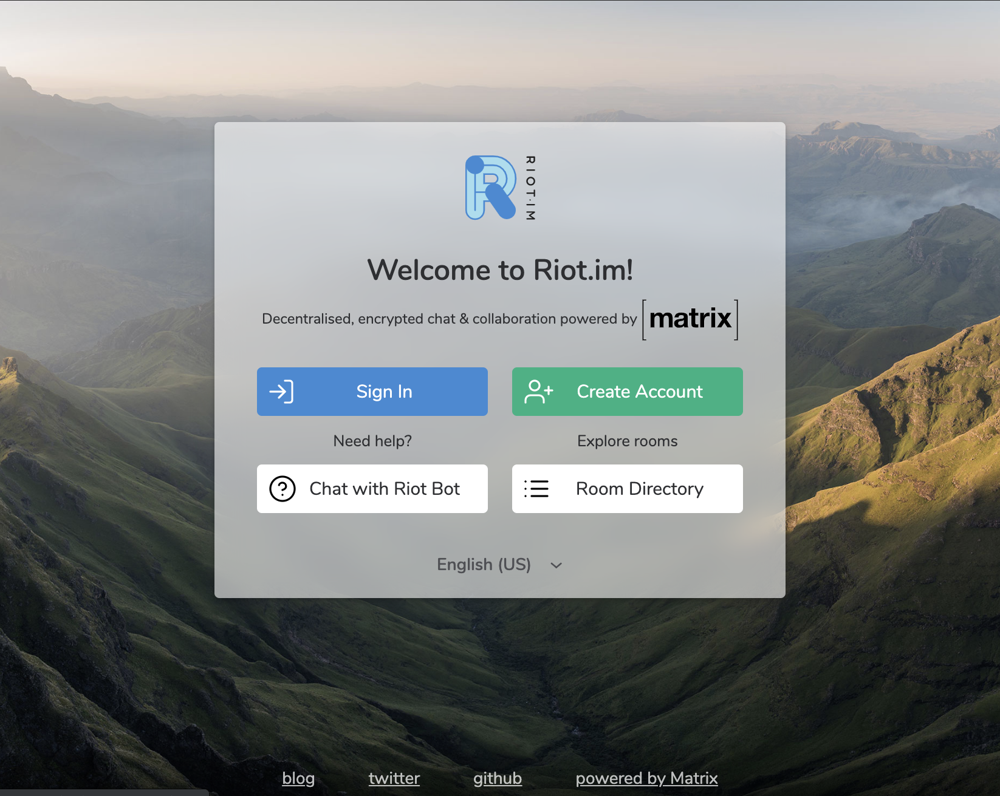
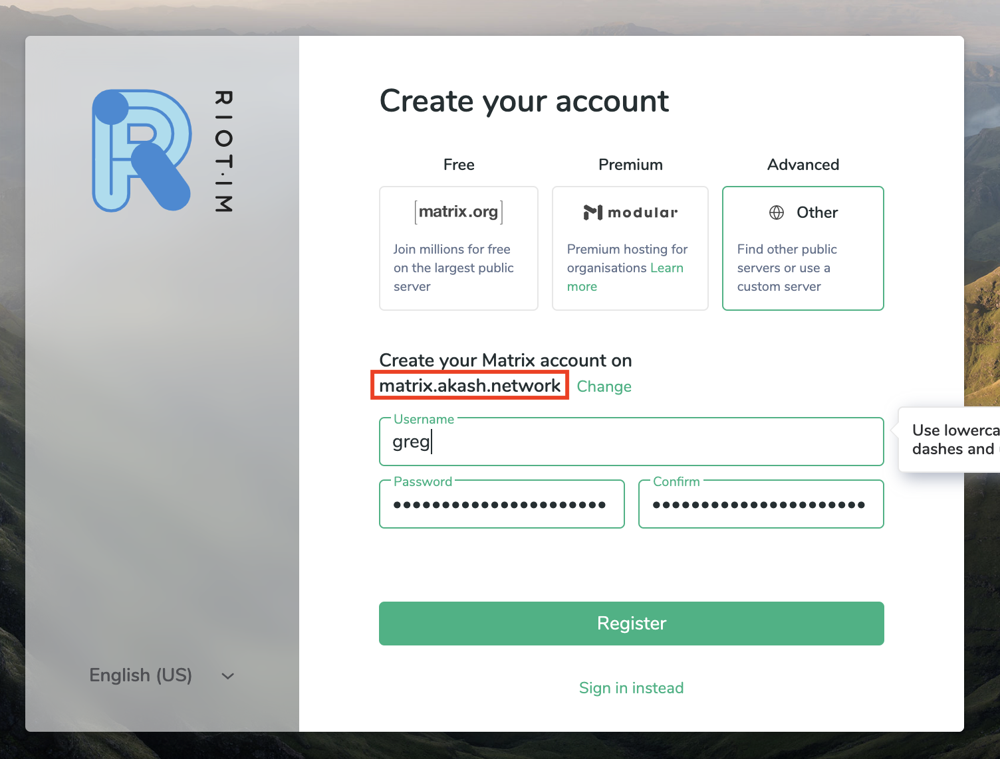
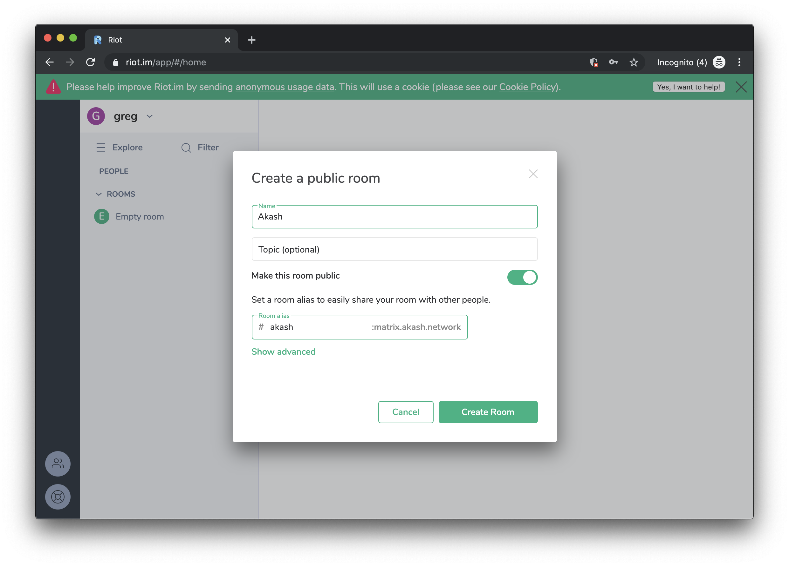
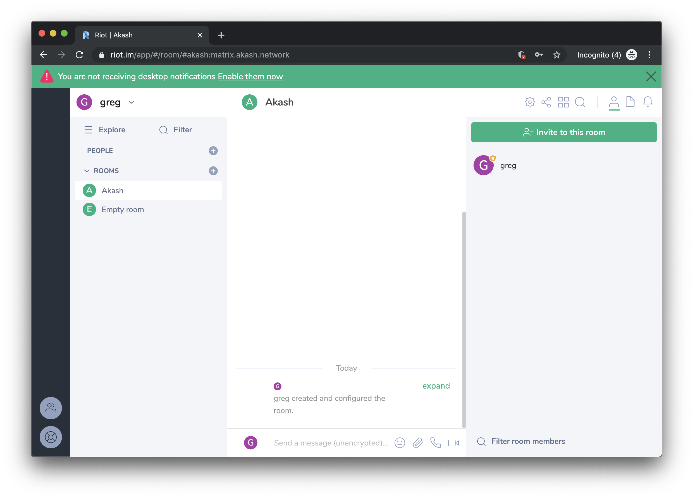

# Private Matrix Messaging Server

In the previous tutorial, we learned how to deploy a simple [Riot chat](../deploy/riot.md) client to access a hosted Matrix server on matrix.org. In this tutorial, we'll deploying a private [Matrix](https://matrix.org) messaging server on Akash under your domain instead of using the hosted matrix.org server.

This is an advanced tutorial as we'll learn how to securely share sensitive information using encrypted Git. For an introduction, please check out the previous guide.

## About Matrix Messaging

Matrix is an open network for secure, decentralized communication; an ambitious new ecosystem for open federated Instant Messaging and VoIP.  

Matrix is really a decentralized conversation store rather than a messaging protocol. When you send a message in Matrix, it is replicated over all the servers whose users are participating in a given conversation - similarly to how commits are replicated between Git repositories. There is no single point of control or failure in a Matrix conversation which spans multiple servers: the act of communication with someone elsewhere in Matrix shares ownership of the conversation equally with them. Even if your server goes offline, the conversation can continue uninterrupted elsewhere until it returns.

## Before we Begin

You'll need a domain name you have DNS control over. We will be using `dentacoin.dev` as an example in this tutorial. For DNS, we recommend [Cloudflare](https://www.cloudflare.com), its free to use.

In this step, you actually use the testnet to deploy a simple web app, paying with your testnet ATK tokens. Check out the [testnet guide](../testnet.md) to request tokens. Make sure to have Akash client installed on your workstation, check [install guide](/guides/install.md) for instructions.

### Additional Software Dependencies

- [Keybase](https://keybase.io/download): Keybase is used as the git hosting platform for various sensitive data we will be sharing on the cloud.
- [Docker](https://www.docker.com/products/docker-desktop): Docker container image is a lightweight, standalone, executable package of software that includes everything needed to run an application: code, runtime, system tools, system libraries and settings. Deployments on Akash are done using Docker.

## 1. Keybase Git Repository for Sharing Secrets

When creating systems like this, there is sensitive local data that is needed to create the clusters and the applications on top of them. Keybase teams offers an easy programatic way to securely version, store and share this data.

To easily and securely share sensitive data with your team and the clusters, create a Keybase team using:

```shell
keybase team create <team>
```

And create a repo called `matrix` for that team using:

```shell
keybase git create matrix --team <team>
```

For example, let's say your team's name is `dentacoin`. We would first need to create the keybase team and then `matrix` git repository for it:

```shell
keybase team create dentacoin

keybase git create matrix --team dentacoin
```

Clone the empty repo to `data` directory:

```shell
git clone keybase://team/dentacoin/matrix data
```

You should see a response like:

```
Cloning into 'data'...
Initializing Keybase... done.
Syncing with Keybase... done.
Syncing encrypted data to Keybase: (100.00%) 3.72/3.72 KB... done.
warning: You appear to have cloned an empty repository
```

## 2. Generate Matrix Configuration

In this step, you'll create a configuration for synapse server for your hostname. For example, if your domain is `matrix.dentacoin.dev`:

```shell
export HOST=matrix.dentacoin.dev
```

```shell
docker run -it --rm \
  --mount type=bind,src="${PWD}/data",dst=/data \
  ovrclk/synapse /run.sh  \
  --server-name ${HOST} \
  --config-path /data/homeserver.yaml \
  --generate-config \
  --report-stats=yes
```

You'll see a response similar to:

```text
Generating config file /data/homeserver.yaml
Generating log config file /data/matrix.dentacoin.dev.log.config which will log to /synapse/homeserver.log
Generating signing key file /data/matrix.dentacoin.dev.signing.key
A config file has been generated in '/data/homeserver.yaml' for server name 'matrix.dentacoin.dev' Please review this file and customise it to your needs.
```

Your `data` directory should look something like this:

```
data
├── homeserver.yaml
├── matrix.dentacoin.dev.log.config
└── matrix.dentacoin.dev.signing.key
```

Replace the `data/homeserver.yaml` with the below configuration, (the generated configuration has imporper port listening configuration besides other issues). Ideally, you should replace `registration_shared_secret` `form_secret` `macaroon_secret_key` with the generated values but not required for the this tutorial.

For a full configuration sample, see Matrix [sample_config.yaml](https://github.com/matrix-org/synapse/blob/master/docs/sample_config.yaml).

Ensure `HOST` variable is set

```shell
export HOST=matrix.dentacoin.dev
```

Create `homeserver.yaml` configuration

```toml
cat > data/homeserver.yaml <<EOF
server_name: "${HOST}"
enable_registration: true
pid_file: /synapse/homeserver.pid
federation_ip_range_blacklist:
  - '127.0.0.0/8'
  - '10.0.0.0/8'
  - '172.16.0.0/12'
  - '192.168.0.0/16'
  - '100.64.0.0/10'
  - '169.254.0.0/16'
  - '::1/128'
  - 'fe80::/64'
  - 'fc00::/7'

listeners:
  - port: 8008
    tls: false
    type: http
    x_forwarded: true
    bind_addresses: ['::']

    resources:
      - names: [client, federation]
        compress: false
acme:
  enabled: false
  port: 80
  bind_addresses: ['::', '0.0.0.0']
  reprovision_threshold: 30
  domain: ${HOST}
  account_key_file: /synapse/acme_account.key

database:
  name: "sqlite3"
  args:
    database: "/synapse/homeserver.db"

log_config: "/data/${HOST}.log.config"

media_store_path: "/synapse/media_store"

uploads_path: "/synapse/uploads"

registration_shared_secret: "FdvX6=Zl^criYPibk+=VkyS:_f*K#=kl#NZ0d;BE#3kL1YNSuE"

trusted_third_party_id_servers:
  - matrix.org
  - vector.im

autocreate_auto_join_rooms: false

report_stats: true

macaroon_secret_key: "Oyy*=k5Ogwkx;oCZx7e;j@bC_iD,P^H-O3#AnszmRFEMm_lxu6"
form_secret: "P-qZnkpZpT4Y-kAH7ycH0;a#zVz#q#:.-0CD=0*B7;.3#zI&Yq"

signing_key_path: "/data/${HOST}.signing.key"

trusted_key_servers:
  - server_name: "matrix.org"

password_config:
  enabled: true

user_directory:
  enabled: true
search_all_users: false
EOF
```

### 3. Commit and Push your Configuration

Since we'll be sharing the configuration and private keys, commit the configuration and push to keybase:

```shell
cd data
git add .
git commit -am 'add home server configuration'
git push
```

You should see a response similar to:

```text
Initializing Keybase... done.
Syncing with Keybase... done.
Preparing and encrypting: (100.00%) 3/3 objects... done.
Indexing hashes: (100.00%) 3/3 objects... done.
Indexing CRCs: (100.00%) 3/3 objects... done.
Indexing offsets: (100.00%) 3/3 objects... done.
Syncing encrypted data to Keybase: (100.00%) 18.95/18.95 KB... done.
To keybase://team/dentacoin/matrix
   c8adf78..d15b446  master -> master
```


### 4. Deploy on Akash

#### 4.1 Authenticating Keybase on the Cluster

We'll be using `keybase oneshot` for logging into keybase from the cluster. `keybase oneshot` is used to establish a temporary device that will be thrown away after the corresponding "keybase service" process exits (or logout is called).

We'll need to create a paper key that'll be shared using an environment variable along with your Keybase username and the configuration repository.

Create a Keybase Paper Key, using:

```shell
keybase paperkey
```

The above will result in some thing similar to:

```text
Generating a new paper key.
Here is your secret paper key phrase:

  dry beauty false duck enroll age ozone acoustic truth picture thumb gasp toast

Write it down and keep somewhere safe.
```

Create a [SDL](../../sdl/README.md) file that looks like the below, replace the values for `KEYBASE_PAPERKEY`, `HOST`, `KEYBASE_USERNAME` and `CONFIG_REPO` with your values, like replace `matrix.dentacoin.dev` with your domain name.

Export the below environment variables:

```shell
export KEYBASE_PAPERKEY="dry beauty false duck enroll age ozone acoustic truth picture thumb gasp toast"
export KEYBASE_USERNAME=kn0tch
export CONFIG_REPO=keybase://team/dentacoin/matrix
export HOST=matrix.dentacoin.dev
```

Generate a deployment config using the below, here you're passing the Paper key and username using Environment variables as well as setting command line arguments the `synapse` container:

```shell                                     
cat > deploy.yml <<EOF                       
---
version: "1.0"

services:
  synapse:
    image: ovrclk/synapse
    env:
      - "KEYBASE_PAPERKEY=${KEYBASE_PAPERKEY}"
      - "KEYBASE_USERNAME=${KEYBASE_USERNAME}"
      - "CONFIG_REPO=${CONFIG_REPO}"
    args:
      - "-c"
      - "/data/homeserver.yaml"
    expose:
      - port: 8008
        as: 80
        accept:
          - ${HOST}
        to:
          - global: true

profiles:
  compute:
    synapse:
      cpu: "1"
      memory: "1Gi"
      disk: "1G"

  placement:
    attributes:
      sgx: enabled
    global:
      pricing:
        synapse: 500u

deployment:
  synapse:
    global:
      profile: synapse
      count: 1
EOF
```

Here's a sample of full [SDL file](./deploy.yml) for your reference.


Create a deployment on Akash using:


```shell
akash deployment create deploy.yml
```

You should see a response similar to:

```
(wait)  [deploy] begin deployment from config: (...)
(wait)  [broadcast] request deployment for group(s): global
(done)  [broadcast] request accepted, deployment created with id: 5961e9263ca8e3a4fcff357a44272ca75266486d0633aec68daf8da63e5afa2c
(wait)  [auction] waiting to create buy orders(s) for 1 deployment groups(s)
(wait)  [auction] buy order (1) created with id: 5961e9263ca8e3a4fcff357a44272ca75266486d0633aec68daf8da63e5afa2c/1/2
(wait)  [auction] waiting on fulfillment(s)
(wait)  [auction] received fulfillment (1/1) with id:
        5961e9263ca8e3a4fcff357a44272ca75266486d0633aec68daf8da63e5afa2c/1/2/f1695acb26884111d87e91d655fddc511a961987c846a61b62ce42f5ba1d90e7
(wait)  [lease] waiting on lease(s)
(done)  [auction] complete; received 1 fulfillment(s) for 1 order(s)
(wait)  [lease] received lease (1) for group (1/1) [price 86] [id
        5961e9263ca8e3a4fcff357a44272ca75266486d0633aec68daf8da63e5afa2c/1/2/f1695acb26884111d87e91d655fddc511a961987c846a61b62ce42f5ba1d90e7]
(wait)  [lease] send manifest to provider at http://roy.akashtest.net
(done)  [lease] manifest accepted by provider at http://roy.akashtest.net
(done)  [lease] complete; received 1 lease(s) for 1 groups(s)
(done)  [deploy] deployment complete

Deployment
==========

Deployment ID:        	5961e9263ca8e3a4fcff357a44272ca75266486d0633aec68daf8da63e5afa2c
Deployment Groups(s): 	Group:        	global
                      	Requirements:
                      	Resources:    	Count:  	1
                      	              	Price:  	500
                      	              	CPU:    	1000
                      	              	Memory: 	1073741824
                      	              	Disk:   	1000000000
Fulfillment(s):       	Group:    	1
                      	Price:    	86
                      	Provider: 	f1695acb26884111d87e91d655fddc511a961987c846a61b62ce42f5ba1d90e7

Lease(s)
========

Lease ID:    	5961e9263ca8e3a4fcff357a44272ca75266486d0633aec68daf8da63e5afa2c/1/2/f1695acb26884111d87e91d655fddc511a961987c846a61b62ce42f5ba1d90e7
Services(s): 	NAME	HOST(S) / IP(S)                        	AVAILABLE	TOTAL
             	web 	matrix.dentacoin.dev                   	0        	0
             	web 	ghudphwn2h2yj8mj7gkt6.roy.akashtest.net	0        	0
             	web 	147.75.201.147                         	0        	0
```

### 5. Update DNS by adding a CNAME

Add a CNAME dns record on your DNS provider to map, `matrix.dentacoin.dev` with `ghudphwn2h2yj8mj7gkt6.roy.akashtest.net`. For example:

```text
CNAME matrix.dentacoin.dev ghudphwn2h2yj8mj7gkt6.roy.akashtest.net
```

Once that's complete, you can simply share `matrix.dentacoin.dev` with your community.



If you're hosting your DNS on Cloudflare, please make sure your SSL/TLS encryption mode is Flexible for DNS to work.



### 6. Login To Your Private Matrix Server using Riot

Set up the Riot Web client for Matrix by following this [Guide](../deploy/riot.md). Alternatively, you could use the hosted [riot client](https://riot.im/app).



<<<<<<< Updated upstream
#### Create Account

Create a new Account by selecting the option and chose **Advanced**. Provide the url to your matrix server for `Homeserver URL`. Ignore the errors on screen if any as they are mostly configuration related.
=======
#### 6.1 Create Account

Create a new Account by selecting the option and chose 'Advanced'. Provide the url to your matrix server for 'Homeserver URL'. Ignore the errors on screen if any as they are mostly configuration related.
>>>>>>> Stashed changes

The below example will create a user `greg` at `matrix.akash.network`:

```
@greg:matrix.akash.network
```
<<<<<<< Updated upstream


#### Create a Room

And invite our community by showing what you built, [join our chat](https://akash.network/chat)



If you enjoyed this article, don't forget to [subscribe to our newsletter](https://akash.network/newsletter), we have exciting things coming every week!
=======



>>>>>>> Stashed changes
