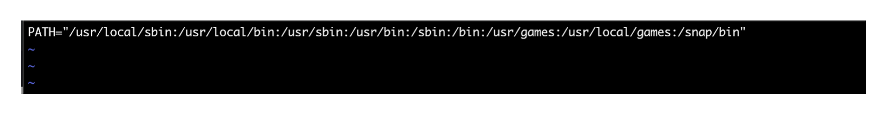
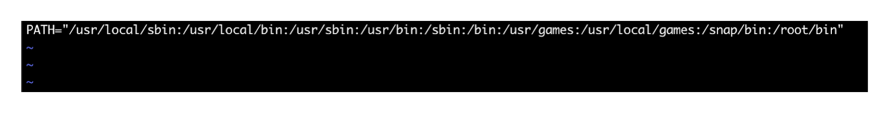
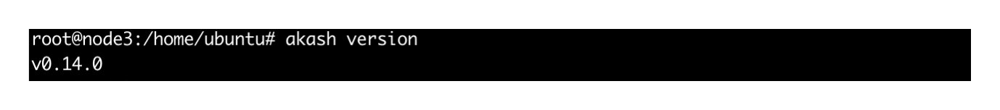
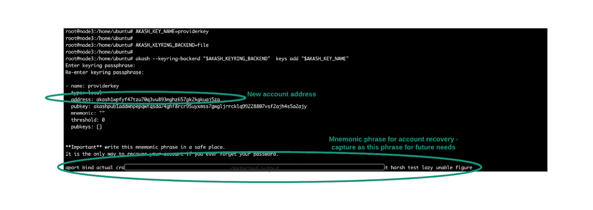
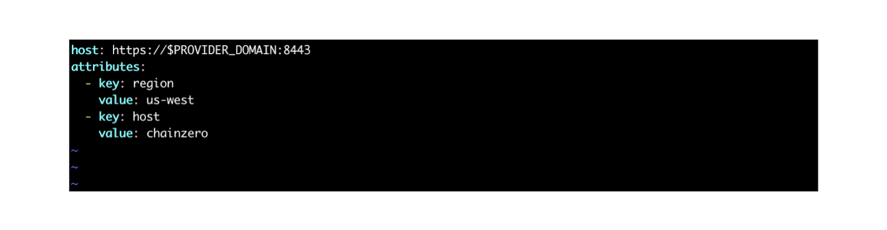
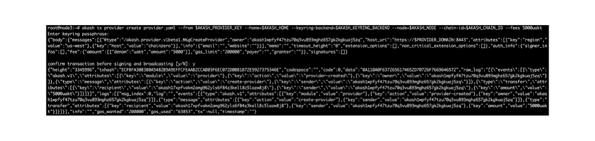
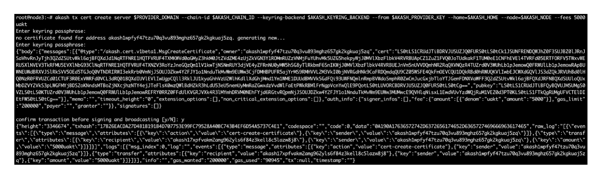
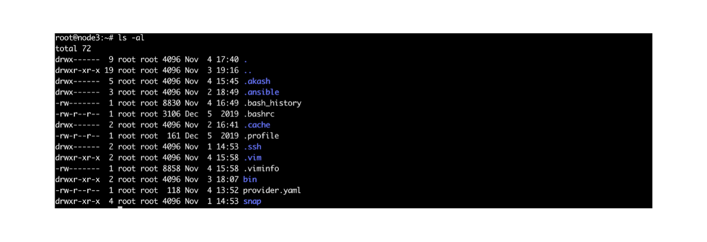
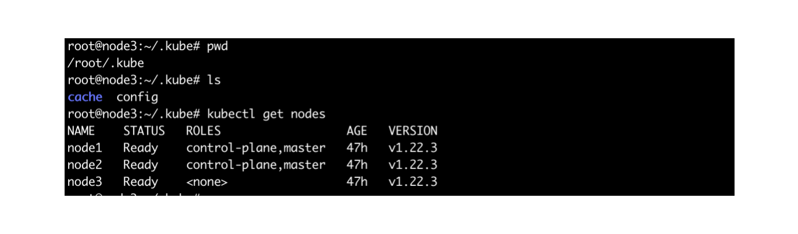

# Build a Cloud Provider

## Prerequisites of an Akash Provider

### Wallet Funding - Minimum of 50 AKT

Placing a bid on an order requires a 50 AKT deposit. This deposit is fully refunded after the bid is won/lost.&#x20;

The steps to create an Akash account are covered in the Provider setup section of this document.

### Kubernetes Cluster

* A full Kubernetes cluster is required.
* This Akash provided guide offers one possible path for cluster creation via Kubespray.
  * [ ] [https://docs.akash.network/operations/provider/kubernetes-cluster ](https://docs.akash.network/operations/provider/kubernetes-cluster)
* The cluster must have outbound internet access and be reachable from the internet.

## Akash Provider Setup

### Provider Setup Overview

The following sections will explore each step of the Akash provider setup in detail.

### STEP1 - Select a Host to Run the Akash Provider

The Akash provider can be installed on any Kubernetes master or worker node. Or if preferred the provider may be installed on a separate host outside of the Kubernetes cluster.

### STEP2 - Install Akash Software

The Akash software install process on a Linux server is shown in this step.

_Specify the Akash Version_

* This command will retrieve the latest, stable version of the Akash software and store the version in a local variab**le**

```
AKASH_VERSION="$(curl -s "https://raw.githubusercontent.com/ovrclk/net/master/mainnet/version.txt")"
```

_**Add Akash Install Location to User’s Path**_

Add the software’s install location to the user’s path for easy use of Akash commands.

**NOTE** - below we provide the steps to add the Akash install directory to a user’s path on a Linux Ubuntu server.  Please take a look at a guide for your operating system and how to add a directory to a user’s path.

_Open the user’s path file in an editor:_

```
vi /etc/environment
```

_View within text editor prior to the update:_



_Add the following directory, which is the Akash install location, to PATH:_

```
/root/bin
```

_View within the text editor following the update:_



_Make the new path active in the current session:_

```
​​source /etc/environment
```

_Display the version of Akash software installed. This confirms the software installed and that the new user path addition worked._

```
akash version
```

_Expected result_:



### STEP3 - Create/Import Akash Account

For a Provider to bid on leases an account is needed with minimum funding of 50 AKT.  An account can be created by using the commands of this section.  Alternatively an existing account could be imported for provider use.

_**Specify a key with your choice of name:**_

```
AKASH_KEY_NAME=<name>
```

_**Specify the location of the keyring on the provider:**_

```
AKASH_KEYRING_BACKEND=file
```

_**Create the new account and store the encrypted private key in the keyring**_

* Enter a passphrase of your choice when prompted

```
akash --keyring-backend "$AKASH_KEYRING_BACKEND"  keys add "$AKASH_KEY_NAME"
```

_**Expected results with important outputs high**_lighted



### STEP4 - Verify Account Balance

We should verify the minimum account balance for the provider now that the account has been set up. As mentioned, the account needs slightly more than 50 AKT at a minimum.

_**Specify the Akash network to query (in this case the mainnet):**_

```
AKASH_NET="https://raw.githubusercontent.com/ovrclk/net/master/mainnet"
```

_**Query the network for an available node to communicate with:**_

```
export AKASH_NODE="$(curl -s "$AKASH_NET/rpc-nodes.txt" | shuf -n 1)"
```

_**Store the account created in the previous step. Replace the variable portion with your account address (I.e. account such as akash1wpfyf47tzu70q3vu893mghz657gk2kgkuaj5zq):**_

```
AKASH_ACCOUNT_ADDRESS=<account-address>
```

_**Get your account balance:**_

```
akash --node "$AKASH_NODE" query bank balances "$AKASH_ACCOUNT_ADDRESS"
```

_**Example output:**_

.png>)

### STEP5 - Create the Provider

Use the host that the Akash software was installed on for this section.

_**Provider Domain**_

* Create the environment variable of PROVIDER\_DOMAIN&#x20;
* This domain is used whenever a lease owner needs to speak directly with the provider to send a manifest or get a lease status&#x20;
* This should be a publicly accessible domain name

```
export PROVIDER_DOMAIN=<provider-host-domain-name>
```

_**Create provider.yaml File**_

* Create a file with the name of provider.yaml and add the contents below

```
host: https://$PROVIDER_DOMAIN:8443
attributes:
  - key: region
    value: us-west
  - key: host
    value: <nameOfYourOrganization>
```

_**Example of Creating Provider File**_

* These screenshots shows the previous steps for further clarity


* File details within an editor



_**Create the Akash Provider**_

* Register the provider on the Akash Network&#x20;
* Three new environment variables are added that the provider create command will use&#x20;
* Replace the AKASH\_PROVIDER\_KEY with the name of the key created earlier (I.e. providerkey in the example)&#x20;
* Replace the AKASH\_HOME with the location of the keychain (I.e. /root/.akash in the example)

```
export AKASH_CHAIN_ID="$(curl -s "$AKASH_NET/chain-id.txt")"
AKASH_PROVIDER_KEY=<key-name>
AKASH_HOME=<keyring-location>
```

```
akash tx provider create provider.yaml --from $AKASH_PROVIDER_KEY --home=$AKASH_HOME --keyring-backend=$AKASH_KEYRING_BACKEND --node=$AKASH_NODE --chain-id=$AKASH_CHAIN_ID --fees 5000uakt
```

_**Example of Creating the Provider**_




### STEP6 - Create a TLS Certificate

Create a TLS certificate for your provider. The certificate will be stored on the blockchain.

```
akash tx cert create server $PROVIDER_DOMAIN --chain-id $AKASH_CHAIN_ID --keyring-backend $AKASH_KEYRING_BACKEND --from $AKASH_PROVIDER_KEY --home=$AKASH_HOME --node=$AKASH_NODE --fees 5000uakt
```

_**Example of Creating the Certificate**_



### STEP7 - Configure Kubectl

If the provider is on a non-Kubernetes master node, kubectl and the kubeconfig file might not be present.  In this step we will create the kubeconfig file on the provider host which is necessary when we try to start the provider.

_**Verify Kubeconfig File**_

* On the provider host, verify if the kubeconfig file is present&#x20;
* We are looking for the presence of the .kube directory within the user’s home directory

```
cd ~
ls -al
```

_**Example output of directory contents**_

* In this example the .kube directory does not exist and we will need to create it&#x20;
* If the directory does exist and you are able to conduct kubectl commands (I.e. “kubectl get nodes”), feel free to skip forward to STEP8



_**Create a .kube Directory**_

```
mkdir .kube
```

_**Copy Kubeconfig to the Provider**_

* We will use the following command to copy the config file from the Kubernetes master to the provider host&#x20;
* Replace the username and IP address parts of the command

```
scp <username>@<ipaddress>:/root/.kube/config /root/.kube/config
```

_**Install Kubectl on the Provider**_

```
stable=$(curl -s https://storage.googleapis.com/kubernetes-release/release/stable.txt)
curl -LO
 
https://storage.googleapis.com/kubernetes-release/release/${stable}/bin/linux/amd64/kubectl

chmod +x ./kubectl

sudo mv ./kubectl /usr/local/bin/kubectl
```

_**Verify Kubectl**_

* Following the copy of the kubeconfig file and the kubectl install, you should be able to execute commands like “kubectl get nodes” as shown in example below



### STEP8 - Start the Provider

In our final step the provider is started.

```
akash provider run \
  --home $AKASH_HOME \
  --chain-id $AKASH_CHAIN_ID \
  --node $AKASH_NODE \
  --keyring-backend=file \
  --from $AKASH_PROVIDER_KEY \
  --fees 1000uakt \
  --kubeconfig $KUBECONFIG \
  --cluster-k8s true \
  --deployment-ingress-domain $PROVIDER_DOMAIN \
  --deployment-ingress-static-hosts true \
  --bid-price-strategy scale \
  --bid-price-cpu-scale 0.001 \
  --bid-price-memory-scale 0.001 \
  --bid-price-storage-scale 0.00001 \
  --bid-price-endpoint-scale 0 \
  --bid-deposit 5000000uakt \
  --cluster-node-port-quantity 1000 \
  --cluster-public-hostname $PROVIDER_DOMAIN
```

_**Expected Output**_

* When the provider starts the initial output should look like the following.&#x20;
* The full output is not displayed but only the first lines indicating a successful start


