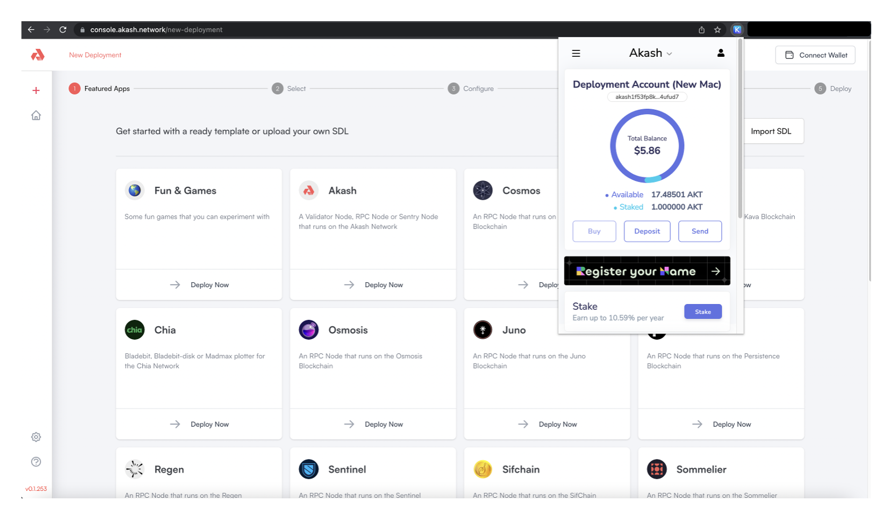
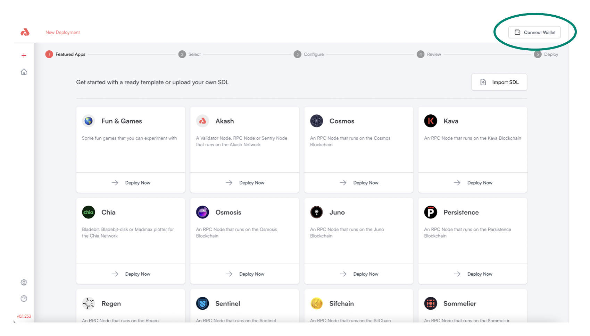

# Akash Console Access

## Before Getting Started

The Keplr browser extension must be installed and with sufficient funds (5AKT minimum for a single deployment plus a small amount for transaction fees).

Follow our [Keplr Wallet](../../../tokens-and-wallets/keplr.md) guide to create your first wallet if necessary.

## &#x20;Akash Console Access

The Akash Console web app is available via the following URL:

* [https://console.akash.network](https://console.akash.network)

## Keplr Account Selection

Ensure that an Akash account with sufficient AKT balance is selected in Keplr prior to proceeding with subsequent steps.

<figure><figcaption></figcaption></figure>

## Connect Wallet

Use the `Connect Wallet` button to connect the account selected in Keplr in the prior step to the Akash Console.

<figure><figcaption></figcaption></figure>
