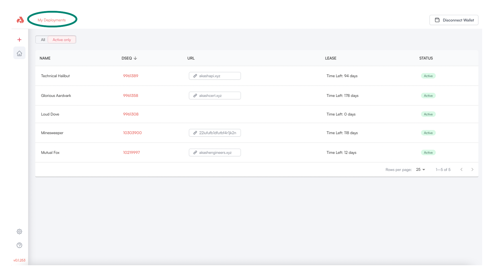

# Deployment Management

### Deployment Dashboard Overview

The `My Deployments` link may be selected from any page within the Akash Console.  The arrived upon management pane lists all active Deployments associated with the account currently selected.

Select/click a Deployment of interest to drill into additional details.

<figure><figcaption></figcaption></figure>

From the example `My Deployment` screen shown, we drill into the Minesweeper Deployment to expose Deployment details and the ability to navigate into EVENTS/LOGS/LEASES tabs.

<figure><figcaption></figcaption></figure>
