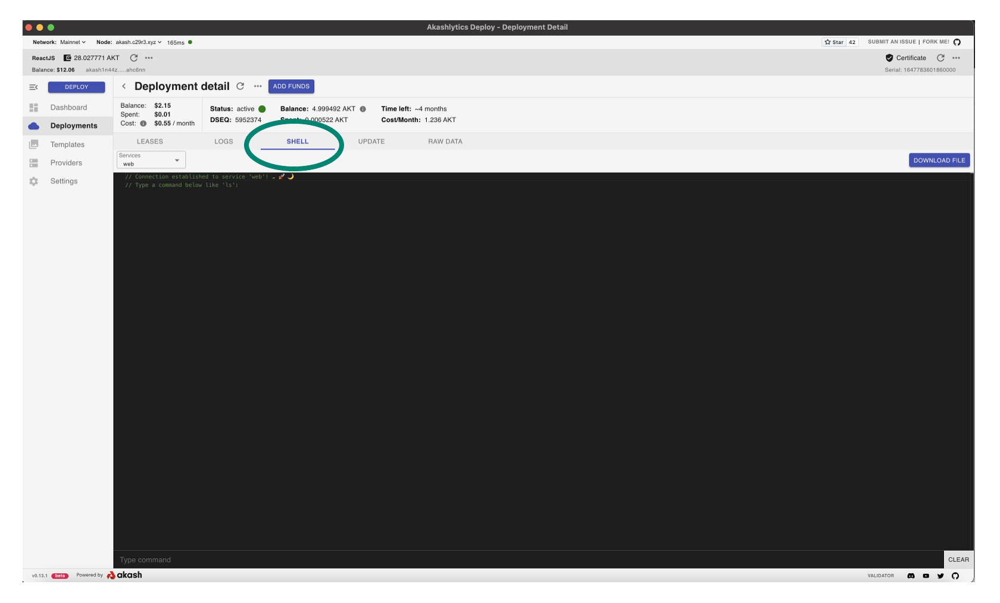
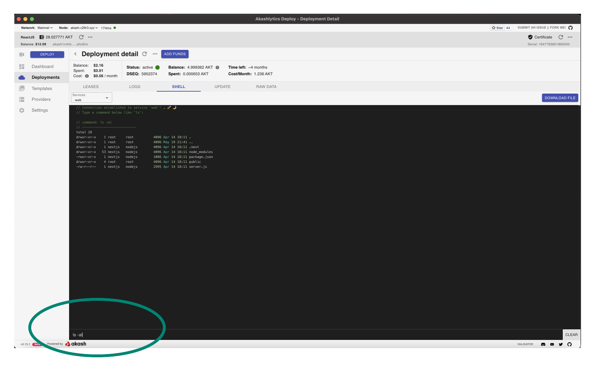

# STEP 3 - Shell Access Verification

* Tenants should have access to their deployment’s Linux shell which can be used for basic troubleshooting and administration.
* Within this step we will ensure that there are no issues with shell access into a deployment running on your provider.
* Open the shell for the Hello Akash World test deployment and within Cloudmos via the deployment’s SHELL tab as demonstrated

* Ensure that not only can we get into a deployment’s shell but we can issue commands in operating system
* Issue a simple `ls -al` and list the file details in the current directory as a simple shell command execution test

