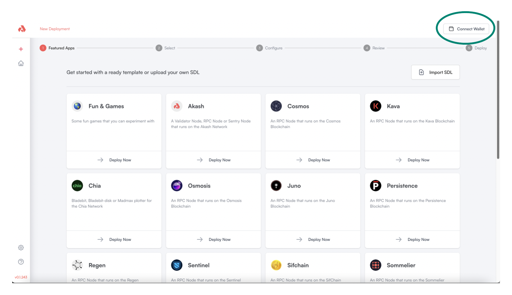

# Akash Console Access and Initial Setup

## Akash Console Access

The Akash Console can be accessed [here](https://console.akash.network/).

## Akash Console Initial Setup

### Connect Wallet

* The Akash Console currently supports Keplr wallets
* If Keplr is not installed as a browser extension and/or a funded Akash account is not available, follow the instructions in our [Keplr Guide](../../../tokens-and-wallets/keplr.md)
* Select the desired Akash account in Keplr and then select the `Connect Wallet` option within the Akash Console as shown below

<figure><figcaption></figcaption></figure>
