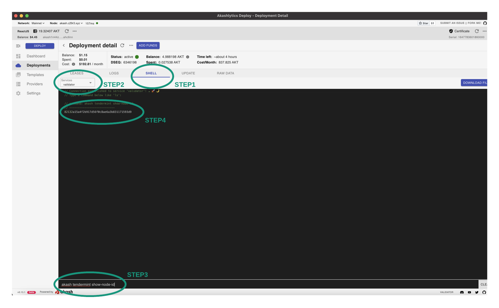

# Cloudmos Initial Deployment

The Akash validator build - using a Sentry architecture - requires that the Validator ID are known by the Sentry nodes. Additionally the Sentry node IDs must be known by the Validator. As these IDs are unknown prior to the build process - and are then stored for re-use in the S3 bucket - we must create an initial deployment, capture the necessary IDs, close the initial deployments, and launch anew the deployments with the IDs specified.

In this section we will create the initial deployments for ID captures.

## **Create Deployments via Cloudmos**

* Within the Cloudmos Deploy app, begin the process of creating a new deployment

* Select Empty Template for eventual entry of our custom SDL

* Copy and paste the Validator SDL we created prior
* Proceed thru steps of accepting necessary gas fees to create the deployment
* When prompted select the desired Provider to host the deployment and complete the deployment process

## Capture Validator and Sentry Node IDs

* Within the Cloudmos deployment shell tab - as shown in the depiction below - we can capture the necessary IDs for the eventual, permanent deployment
* Select the SHELL tab and select the “validator” instance from Service drop down
* Enter the command `akash tendermint show-node-id` in the command line entry box on the bottom of the display
* Copy the exposed ID for the validator to a text pad for use in a later step
* Repeat this same process to collect the IDs of node1 and node2 (same steps as above but change the Service drop down to the nodes)

## Close the Deployment

With the necessary IDs now captured, close the current deployment.  As mentioned previously - we will use the IDs captured to create a permanent deployment in subsequent steps.
