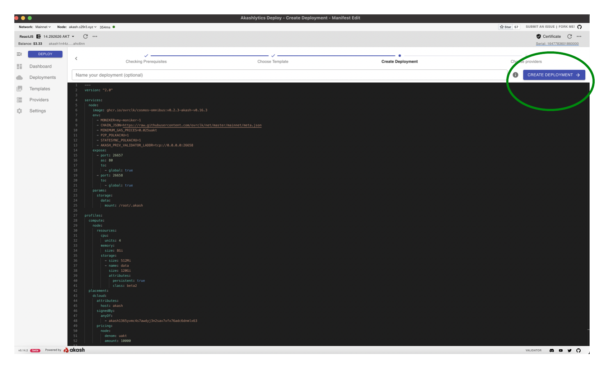
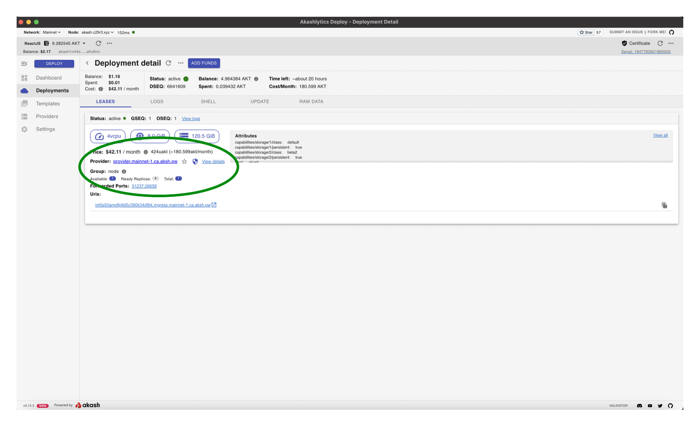

# Akash Validator Deployment

## Cloudmos Deploy

* Within this guide we will use the Cloudmos Deploy application to create the Akash Validator
* Please review our[ Cloudmos Deploy ](broken-reference)docs to install and configuration the application if this is your first time using

## Create the Akash Validator Deployment

* Use the steps that follow - within Cloudmos Deploy - to create your Akash Validator deployment

### Create New Deployment

* Use the `CREATE DEPLOYMENT` button to launch a new deployment


### Empty Template Option

* Select the `Empty` option as we will be copying a pre-constructed Akash SDL for the deployment


### Copy SDL into Editor

* Copy the following Akash SDL into the Editor pane
* Reference the [Populated Editor](akash-validator-deployment.md#populated-editor) section for further clarity
* Select the `CREATE DEPLOYMENT` button to proceed

```
---
version: "2.0"

services:
  node:
    image: ghcr.io/ovrclk/cosmos-omnibus:v0.3.1-akash-v0.16.3
    env:
      - MONIKER=my-moniker-1
      - CHAIN_JSON=https://raw.githubusercontent.com/ovrclk/net/master/mainnet/meta.json
      - MINIMUM_GAS_PRICES=0.025uakt
      - P2P_POLKACHU=1
      - STATESYNC_POLKACHU=1
      - AKASH_PRIV_VALIDATOR_LADDR=tcp://0.0.0.0:26658
    expose:
      - port: 26657
        as: 80
        to:
          - global: true
      - port: 26658
        to:
          - global: true
    params:
      storage:
        data:
          mount: /root/.akash

profiles:
  compute:
    node:
      resources:
        cpu:
          units: 4
        memory:
          size: 8Gi
        storage:
          - size: 512Mi
          - name: data
            size: 120Gi
            attributes:
              persistent: true
              class: beta2
  placement:
    dcloud:
      attributes:
        host: akash
      signedBy:
        anyOf:
          - akash1365yvmc4s7awdyj3n2sav7xfx76adc6dnmlx63
      pricing:
        node:
          denom: uakt
          amount: 10000

deployment:
  node:
    dcloud:
      profile: node
      count: 1
```

#### Populated Editor



### Deployment Deposit

* An escrow account is created for the deployment that is deducted from by the provider for the cost of the workload over time
* By default 5 AKT is specified as the initial escrow deposit
* If a deployment's escrow runs out of funds (0 AKT), the lease will be closed by the provider. Consider increasing the initial deposit to an amount that will be enough to fund the deployment for some time. And/or consider a strategy to ensure the escrow is re-funded on a periodic basis to ensure no disruption to your validator.
* When ready select `DEPOSIT` to proceed and `APPROVE` any Transaction/gas fee prompts that follow


### Select Akash Provider

* A list of Akash Providers that have bid on your deployment is displayed
* Choose the desired Provider from the list and then select `ACCEPT BID` to proceed


### Deployment Logs

* The `LOGS` pane for the new Deployment will display
* NOTE - after a period of time the logs will display a `Back-off restarting failed container` message. This is expected as the container will not start until it has established a connection with the TMKMS server in subsequent steps.
* Select the `LEASES` tab to proceed into the next step


### Capture Deployment URI and Port

* In upcoming TMKMS configuration sections we will need to specify our Akash Validator deployment's URI and port
* Capture this info from the `LEASES` tab for later use
* In the example the following values would be captured (these values will be different for your deployment):
  * URI - using the Provider field - `provider.mainnet-1.ca.aksh.pw`
  * Port - using the Forwarded Port field - `31237`


