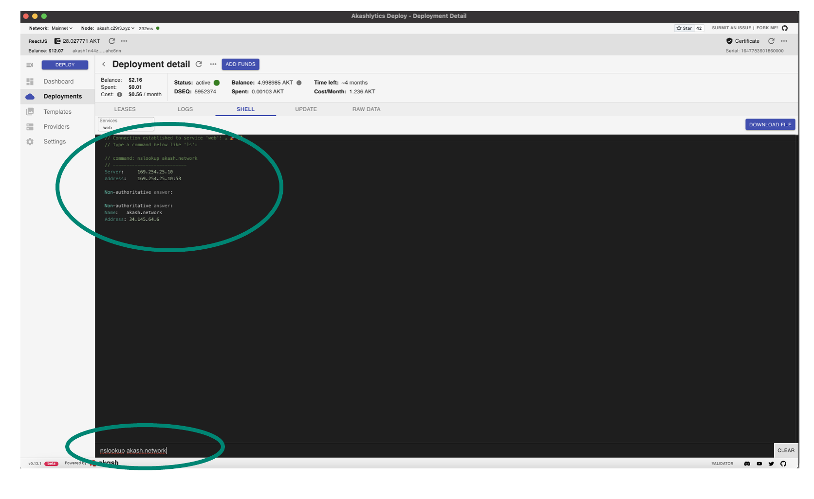

# STEP 4 - Provider DNS Verification

* DNS issues within deployments launched a provider are a somewhat frequent issue and should be verified immediately following provider creation.
* Often DNS issues can be unrecognized for some time so this verification ensures we will not have such issues in the future.
* Issue a `nslookup akash.network` from the deployment's shell as shown in the demonstration. The example also displays the successful response of the domain name to IP address lookup we would expect and verifies that no DNS issues exist within deployments on our provider.

