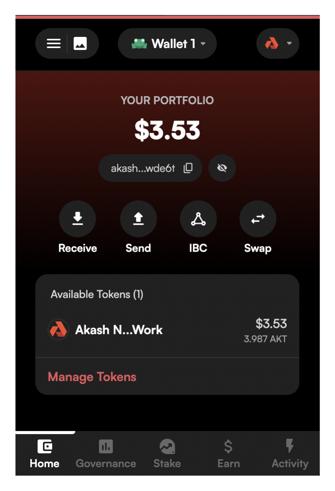
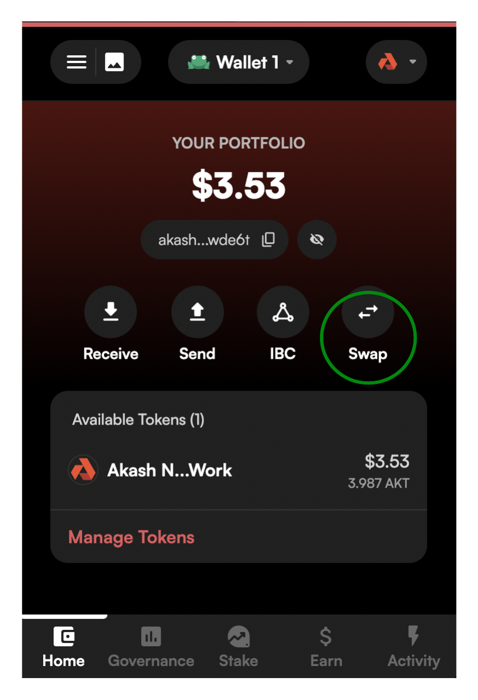
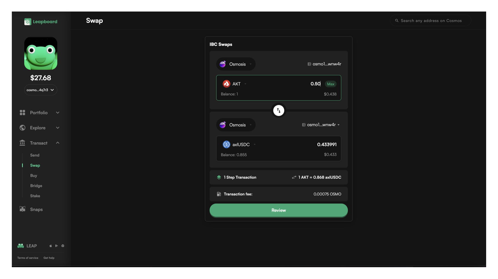
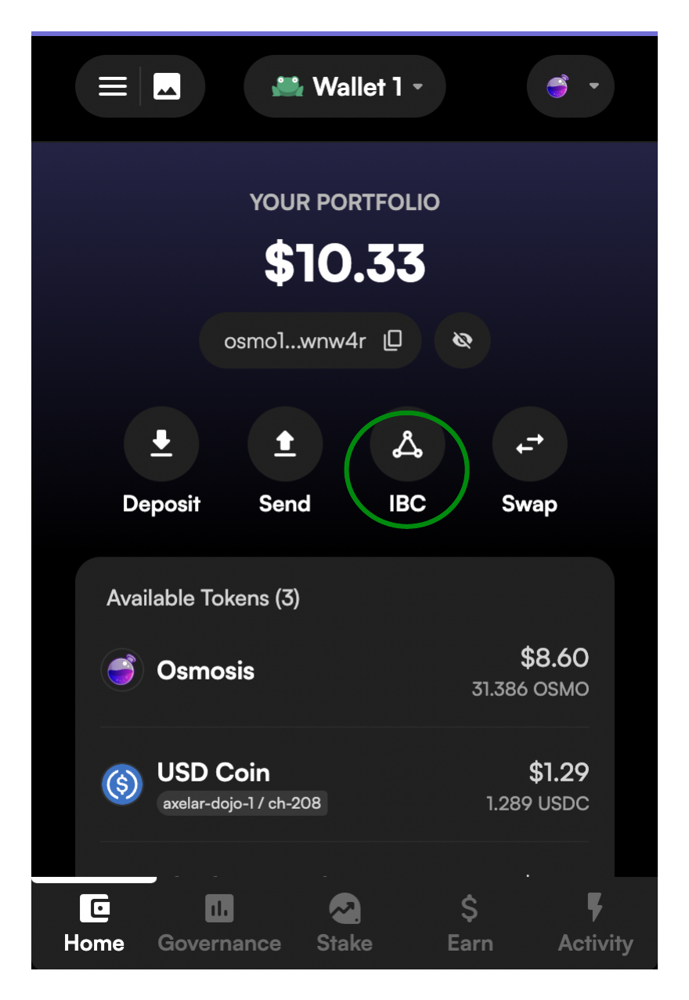
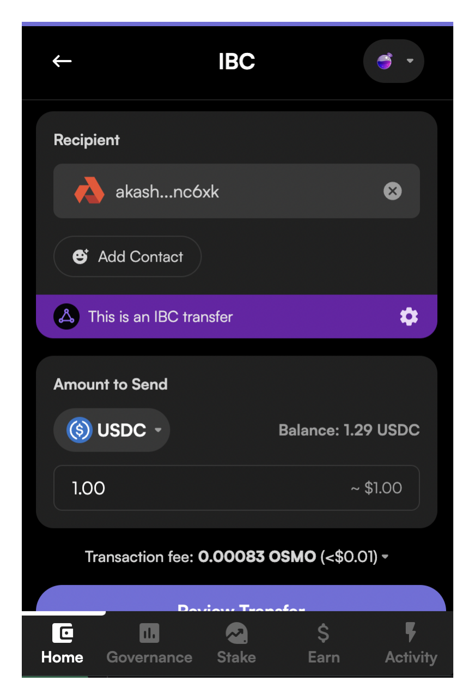
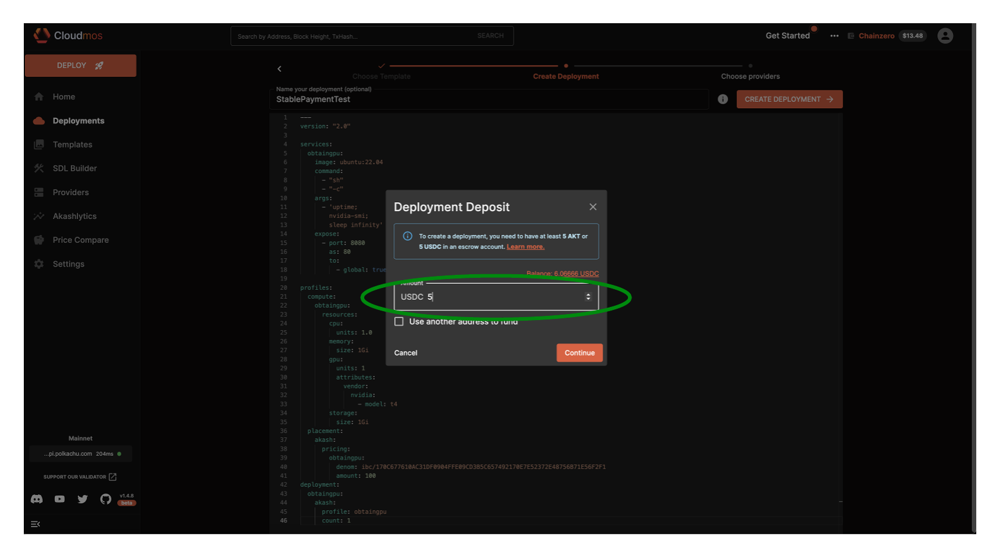

# Stable Payment Deployments

## Overview

Akash deployments can be funded using our native crypto currency (AKT) or through stable coins.

In this guide we will review:

* [Methods to Transfer USDC onto Akash for Stable Payments](stable-payment-deployments.md#methods-to-transfer-usdc-onto-akash-for-stable-payments)
* [Akash Deployment Creation using Stable Payments](stable-payment-deployments.md#akash-deployment-creation-using-stable-payments)

### Currently Supported Stable Coins

* Axelar USDC (axlUSDC)

## Methods to Transfer USDC onto Akash for Stable Payments

### Section Overview

In this section we will detail methods to transfer Axelar USDC into your Akash account for funding of deployments using stable payments.

### Leap Wallet

We find that using Leap Wallet to be the simplest method of transferring Axelar USDC into the Akash network and associated accounts as no manual specification of the IBC is necessary.

#### Leap Wallet Overview

In the steps that follow we will swap Akash AKT for Axelar USDC.  Other methods are possible but if you would like to follow these instructions explictly, ensure that you have some available AKT.

#### Install Leap Wallet Browser Plug In

* Follow the instructions provided by Leap Wallet to install the appropriate web browser plug in [here](https://www.leapwallet.io/download).

### IBC Transfer of USDC onto Akash

> _**NOTE**_ - in the current Leap Wallet version swaps of AKT to axlUSDC are only possible in the web app.  Via the instructions below you will be automatically redirected to the Leap Wallet app for the purpose of AKT to axlUSDC swap.  In future versions of Leap Wallet it may become possible to conduct the swap directly within the Leap Wallet browser plug in.

#### STEP 1 - Open Leap Wallet Web App

* Open your Leap Wallet browser extension
* Select Akash from the network selection drop down as shown

<figure><figcaption></figcaption></figure>

#### STEP 2 - Open Leap Wallet Web App to Conduct Swap

* Select the Swap option within Leap Wallet as shown below

<figure><figcaption></figcaption></figure>

* The selection of the Swap option in the prior step will provoke the opening of the Leap Wallet web app
* Within the app make the selections as indicated in the depiction below.  The source and destination network should be Osmosis.  The source denomination should be `AKT` and the destination denomination should be `axlUSDC` also as shown.

<figure><figcaption></figcaption></figure>

#### STEP 3 - Complete the IBC Transfer of axlUSDC onto Akash

* With the Swap now completed in the previous step, return to the Leap Wallet browser plug in.
* Select the `IBC` option as depicted below.

<figure><figcaption></figcaption></figure>

* Complete an IBC transfer of `axlUSDC` onto the Akash Network.
* Ensure that the Osmosis network is selected during this step as depicted below.

<figure><figcaption></figcaption></figure>

### Verify IBC Transfer and Availability of USDC on Akask Network

* The simplest means of verifying the IBC transfer of USDC was successful and is available in your account on the Akash network is via the Akash CLI.
* USDC balances can also be verified in Cloudmos Deploy of preferred.

_**CLI Verification/Command Template**_

```
provider-services query bank balances <akash-address>
```

_**Expected/Example Output**_

* Note the appearance and balance of denom `ibc/170C677610AC31DF0904FFE09CD3B5C657492170E7E52372E48756B71E56F2F1`
* This demon represents available Axelar USDC and indicates availability of stable payment funds to utilize for Akash deployments

```
provider-services query bank balances akash1w3k6qpr4uz44py4z68chfrl7ltpxwtkngnc6xk

balances:
- amount: "3068485"
  denom: ibc/170C677610AC31DF0904FFE09CD3B5C657492170E7E52372E48756B71E56F2F1
- amount: "8650845"
  denom: uakt
pagination:
  next_key: null
  total: "0"
```

## Akash Deployment Creation using Stable Payments

In this section we will cover using the following clients to create an Akash deployment using Stable Payments.

> NOTE - when creating an Akash deployment using Stable Payment - ensure that the SDL pricing section reflects the correct denomination as covered [here](https://docs.akash.network/readme/stack-definition-language#stable-payment).

* [Cloudmos Deploy](stable-payment-deployments.md#cloudmos-deploy-stable-payment-use)
* [Akash CLI](stable-payment-deployments.md#akash-cli-stable-payment-use)

### Cloudmos Deploy Stable Payment Use

* When using Cloudmos Deploy no change is necessary in the deployment creation when using Stable Payments.
* When the associated SDL uses the USDC denomination, Cloudmos Deploy will create the deployment with Stable Payment.
* An indication that Stable Payments are being used in the deployment creation is provided in the `Deployment Deposit` dialog box as shown below.

<figure><figcaption></figcaption></figure>

### Akash CLI Stable Payment Use

* When creating a deployment via the Akash CLI, all steps in the typical deployment creation steps (as covered [here](../../guides/cli/detailed-steps/)) remain applicable and valid with the only edit in such steps being this syntax in the `deployment create` step.
* As shown in this Stable Payment relevant `deployment create` command we must specify the `deposit` switch as the USDC denomination.

#### Create Deployment Command for USDC Stable Payment Use

```
provider-services tx deployment create deploy.yml --from $AKASH_KEY_NAME --deposit=5000000ibc/170C677610AC31DF0904FFE09CD3B5C657492170E7E52372E48756B71E56F2F1
```
