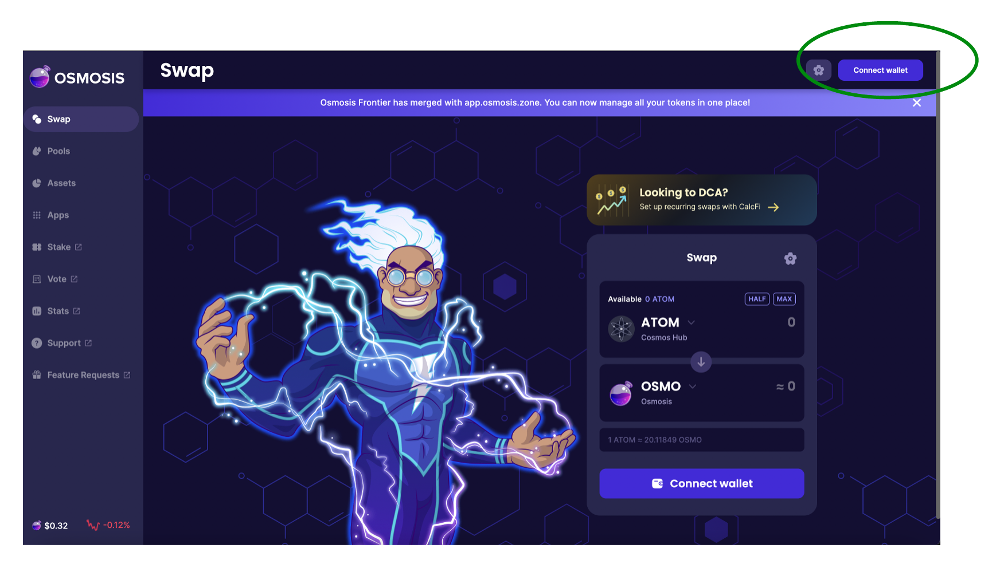
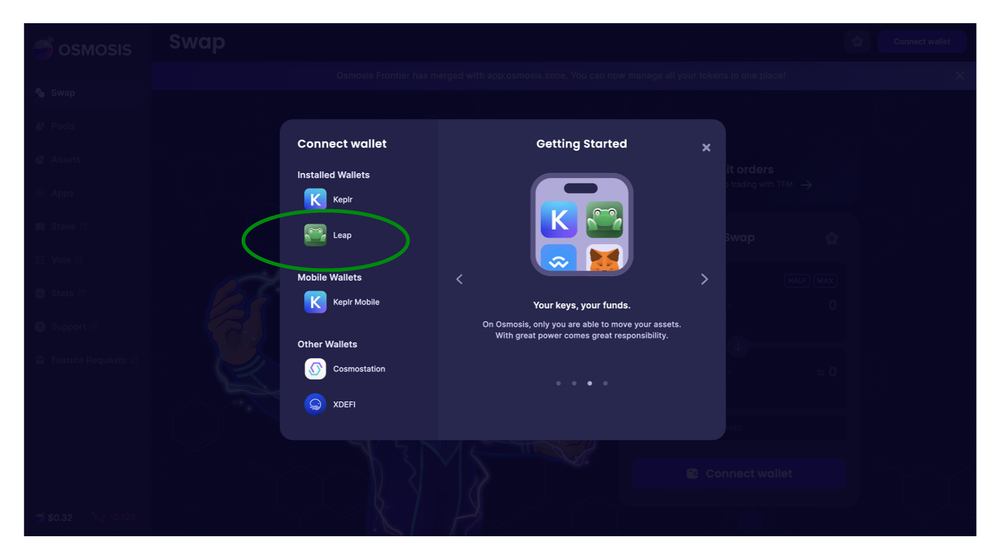
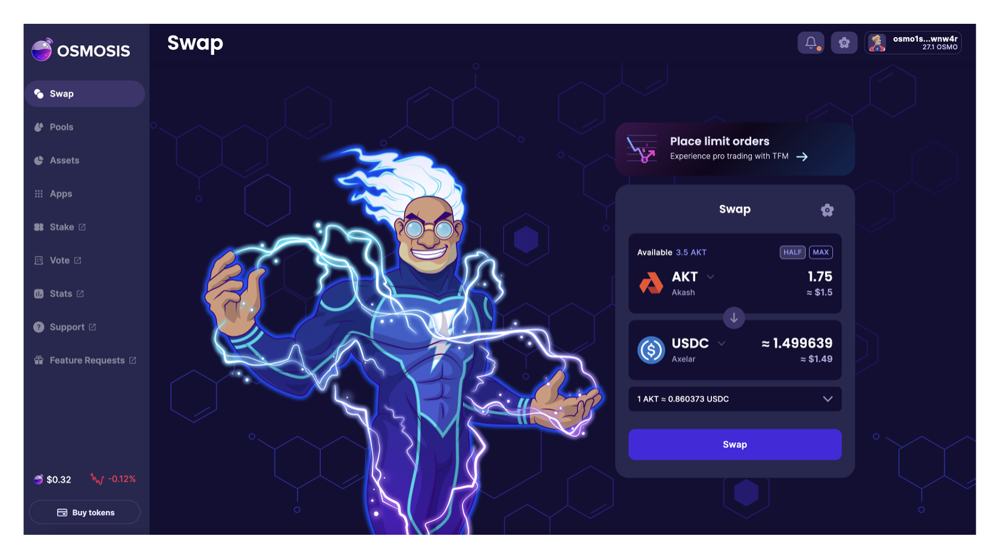
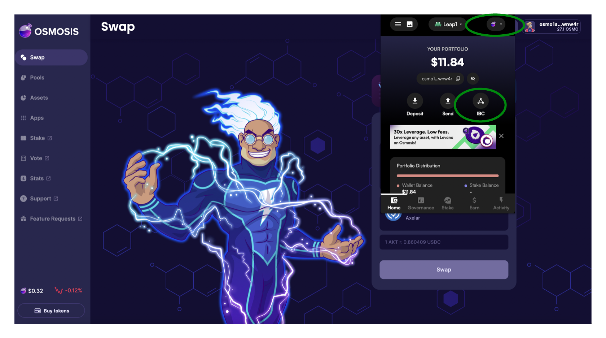
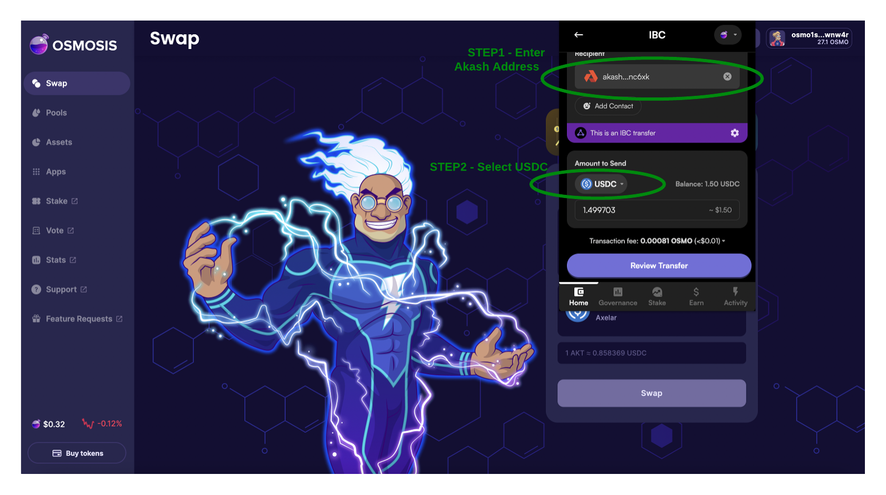

# Stable Payments

## Overview

Akash deployments can be funded using our native crypto currency (AKT) or through stable coins.

In this guide we will review:

* [Methods to Transfer USDC onto Akash for Stable Payments](stable-payments.md#methods-to-transfer-usdc-onto-akash-for-stable-payments)
* [Akash Deployment Creation using Stable Payments](stable-payments.md#akash-deployment-creation-using-stable-payments)

### Currently Supported Stable Coins

* Axelar USDC (axlUSDC)

## Methods to Transfer USDC onto Akash for Stable Payments

### Section Overview

In this section we will detail methods to transfer Axelar USDC into your Akash account for funding of deployments using stable payments.

### Leap Wallet

We find the using the Leap Wallet to be the simplest method of transferring Axelar USDC into the Akash network and associated accounts as no manual specification of the IBC is necessary.

#### Pre-Requisites

* In the steps that follow we will swap Akash AKT for Axelar USDC.  Other methods are possible but if you would like to follow these instructions explictly, ensure that you have some available AKT.

#### Install Leap Wallet Browser Plug In

* Follow the instructions provided by Leap Wallet to install the appropriate web browser plug in [here](https://www.leapwallet.io/download).

#### Connect Leap Wallet to Osmosis

* In this step we utilize Osmosis to swap AKT for Axelar USDC.
* Open the [Osmosis](https://app.osmosis.zone/) app for this purpose.
* Within the Osmosis app begin the process of connecting your Leap Wallet by selecting the highlighted icon in the top right corner of the app.

<figure><figcaption></figcaption></figure>

* Within the window opened, follow steps to connect your Leap Wallet

<figure><figcaption></figcaption></figure>

#### Swap AKT to axlUSDC in Osmosis

* Complete a swap of AKT for Axelar USDC

<figure><figcaption></figcaption></figure>

#### IBC Transfer of USDC onto Akash


* Open the Leap Wallet from your browser plug in
* Ensure that the Osmosis network is selected in the top right hand corner of the Leap Wallet plug as shown below
* Select the `IBC` icon

<figure><figcaption></figcaption></figure>

##

* Complete the IBC transfer by entering the destination Akash address
* Select `USDC` in the `Amount to Send` section
* Populate the desired amount to send in the transfer
* Complete the IBC transfer by clicking `Swap`

<figure><figcaption></figcaption></figure>

#### Verify IBC Transfer and Availability of USDC on Akask Network

* The simplest means of verifying the IBC transfer of USDC was successful and is available in your account on the Akash network is via the Akash CLI

_**Command Template**_

```
provider-services query bank balances <akash-address>
```

_**Expected/Example Output**_


* Note the appearance and balance of denom `ibc/170C677610AC31DF0904FFE09CD3B5C657492170E7E52372E48756B71E56F2F1`
* This demon represents available Axelar USDC and indicates availability of stable payment funds to utilize for Akash deployments

```
provider-services query bank balances akash1w3k6qpr4uz44py4z68chfrl7ltpxwtkngnc6xk

balances:
- amount: "3068485"
  denom: ibc/170C677610AC31DF0904FFE09CD3B5C657492170E7E52372E48756B71E56F2F1
- amount: "8650845"
  denom: uakt
pagination:
  next_key: null
  total: "0"
```

## Akash Deployment Creation using Stable Payments

In this sections we will cover using the following clients to create an Akash deployment using Stable Payments

* [Cloudmos Deploy](stable-payments.md#cloudmos-deploy-stable-payment-use)
* [Akash CLI](stable-payments.md#akash-cli-stable-payment-use)

### Cloudmos Deploy Stable Payment Use

### Akash CLI Stable Payment Use

