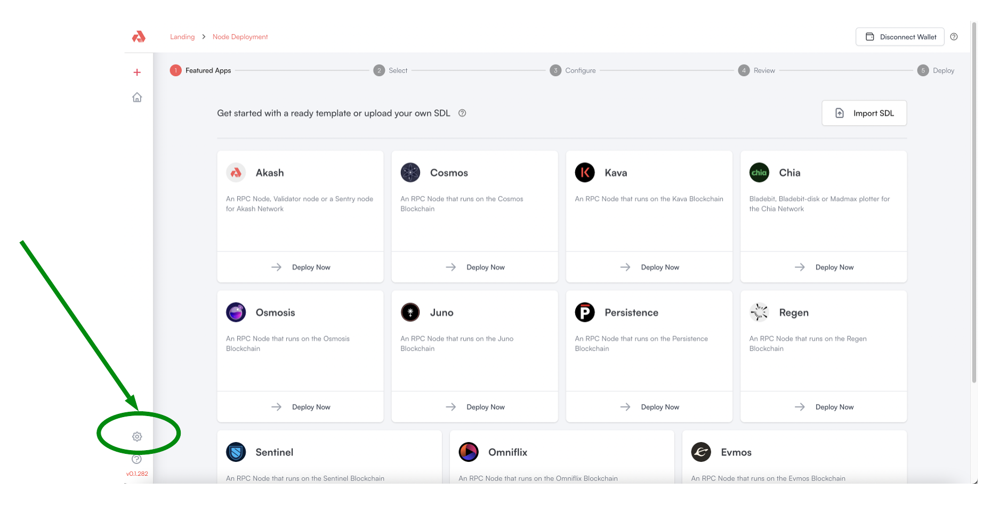
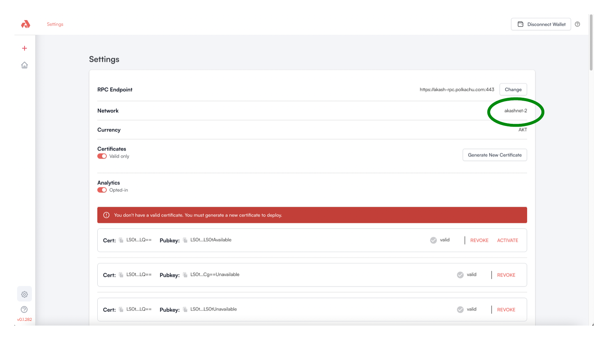
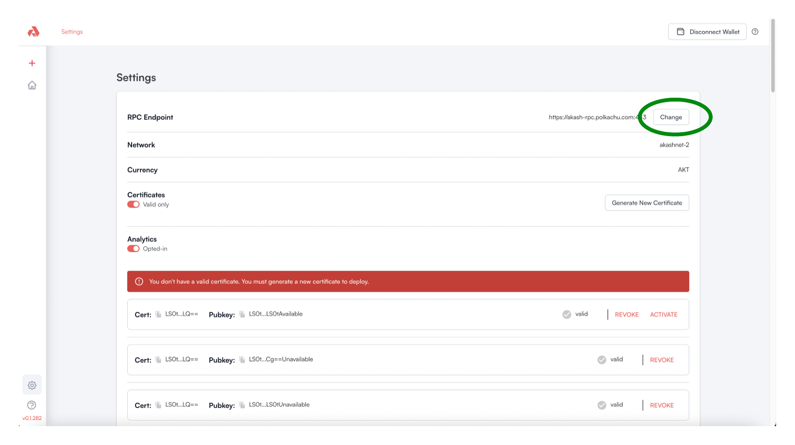
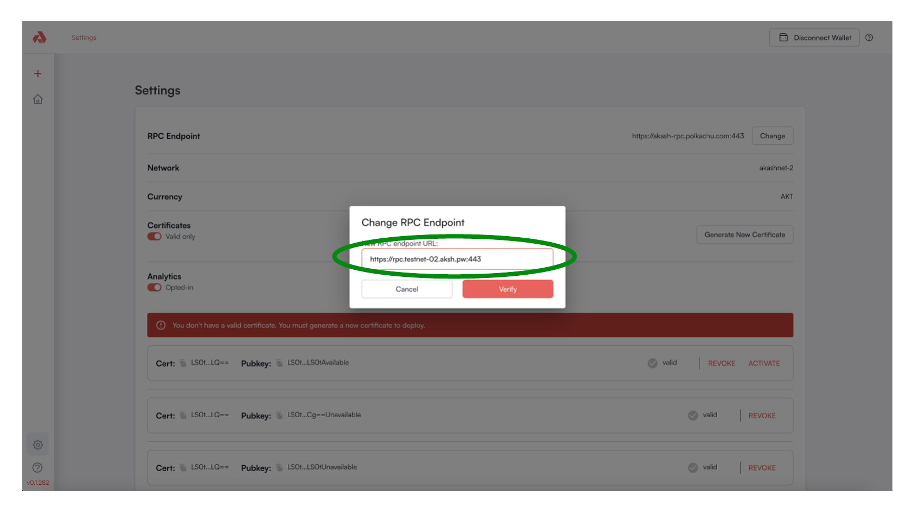
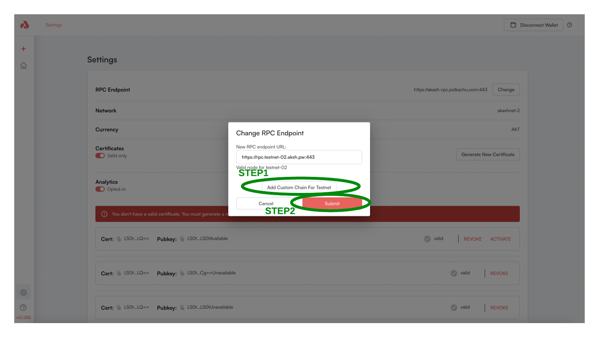

# GPU Testnet Settings

## Configure GPU Testnet Network Settings

* Prior to launching a deployment, we need need to configure a few settings for GPU Testnet use

### Access Settings

* Begin by accessing the Settings via selection of the gear icon and as depicted below

<figure><figcaption></figcaption></figure>

### Initial Settings

* The Console is most likely current configured to interact with the Akash Mainnet
* In the depiction below we find this to be the case.  The Console is connected `mainnet-2` which is the current Mainnet version.

<figure><figcaption></figcaption></figure>

### Update Settings for GPU Testnet Use

* To interact with the GPU Testnet via the Akash Console, select the `Change` button in the `RPC Endpoint` row

<figure><figcaption></figcaption></figure>

* Update the RPC Endpoint to the following value and as depicted in the screenshot
* Press the `Verify` button following the updated value

```
https://rpc.testnet-02.aksh.pw:443
```

<figure><figcaption></figcaption></figure>

### Add New Chain in Keplr

* Add the Akash Testnet network to Keplr by pressing the `Add Custom Chain For Testnet` button and then press the `Submit` buttton when complete

<figure><figcaption></figcaption></figure>
