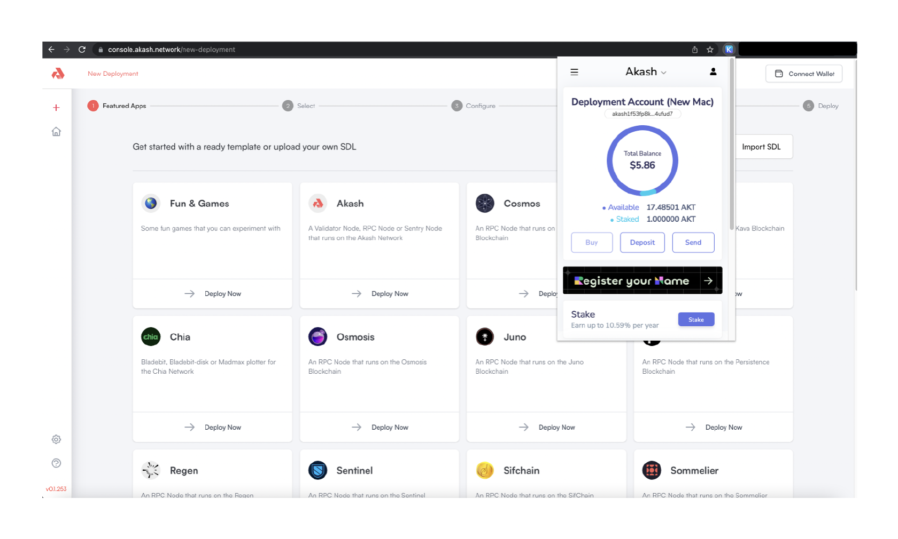
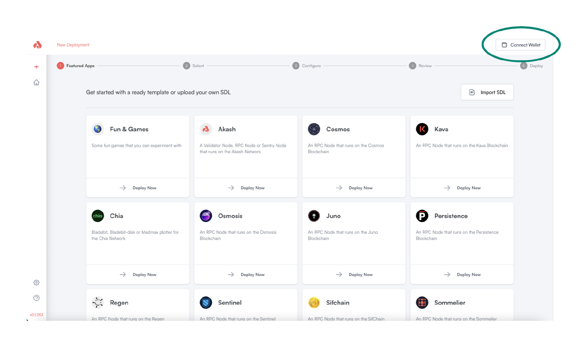
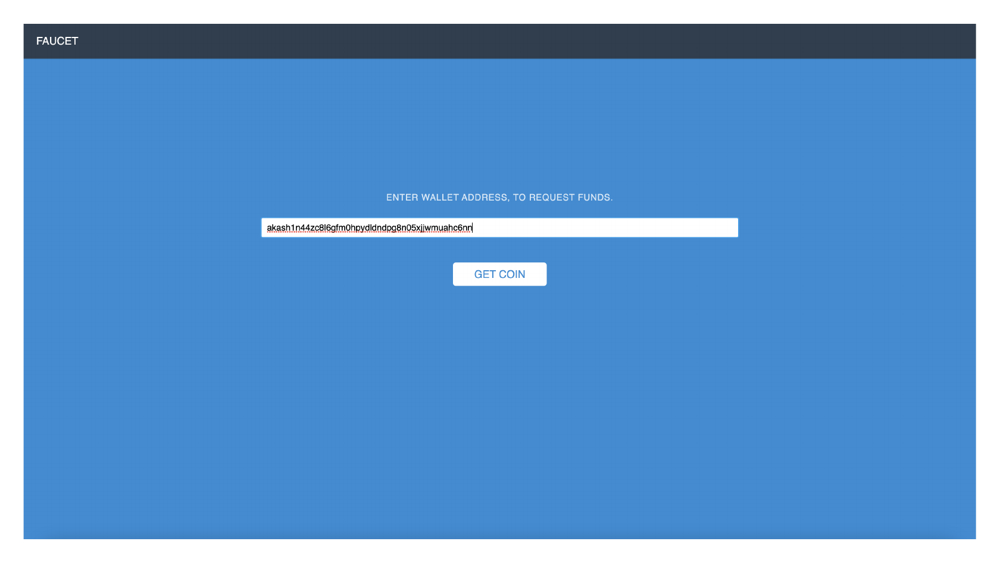

# Keplr Account Selection and Funding

## Keplr Account Selection

Select a pre-existing tAkash account within Keplr.  If you do not have a pre-existing Akash account - use the `Add Wallet` feature within Keplr to create a new account.

<figure><figcaption></figcaption></figure>

## Connect Wallet

Use the `Connect Wallet` button to connect the account selected in Keplr in the prior step to the Akash Console.

<figure><figcaption></figcaption></figure>

## Fund Selected Account via Testnet Faucet

Visit the Testnet faucet [here](http://faucet.testnet-02.aksh.pw/) to fund your provider account. &#x20;

Enter the address of the account selected in previous step.  The address of the account can be copied from the Keplr wallet.

#### Example Use of Akash Testnet Faucet

<figure><figcaption></figcaption></figure>
