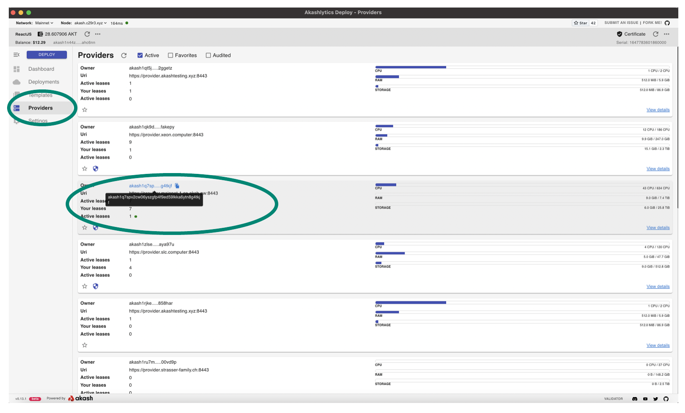
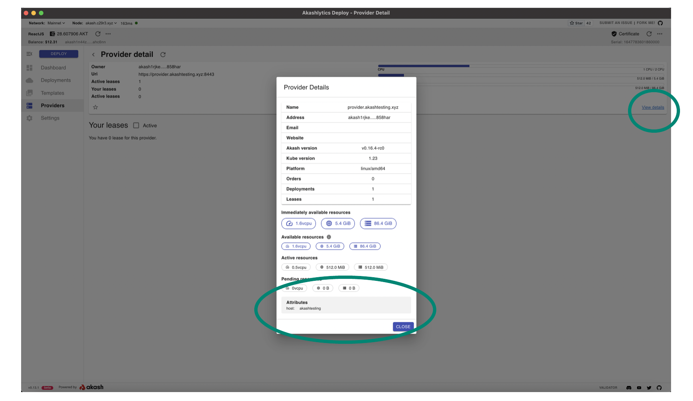

# Prerequisites

In prep for the Akash Provider checkup steps performed in this guide, please ensure the following prerequisites are in place:

* [Familiarity with Cloudmos Deploy](prerequisites.md#familiarity-with-cloudmos-deploy)
* [Obtain Provider Address](prerequisites.md#obtain-provider-address)
* [Familiarity with Your Provider’s Attributes](prerequisites.md#familiarity-with-your-providers-attributes)

## Familiarity with Cloudmos Deploy

For ease of test deployments within this guide and as they relate to verification of your Provider, we will use the Cloudmos Deploy application.

If you are not familiar with the Cloudmos Deploy app - please use this [guide](broken-reference) to complete the installation, ensure you have a deployment wallet funded with a small amount of AKT, and make a quick test deployment.

Alternatively the verifications in this guide could be completed using the Akash CLI if you prefer and which is covered in this [guide](../../../guides/cli/). But the steps below will be detailed assuming Cloudmos use.

## Obtain Provider Address

In most cases your Akash provider address is likely known and was captured during the provider installation steps. If you do not know your provider’s address, which will be necessary for verifications as we proceed, it may be obtained in the Cloudmos app and in the Provider sections shown below.

## **Familiarity with Your Provider’s Attributes**

As test deployments are launched within this guide, we want to ensure that our provider will bid on those deployments. Ensure you are familiar with your provider’s attribute list. The active attributes for a provider can be obtained by drilling into the details within the Cloudmos Provider list by selecting your instance from the list and then drilling into the details as shown.

