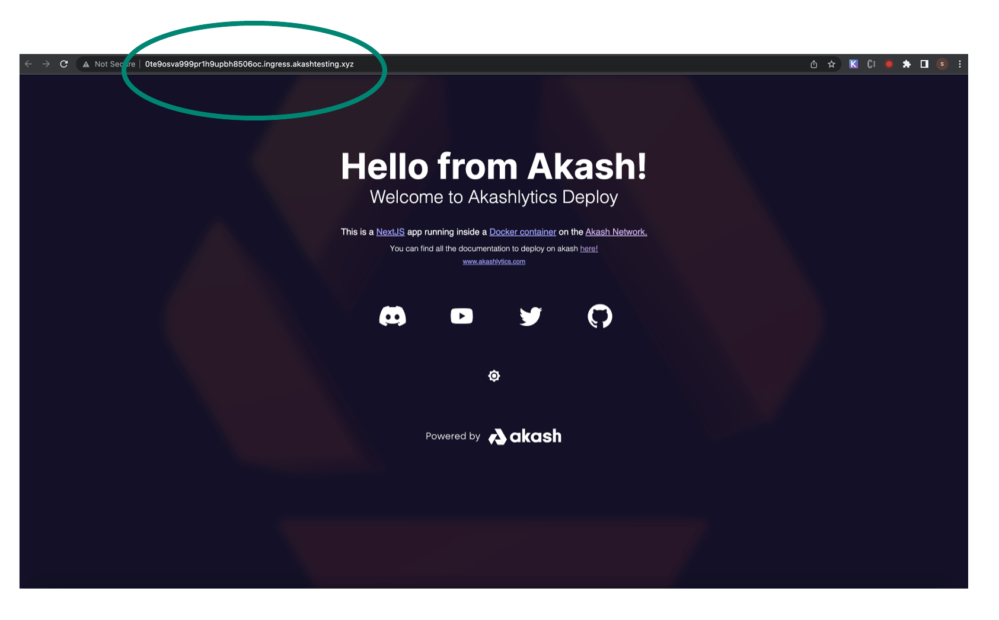

# STEP 2 - Inbound Communication Verifications

* In this step we will verify functionality of inbound communication for active deployments on our provider
* Within the Cloudmos Deployment detail pane > navigate to the LEASES tab > and click the URL of the test deployment

* A new tab within your browser should launch and Hello Akash World home page should display as demonstrated below
* Note - the URL will be directed to the Ingress Controller of your provider Kubernetes cluster
* If this page does not display properly it would indicate an issue with the provider’s Ingress Controller and we should investigate via the [Provider Troubleshooting guide](../../akash-provider-troubleshooting/)

