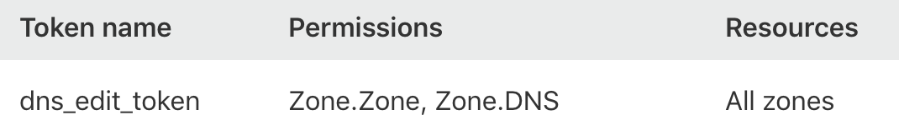
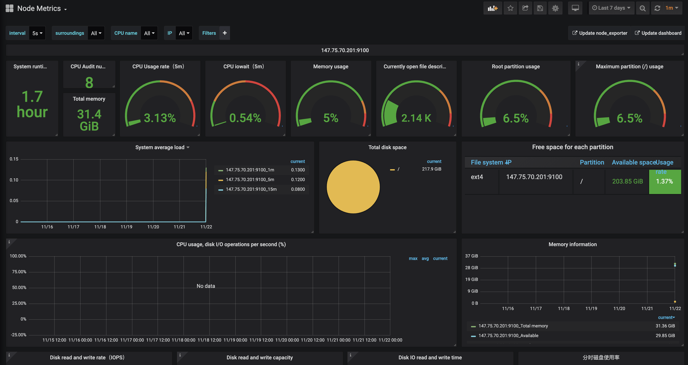

# Setting up Kubernetes for Akash Providers

In this guide, we'll set up a Kubernetes cluster using [Disco](https://disco.akash.network) required to offer computing on the Akash Marketplace.

Although the primary goal fo this guide is educated on you on Akash, you can expect to learn novel workflows on deploying and managing low trust server environments

### Intended Audience

This is a technical guide best suited for an audience with server management experience, comfortable working with the Linux command line. The reader is expected to have:

- Server management experience using Linux.
- Working knowledge of Docker.
- Working knowledge of Kubernetes is preferred, but not mandatory.

### About Disco

Disco (Decentralized Infrastructure for Serverless Computing Operations) is a secure, scalable, standardized softw
are stack for developing, delivering, and debugging decentralized networks.

Disco makes it extremely simple to set up and manage kubernetes and gives you amazing tools to manage a production cluster. Disco is highly customizable and takes a layered approach, meaning each layer can be replaced with an implementation of your choice. In this guide, the layers we'll setup are as follows:

- Layer 0: Bare metal servers on Packet, provisioned using Terraform.
- Layer 1: Kubernetes Cluster with Helm, and Container Storage Interfaces (CSI).
- Layer 2: Observability (Prometheus and Grafana).
- Layer 3: Akash Provider Client.

## Before We Begin

**Domain name**: You will require a publically available Domain name that you control; meaning can update Nameservers and DNS records.

### Services

Akash can run on any computer with Kubernetes. This guide, however, uses [Packet](https://packet.com) as the bare metal provider and [Cloudflare](https://cloudflare.com) for DNS. Please signup to the below services as you'll be using them to complete the tutorial:

- [Packet](https://www.packet.com/developers/api/) - Packet is the hosting provider that is being used. DISCO can also be used with any of the cloud providers [listed here](https://www.terraform.io/docs/providers/index.html). You will need both a `PACKET_API_TOKEN` and a `PACKET_PROJECT_ID`.
- [Cloudflare](https://cloudflare.com) - Cloudflare is the DNS provider used for the demo deployment. DISCO can also be used with any of the cloud providers [listed here](https://www.terraform.io/docs/providers/index.html). You will need a `CLOUDFLARE_API_TOKEN` with `Zone.Zone` and `Zone.DNS` permissions.
- [Keybase](https://keybase.io) - Keybase is used as the git hosting platform for `terraform` state and other sensitive data.

### Software

Install the below required software:

| Tool | Version | Description |
| -- | -- | -- |
| [Akash](https://docs.akash.network/guides/install) | 0.5.4+ |  The Akash Suite is composed of a full node `akashd` and the client `akash` |
| [Keybase](https://keybase.io/download) | 5.0.0 | Keybase is used as the git hosting platform for `terraform` state and other sensitive data |
| [Terraform](https://www.terraform.io) | 0.12.9 | `terraform` is used to provision resources on Packet |
|  [`k3sup`](https://github.com/alexellis/k3sup#download-k3sup-tldr) | 0.3.0 | A great utility for `kubectl config` management! Also makes installing and spinning up a kubernets cluster easy!
| [Helm](https://helm.sh/docs/using_helm/#installing-helm) | 2.14.2 | The package manager for Kubernetes. Helm is the best way to find, share, and use software built for Kubernetes |

## Setup Your Workstation

### Clone Disco

```shell
git clone https://github.com/ovrclk/disco
cd disco
```

### Setting up Keybase Git Repository

DISCO is built using Keybase Teams. When creating systems like this, there is senstitive local data that is needed to create the clusters and the applications on top of them. Keybase teams offers an easy programatic way to securely version, store and share this data.

For example, lets say we're building a `devnet` stack at team `akashnet`. We would first need to create the keybase git repository for it:

```shell
export TEAM=akashnet
export STACK=devnet
```

Set these variables in the `env.mk` file at the root of the repository. For the above example it should look like:

```shell
cat > env.mk <<EOF
TEAM=${TEAM}
STACK=${STACK}
EOF
```

Now, create a Keybase git repository using:

```shell
keybase git create $STACK --team $TEAM
```

You should see a response similar to:

```
Repo created! You can clone it with:
  git clone keybase://team/akashnet/devnet
Or add it as a remote to an existing repo with:
  git remote add origin keybase://team/akashnet/devnet
```

### Setup the directory structure

```shell
make db-setup
```

The `db-setup` task will create the below folder stucture:

```text
data
└── db
    ├── config
    │   ├── nodes
    │   └── providers
    ├── index
    └── keys
```

Define the machine stack dns zones, these domains have to be root level.

```shell
echo mydomain.net > data/db/index/MACHINE_ZONE
```

## Layer 0: Provision Machines and DNS

You can skip to [Layer 1](#layer-1-setup-kubernetes) if you have root access to a bare metal server with DNS mapped to you `$MACHINE_ZONE`.

### Setup Credentials

### Packet

Grab the Packet API Key from [dashboard](https://app.packet.net) under your "User settings > API Keys" and Project ID by clicking on "Project Settings" in the navigaiton bar. Define them in the environment:

```shell
export PACKET_TOKEN='zaEGf8iSE...'
export PACKET_PROJECT_ID='48e3616c..'
```

### Cloudflare

Grab you Cloudflare API keys from the [dashboard](https://dash.cloudflare.com) under "My Profile" > "API Tokens".  Set the permissions to `Zone.Zone, Zone.DNS` for `All Zones`, similar to:



Define the key in your environment:

```shell
CLOUDFLARE_API_TOKEN='68d3616c..'
```

Set these values in the secure data repository:

```shell
echo $PACKET_TOKEN > data/db/keys/packet.api.token
echo $PACKET_PROJECT_ID > data/db/keys/packet.project.id
echo $CLOUDFLARE_API_TOKEN > data/db/keys/cloudflare.api.token
```

### Provision Resources using Terraform

In this step you are provisioning a Bare metal server on Packet (t1.small.x86) that costs $0.07/Hr. You will need it for less than an hour to complete this tutorial.

```shell
make layer0-init layer0-apply
```

You will see an output similar to when your `MACHINE_ZONE` variable is set to `ovrclk2.com`

```
...
Outputs:

node_access_public_ipv4 = 147.75.70.201
node_root_password = ^)40zJ(s1h
node_zone_record = 147.75.70.201 akash.ovrclk2.com
node_zone_record_wc = 147.75.70.201 *.akash.ovrclk2.com
 ```

Grab the host and IP address and set that in your environment, In the below example, replace `akash.ovrclk2.com` and `147.75.70.201` with your values:

```shell
export HOST=akash.ovrclk2.com
export MASTER_IP=147.75.70.201
```

Commit and save your changes using:

```shell
make db-commit db-push
```

## Layer 1: Setup Kubernetes

First ensure you have the environment variables setup from the previous section, replace `akash.sjc1.ovrclk2.com` and `147.75.70.201` with your values:

```shell
export HOST=akash.ovrclk2.com
export MASTER_IP=147.75.70.201
```

Please note, if you are using a domain not automated by the previous step (cloudflare), make sure to map your `$HOST` and wildcard to the host, `*.$HOST` mapped to the `$MASTER_IP`. For example, for the above values:

```text
A akash.ovrclk2.com 147.75.70.201
A *.akash.ovrclk2.com 147.75.70.201
```

Verify using dig:

```sh
dig +short akash.ovrclk2.com
dig +short foo.akash.ovrclk2.com
```

Should your `$MASTER_IP`, example:

```
147.75.70.201
147.75.70.201
```

Install Kubernetes by running the below:

```shell
make layer1-install HOST=$HOST MASTER_IP=$MASTER_IP
```

Set up `KUBECONFIG` environment variable:

```shell
export KUBECONFIG=$(make kube-config-path HOST=$HOST MASTER_IP=$MASTER_IP)
```

Verify using:

```shell
kubectl cluster-info
```

You should see an output similar to below when your `MASTER_IP` is `147.75.70.201`:

```
Kubernetes master is running at https://147.75.70.201:6443
CoreDNS is running at https://147.75.70.201:6443/api/v1/namespaces/kube-system/services/kube-dns:dns/proxy
```

Verify you have required components, `traefik`, `coredns`. `csi-node` and `csi-packet-controller` when using paket:

```shell
kubectl get pods -A
```

```
kube-system   coredns-66f496764-hpz6q          1/1     Running     0          6m47s
kube-system   helm-install-traefik-9qn28       0/1     Completed   0          6m47s
kube-system   svclb-traefik-4cqrp              3/3     Running     1          6m28s
kube-system   tiller-deploy-767d9b9584-w7qcn   1/1     Running     0          6m47s
kube-system   traefik-d869575c8-jxcjk          1/1     Running     0          6m28s
kube-system   csi-node-nchzj                   2/2     Running     0          6m19s
kube-system   csi-packet-controller-0          3/3     Running     0          6m19
```


## Layer 2: Deploy Observability Stack

```
make layer2-install HOST=$HOST MASTER_IP=$MASTER_IP
```

You can verify by running checking if the pods were created:

```
kubectl get pods -n monitoring
```

You should an output similar to:

```
NAME                                             READY   STATUS    RESTARTS   AGE
prometheus-node-exporter-g4w7h                   1/1     Running   0          2m6s
prometheus-kube-state-metrics-6cd8cdc7b7-zrpv9   1/1     Running   0          2m6s
prometheus-pushgateway-655f59475-8x9zb           1/1     Running   0          2m6s
grafana-5866c8596f-fw4g5                         1/1     Running   0          2m5s
metrics-server-77f4b87964-z945p                  1/1     Running   0          2m3s
prometheus-alertmanager-5548dbcdbf-2h6qw         2/2     Running   0          2m6s
prometheus-server-596dcdfc99-5l8nx               2/2     Running   0          2m6s
```

Open the Graphana dashboard by running below:

```
open "http://status.$HOST"
```

Login using `admin` for username and `insecure` for password. Navigate to Dashboards". You should see a Dashboard like the below:



## Layer 3: Setup Akash Provider

### Create a Key for the Provider

First, create a key locally that we'll use as an identifier.

```shell
akash key create provider
```

You should see a response similar to, for the user `alice`:

```text
(info)  [key] key created

Create Key
==========

Name:           	provider
Public Key:     	4fbe42a0f09ed555ef36566d148a15bae5a694db
Recovery Codes: 	album return owner forget top scissors kangaroo escape panther history liberty industry raise surge trigger jealous fit erase horn era hero dust weekend slim
```

### Add the Provider to the Network

Create a config file with various attributes to your offering, such as `region`. By running  `akash provider status` , you can get an idea of what attributes to use. In our example, we set the region to `sfo`.

```shell
export INGRESS="akash.$(cat data/db/index/MACHINE_ZONE)"
export MONIKER=${USER}
```

```shell
cat > data/db/config/providers/provider.yml <<EOF
hostURI: http://${INGRESS}
attributes:
  - name: region
    value: sfo
  - name: moniker
    value: ${MONIKER}
EOF
```

To register, run the below and save the key as this is your unique identifier.

```shell
akash provider add data/db/config/providers/provider.yml --key provider
```

You will see an output similar to:

```
(info)  [provider] provider added

Add Provider
============

Key: 	7e99e953d23570c2350ae6eee6937d00b6accc258f1904c4547b7aabd900b1dd
```

Save the `Key` from the output and store in the db `PROVIDER`

```
echo 7e99e953d23570c2350ae6eee6937d00b6accc258f1904c4547b7aabd900b1dd > data/db/keys/provider.address
```

### Deploy Akash Provider Service on Kubernetes

#### Create a Kubernetes Secret for your Private Key

To create a secret for the private key,  first export the private key to a file using `key show --private` and then create a kubernetes secret.


```shell
akash key show provider --private > data/db/keys/akash-provider.private
```

```shell
kubectl create secret generic akash-provider-private-key --from-file=data/db/keys/akash-provider.private
```

Confirm using `kubectl describe secret akash-provider-private-key`. You should see a response similar to:

```
Name:         akash-provider-private-key
Namespace:    default
Labels:       <none>
Annotations:  <none>

Type:  Opaque

Data
====
key:      505 bytes
keyname:  5 bytes
```

#### Deploy to Kubernetes

 

##### Using Helm

Simplest way to install Akash is using Helm. Add the Akash Network Helm repo:

```shell
helm repo add akash https://helm.akash.network
helm repo update
```

Install Akash Provider Chart by:

```shell
INGRESS="akash.$(cat data/db/index/MACHINE_ZONE)"
PROVIDER=$(cat data/db/keys/provider.address)

helm install akash/akash-provider \
  --name akash-provider \
  --set "ingress.domain=$INGRESS" \
  --set "provider.address=$PROVIDER"
```

 

##### Using kubectl

First, create kubernetes deployment configuration using:

```shell
cat > akash-provider.yml <<EOF
---
apiVersion: rbac.authorization.k8s.io/v1beta1
kind: ClusterRoleBinding
metadata:
  name: akash-provider
  labels:
    app: akash-provider
subjects:
  - kind: ServiceAccount
    name: default
    namespace: default
roleRef:
  kind: ClusterRole
  name: cluster-admin
  apiGroup: rbac.authorization.k8s.io

---
apiVersion: v1
kind: Service
metadata:
  name: akash-provider
  labels:
    app: akash-provider
spec:
  ports:
    - port: 3001
      name: http
      type: HTTP
  selector:
    app: akash-provider

---
apiVersion: apps/v1beta2
kind: Deployment
metadata:
  name: akash-provider
  labels:
    app: akash-provider
    akash.network/component: provider
spec:
  selector:
    matchLabels:
      app: akash-provider
  template:
    metadata:
      labels:
        app: akash-provider
        akash.network/component: provider
    spec:
      containers:
        - name: akash-provider
          image: "ovrclk/akash:latest"
          imagePullPolicy: IfNotPresent
          command:
            - "/akash"
            - "provider"
            - "run"
            - "${PROVIDER}"
            - "--key"
            - "${KEY}"
            - "--private-key"
            - "/private/private.key"
            - "--kube"
          env:
            - name: AKASH_HOST
              value: http://${INGRESS}
            - name: AKASH_NODE
              value: "http://api.akashtest.net:80"
            - name: AKASH_DEPLOYMENT_SERVICE_TYPE
              value: "ClusterIP"
            - name: AKASH_DEPLOYMENT_INGRESS_STATIC_HOSTS
              value: "true"
            - name: AKASH_DEPLOYMENT_INGRESS_DOMAIN
              value: ${INGRESS}
          ports:
            - containerPort: 3001
              name: http
          volumeMounts:
            - name: config
              mountPath: /private
              readOnly: true
      volumes:
        - name: config
          secret:
            secretName: akash-provider-private-key
            items:
              - key: key
                path: private.key

---
apiVersion: extensions/v1beta1
kind: Ingress
metadata:
  name: akash-provider
  labels:
    app: akash-provider
spec:
  rules:
    - host: ${ingress}
      http:
        paths:
          - backend:
              serviceName: akash-provider
              servicePort: http

EOF
```

Make sure the values are populated correctly and use `kubectl` to deploy:

```shell
kubectl apply -f akash-provider.yml
```
 


##### Verify

Verify by cURL and by checking status

```shell
akash provider status $PROVIDER
```

You should see a response similar to:

```
Active Provider(s) Status
=========================

Provider:    	7e99e953d23570c2350ae6eee6937d00b6accc258f1904c4547b7aabd900b1dd
Attributes:  	region: sfo
Version:     	commit: 43ef4e6c1e2ce1495f417e00e9c441e14017b135 | date: 2019-11-21T01:36:34Z | version: 0.5.4-rc3
Leases:      	0
Deployments: 	0
Orders:      	0
Active:
Pending:
Available:   	cpu: 7825 | disk: 222 GB | mem: 32 GB
Message(s):  	code=200  msg=OK
```

Alternatively, you can use cURL as well

```
curl http://akash.ovrclk2.com/status
```

## Conclusion

Congratulations, you are now an Akash Provider! Finally, make sure to save your changes to db and share with your team.

```
make db-commit
make db-push
```

We hope you found this guide useful. We gave our best to keep the it accurate and updated. If there is any part of the guide that you felt could use improvement, make your updates in a [fork](http://github.com/ovrclk/docs) and send me a pull request. We will attend to it promptly.
