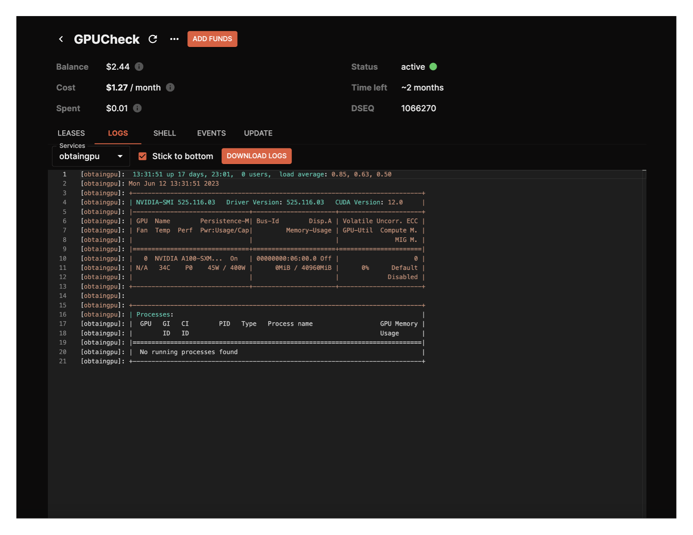

# Specific GPU Vendor & Model

## Overview

In the example SDL provided below the following request is made:

* GPU Quantity: 1
* GPU Vendor: NVIDIA
* GPU Model: T4

Based on these inclusions in the SDL - only providers that have NVIDIA T4 chips will respond with a bid.

## SDL Example

```
---
version: "2.0"

services:
  obtaingpu:
    image: ubuntu:22.04
    command:
      - "sh"
      - "-c"
    args:
      - 'uptime;
        nvidia-smi;
        sleep infinity'
    expose:
      - port: 8080
        as: 80
        to:
          - global: true

profiles:
  compute:
    obtaingpu:
      resources:
        cpu:
          units: 1.0
        memory:
          size: 1Gi
        gpu:
          units: 1
          attributes:
            vendor:
              nvidia:
                - model: t4
        storage:
          size: 1Gi
  placement:
    akash:
      pricing:
        obtaingpu: 
          denom: uakt
          amount: 100000

deployment:
  obtaingpu:
    akash:
      profile: obtaingpu
      count: 1

```

## Confirmation

* The SDL used in the provided example prints the GPU Model/Chip Type to the logs as depicted below
* We can use these logs to determine the success of the deployment and confirm that the requested GPU model/type was allocated

<figure><figcaption></figcaption></figure>
