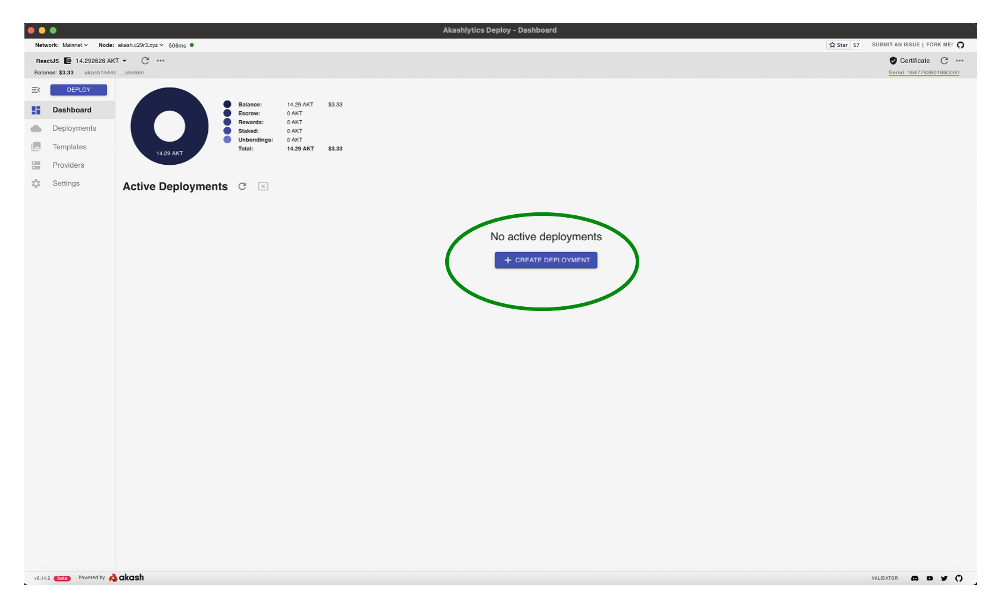
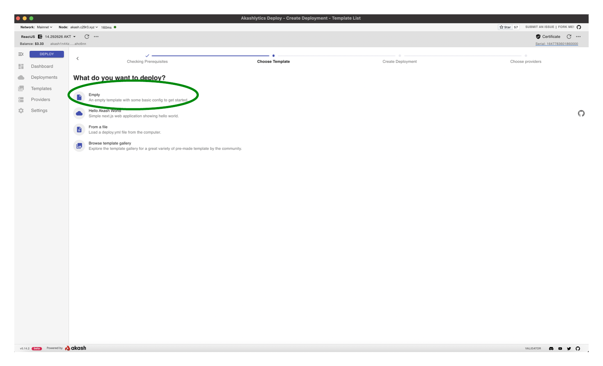
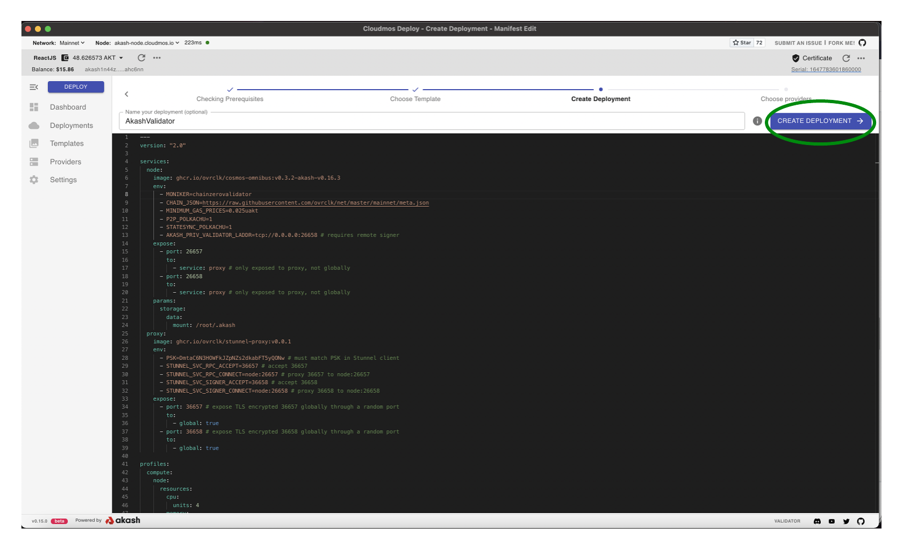
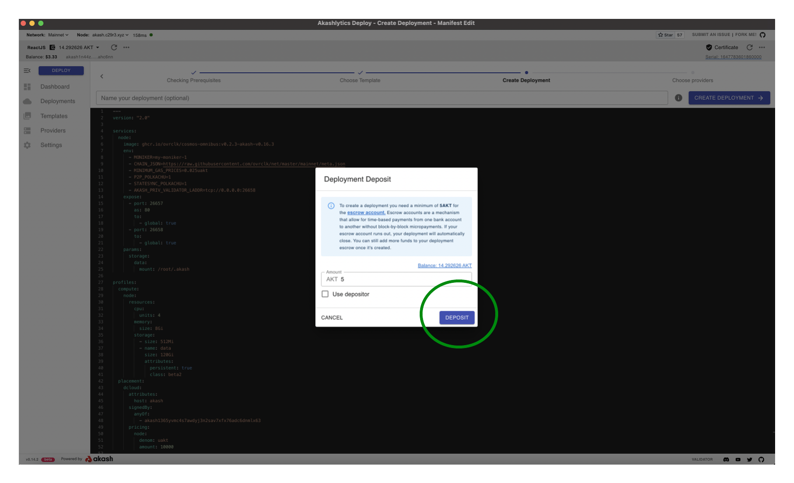
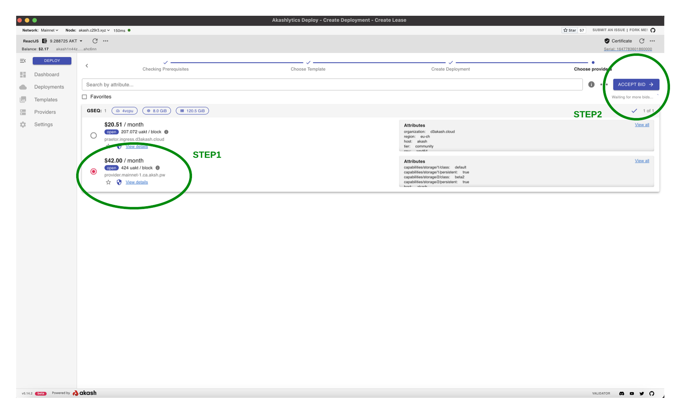
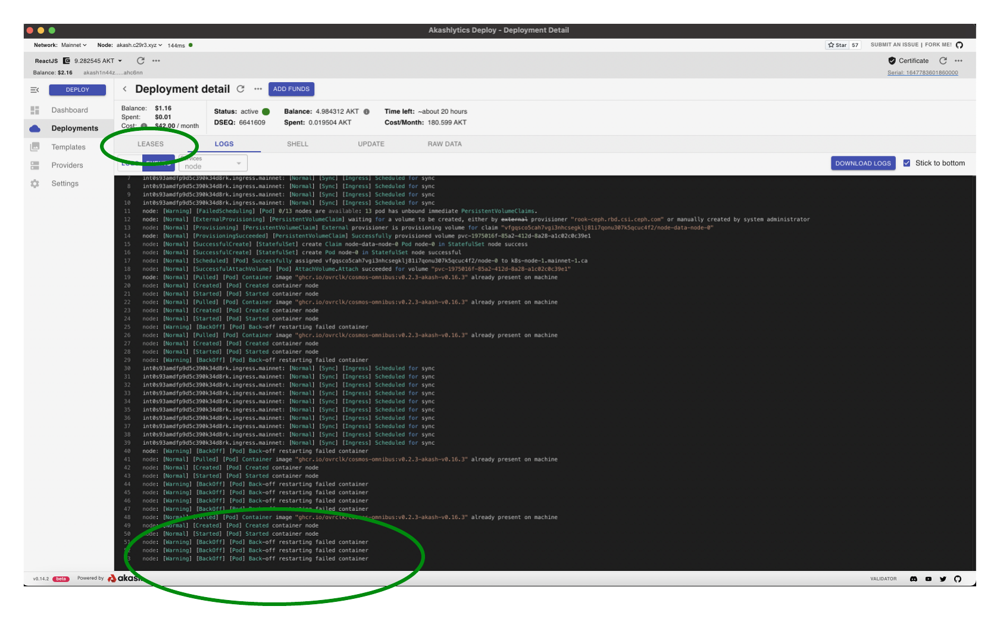
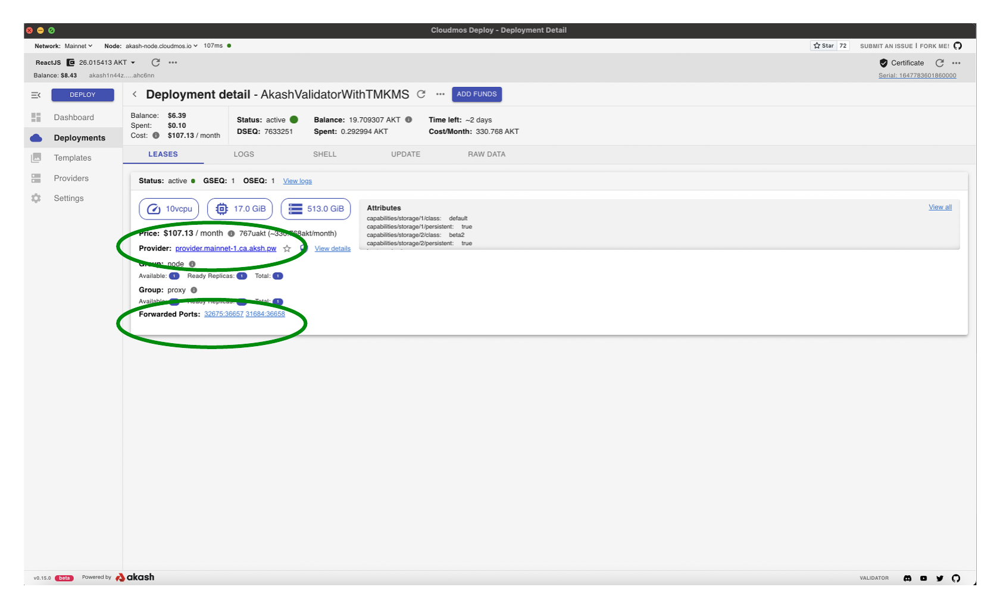

# Akash Validator Deployment

## Cloudmos Deploy

* Within this guide we will use the Cloudmos Deploy application to create the Akash Validator
* Please review our[ Cloudmos Deploy ](broken-reference)docs to install and configure the application if this is your first time using

## Create the Akash Validator Deployment

* Use the steps that follow - within Cloudmos Deploy - to create your Akash Validator deployment
* The Akash SDL used additionally spins up a Stunnel server to facilitate secure communication with the TMKMS server created in later steps

### Create New Deployment

* Use the `CREATE DEPLOYMENT` button to launch a new deployment



### Empty Template Option

* Select the `Empty` option as we will be copying a pre-constructed Akash SDL for the deployment



### Copy SDL into Editor

* Copy the following Akash SDL into the Editor pane
* Reference the [Populated Editor](akash-validator-deployment.md#populated-editor) section of this guide for further clarity
* Note that the SDL is using persistent storage to allow data residency should your deployment restart.  Data will only persist thru the life of the associated Akash lease.

> To ensure the most to update SDL is utilized, view the latest version [here](https://github.com/ovrclk/cosmos-omnibus/blob/09679171d513586b5e1a9aafe73db55ebdbf5098/\_examples/validator-and-tmkms/deploy.yml).

#### SDL Edits

* Consider updating the Pre-Shared Key (PSK) value in the  `proxy` service > `env` stanza to your own unique value.  The pre-shared key must match that which is defined in the upcoming [Stunnel Client](stunnel-client.md) configuration.
* Update the MONIKER in the `node` service > `env` stanza to your own name/organization name.
*   No additional edits of this SDL are necessary for Akash Validator creation.


```
---
version: "2.0"

services:
  node:
    image: ghcr.io/ovrclk/cosmos-omnibus:v0.3.2-akash-v0.16.3
    env:
      - MONIKER=my-moniker-1
      - CHAIN_JSON=https://raw.githubusercontent.com/ovrclk/net/master/mainnet/meta.json
      - MINIMUM_GAS_PRICES=0.025uakt
      - P2P_POLKACHU=1
      - STATESYNC_POLKACHU=1
      - AKASH_PRIV_VALIDATOR_LADDR=tcp://0.0.0.0:26658 # requires remote signer
    expose:
      - port: 26657
        to:
          - service: proxy # only exposed to proxy, not globally
      - port: 26658
        to:
          - service: proxy # only exposed to proxy, not globally
    params:
      storage:
        data:
          mount: /root/.akash
  proxy:
    image: ghcr.io/ovrclk/stunnel-proxy:v0.0.1
    env:
      - PSK=DmtaC6N3HOWFkJZpNZs2dkabFT5yQONw # must match PSK in Stunnel client
      - STUNNEL_SVC_RPC_ACCEPT=36657 # accept 36657
      - STUNNEL_SVC_RPC_CONNECT=node:26657 # proxy 36657 to node:26657
      - STUNNEL_SVC_SIGNER_ACCEPT=36658 # accept 36658
      - STUNNEL_SVC_SIGNER_CONNECT=node:26658 # proxy 36658 to node:26658
    expose:
      - port: 36657 # expose TLS encrypted 36657 globally through a random port
        to:
          - global: true
      - port: 36658 # expose TLS encrypted 36658 globally through a random port
        to:
          - global: true

profiles:
  compute:
    node:
      resources:
        cpu:
          units: 4
        memory:
          size: 8Gi
        storage:
          - size: 512Mi
          - name: data
            size: 120Gi
            attributes:
              persistent: true
              class: beta2
    proxy:
      resources:
        cpu:
          units: 1
        memory:
          size: 512Mi
        storage:
          size: 512Mi
  placement:
    dcloud:
      attributes:
        host: akash
      signedBy:
        anyOf:
          - akash1365yvmc4s7awdyj3n2sav7xfx76adc6dnmlx63
      pricing:
        node:
          denom: uakt
          amount: 10000
        proxy:
          denom: uakt
          amount: 10000

deployment:
  node:
    dcloud:
      profile: node
      count: 1
  proxy:
    dcloud:
      profile: proxy
      count: 1
```

#### Populated Editor

> _**NOTE**_- SDL spans past the view in this panel and bottom portion is not displayed

* Select the `CREATE DEPLOYMENT` button to proceed

<figure><figcaption></figcaption></figure>

### Deployment Deposit

* An escrow account is created for the deployment that is deducted from by the provider for the cost of the workload over time
* By default 5 AKT is specified as the initial escrow deposit
* If a deployment's escrow runs out of funds (0 AKT), the lease will be closed by the provider. Consider increasing the initial deposit to an amount that will be enough to fund the deployment for some time. And/or consider a strategy to ensure the escrow is re-funded on a periodic basis to ensure no disruption to your validator.
* When ready select `DEPOSIT` to proceed and `APPROVE` any Transaction/gas fee prompts that follow



### Select Akash Provider

* A list of Akash Providers that have bid on your deployment is displayed
* Choose the desired Provider from the list and then select `ACCEPT BID` to proceed



### Deployment Logs

* The `LOGS > EVENTS` pane for the new Deployment will display
* _**NOTE**_ - after a period of time the logs will display a `Back-off restarting failed container` message. This is expected as the container will not start until it has established a connection with the TMKMS server in subsequent steps.
* Select the `LEASES` tab to proceed into the next step



### Capture Deployment URI and Port

* In upcoming TMKMS configuration sections we will need to specify our Akash Validator deployment's URI and port
* Capture this info from the `LEASES` tab for later use and specifically in the Stunnel Client section
* In the example the following values would be captured (these values will be different for your deployment):

> * **URI** - using the Provider field - `provider.mainnet-1.ca.aksh.pw`
> * _**Signer Port**_ - using the Forwarded Port field and capturing the port forward to `36658` which in this example is `31684`
> * _**Proxy/RPC Port**_ -using the Forwarded Port field and capturing the port forward to `36657` which in this example is `32675`

<figure><figcaption></figcaption></figure>
