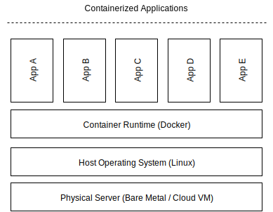

# Introduction

Akash is a permissionless marketplace for trading compute cycles. It aims to create efficiencies in the cloud hosting market through algorithms for allocating compute resources which go to waste in the current market. In this paper, we present the economics of the Akash Network by introducing the Akash Token (AKT) model, which is designed to a) maintain ecosystem sovereignty, b) provide economic security, and c) encourage early adoption by offering *10x lower* cost than current market solutions. Here are some definitions:

Akash Token (AKT)

:  AKT is the native token of the Akash Network. The core utility of AKT acts as a staking mechanism to secure the network and normalize compute prices for the marketplace auction. The amount of AKTs staked towards a validator defines the frequency by which the validator may propose a new block and its weight in votes to commit a block. In return for bonding (staking) to a validator, an AKT holder becomes eligible for block rewards (paid in AKT) as well as a proportion of transaction fees and service fees (paid in any of the whitelisted tokens).

Validator

:   Validators secure the Akash network by validating and relaying transactions, proposing, verifying and finalizing blocks. There will be a limited set of validators, initially 64, which are required to maintain a high standard of automated signing infrastructure. Validators charge *delegators* a commission fee in AKT.

Delegator

:   Delegators are holders of the AKT and use some or all of their tokens to secure the Akash chain. In return, delegators earn a proportion of the transaction fee as well as block rewards.

Provider

:  Providers offer computing cycles (usually unused) on the Akash network and earn a fee for their contributions. Providers are required to maintain a stake in AKT as collateral, proportional to the hourly income earned; hence, every provider is a delegator and/or a validator.

Tenant

:   Tenants lease computing cycles offered by providers for a market-driven price (set using a reverse auction process described in below section).

## Marketplace Overview

A unit of computing (*CPU, Memory, Disk*) is leased as a container on Akash. A container [@container] is a standard unit of software that packages up code and all its dependencies, so the application runs quickly and reliably from one computing environment to another. A container image is a lightweight, standalone, executable package of software that includes everything needed to run an application: code, runtime, system tools, system libraries, and settings.

Any one with a physical machine (ie, computer, server) can slice the machine's resources into containers using a process called virtualization. Docker is a company that provides widely adopted container virtualization technology, and it is common to refer to containers as "docker images." The relation between a physical computer and a container is illustrated in [@fig:containers]).

All marketplace transactions are on the Akash blockchain. To lease a container, the *tenant* (developer) requests a deployment by specifying the type(s) of unit(s), and the quantity of each type of unit. To specify a type of unit, the tenant specifies attributes to match, such as region (e.g. US) or privacy features (e.g. Intel SGX). The tenant also specifies the maximum price they are willing to pay for each type of unit.

An *order* is created in the order book (upon acceptance by a validator).

The *provider(s)* that match all the requirements of the order then place a *bid* by competing on price. The provider that bids the lowest amount on the order wins, upon which a *lease* is created between the tenant and the provider for the order.

{#fig:containers}

### Take Rate

For every successful lease created, a portion of the lease amount (*Take Fee*) goes to a *Take Income Pool*. The Take income is later distributed to stakers based on their stake weight (amount stake and lock up). The *Take Rate* depends on currency used for settlement. The proposed rates at Genesis when using AKT is 10% and 20% when any other currencies are used. The *Take Rate* parameters is subject to community consensus managed by the governance.
