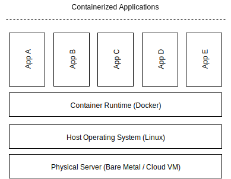
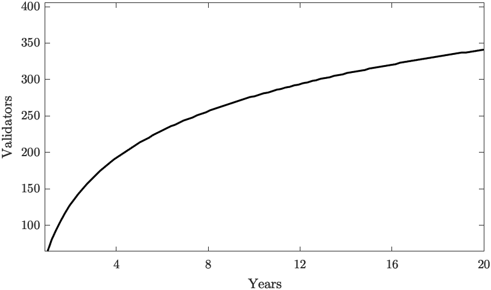

# Network Overview

The Akash Network is a secure, transparent, and decentralized cloud computing marketplace that connects those who need computing resources (clients) with those that have computing capacity to lease (providers). Akash acts as a *supercloud* platform providing a unified layer above all providers on the marketplace so as to present clients with a single cloud platform, regardless of which particular provider they may be using.

Tenants use Akash because of its cost advantage, usability, and flexibility to move between cloud providers, and the performance benefits of global deployments. Providers use Akash because it allows them to earn profits from either dedicated or temporarily-unused capacity.

A unit of computing (*CPU, Memory, Disk*) is leased as a container on Akash. A container [@container] is a standard unit of software that packages up code and all its dependencies, so the application runs quickly and reliably from one computing environment to another. A container image is a lightweight, standalone, executable package of software that includes everything needed to run an application: code, runtime, system tools, system libraries, and settings.

Any one with a physical machine (ie, computer, server) can slice the machine's resources into containers using a process called virtualization. Docker is a company that provides widely adopted container virtualization technology, and it is common to refer to containers as "docker images." The relation between a physical computer and a container is illustrated in [@fig:containers]).

All marketplace transactions are on the Akash blockchain. To lease a container, the *tenant* (developer) requests a deployment by specifying the type(s) of unit(s), and the quantity of each type of unit. To specify a type of unit, the tenant specifies attributes to match, such as region (e.g. US) or privacy features (e.g. Intel SGX). The tenant also specifies the maximum price they are willing to pay for each type of unit.

An *order* is created in the order book (upon acceptance by a validator).

The *provider(s)* that match all the requirements of the order then place a *bid* by competing on price. The provider that bids the lowest amount on the order wins (and match requirements), upon which a *lease* is created between the tenant and the provider for the order. For every successful lease, a portion of the lease amount (*Take Fee*) is paid to the stakers as describe in [@sec:take-fee].

{#fig:containers}

## Proof of Stake Based Consensus {#sec:consensus}

Akash employs a blockchain secured by a *Proof-of-Stake* consensus model as a Sybil resistance mechanism for determining participation in its consensus protocol and implements the Tendermint [@tendermint] algorithm for Byzantine fault-tolerant consensus. Tendermint was designed to address the speed, scalability, and environmental concerns with Proof of Work with the below set of properties:

a) Validators take turns producing blocks in a weighted round-robin fashion, meaning the algorithm has the ability to seamlessly change the leader on a per-block basis.

b) Strict accountability for Byzantine faults allows for punishing misbehaving validators and providing economic security for the network.

Anyone who owns an Akash token can bond (or delegate) their coins and become a validator, making the validator set open and permissionless. The limited resource of Akash tokens acts as a Sybil prevention mechanism.

Voting power is determined by a validator’s bonded stake (not reputation or real-world identity). No single actor can create multiple nodes in order to increase their voting power as the voting power is proportional to their bonded stake. Validators are required to post a “security deposit” which can be seized and burned by the protocol in a process known as “slashing”.

These security deposits are locked in a bonded account and only released after an “unbonding period” in the event the staker wishes to unbond. Slashing allows for punishing bad actors that are caught causing any attributable Byzantine faults that harm the well-functioning the system.

The slashing condition and the respective attributable Byzantine faults and punishments are beyond the scope of this paper. (For more information on these, please review Akash Network Technical White paper).

### Limits on Number of Validators

Akash's blockchain is based on Tendermint consensus which gets slower with more validators due to the increased communication complexity. Fortunately, we can support enough validators to make for a robust globally distributed blockchain with very fast transaction confirmation times, and, as bandwidth, storage, and parallel compute capacity increases, we will be able to support more validators in the future.

On Genesis day, the number of validators $V_i$ is set to $V_i(0) = V_{i,0} = 64$ and the number of validators at time $t~year$ will be:

$$
V_n(t) = \lceil \log_2(2t) \cdot V_{i,0} \rceil
$$

So, in $10~years$, there will be $V_n(10) = 277$ validators as illustrated in [@fig:validator-count]

{#fig:validator-count}
