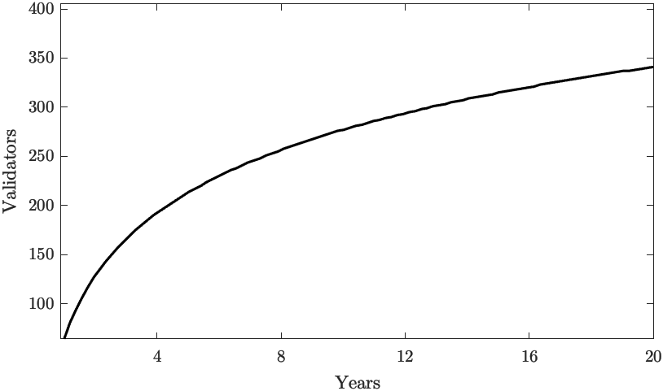

# Proof of Stake Using Tendermint Consensus

Akash employs a blockchain secured by a *Proof-of-Stake* consensus model as a Sybil resistance mechanism for determining participation in its consensus protocol and implements the Tendermint [@tendermint] algorithm for Byzantine fault-tolerant consensus. Tendermint was designed to address the speed, scalability, and environmental concerns with Proof of Work with the below set of properties:

a) Validators take turns producing blocks in a weighted round-robin fashion, meaning the algorithm has the ability to seamlessly change the leader on a per-block basis.

b) Strict accountability for Byzantine faults allows for punishing misbehaving validators and providing economic security for the network.

Anyone who owns an Akash token can bond (or delegate) their coins and become a validator, making the validator set open and permissionless. The limited resource of Akash tokens acts as a Sybil prevention mechanism.

Voting power is determined by a validator’s bonded stake (not reputation or real-world identity). No single actor can create multiple nodes in order to increase their voting power as the voting power is proportional to their bonded stake. Validators are required to post a “security deposit” which can be seized and burned by the protocol in a process known as “slashing”.

These security deposits are locked in a bonded account and only released after an “unbonding period” in the event the staker wishes to unbond. Slashing allows for punishing bad actors that are caught causing any attributable Byzantine faults that harm the well-functioning the system.

The slashing condition and the respective attributable Byzantine faults and punishments are beyond the scope of this paper. (For more information on these, please review Akash Network Technical White paper).

## Limits on Number of Validators

Akash's blockchain is based on Tendermint consensus which gets slower with more validators due to the increased communication complexity. Fortunately, we can support enough validators to make for a robust globally distributed blockchain with very fast transaction confirmation times, and, as bandwidth, storage, and parallel compute capacity increases, we will be able to support more validators in the future.

On Genesis day, the number of validators $V_i$ is set to $V_i(0) = V_{i,0} = 128$ and the number of validators at time $t~year$ will be:

$$
V_n(t) = | \log_2(t+1) \cdot V_{i,0} |
$$

So, in $10~years$, there will be $V_n(10) = 442$ validators as illustrated in [@fig:validator-count]

{#fig:validator-count}

