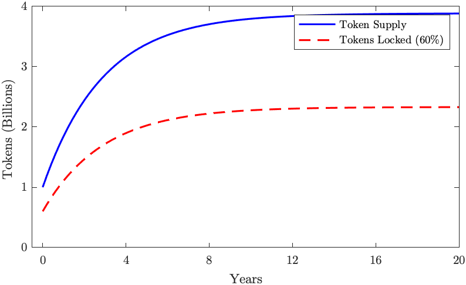
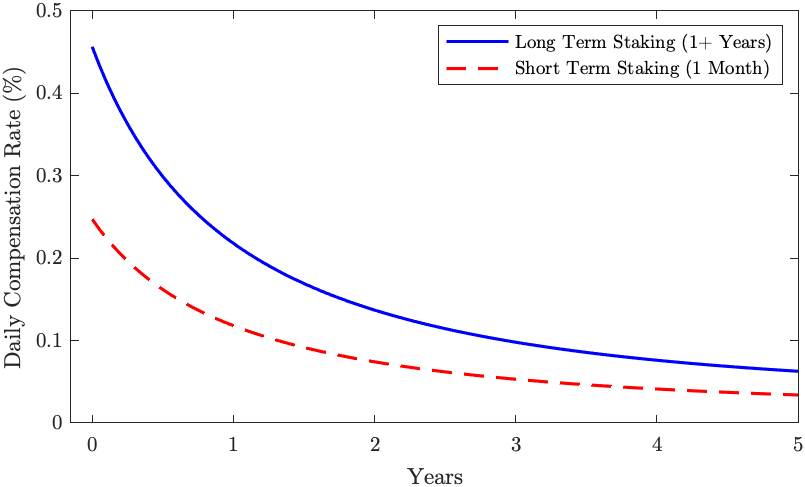
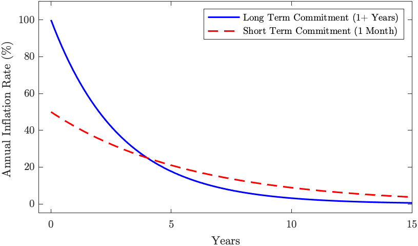

# Token Economics and Incentives

Providers earn income by selling computing cycles to tenants who lease computing services for a fee. However, in the early days of the network, there is a high chance the providers will not be able to earn a meaningful income due to a lack of sufficient demand from the tenants (consumers of computing), which in turn hurts demand because of lack of supply.

To solve this problem, we will incentivize the providers using inflation by means of block rewards until a healthy threshold can be achieved.

In this section, we describe the economics of mining and Akash Network's inflation model. An ideal inflation model should have the following properties:

- Early providers can provide services at exponentially lower costs than in the market outside the network, to accelerate adoption.
- The income a provider can earn is proportional to the number of tokens they stake.
- The block compensation for a staker is proportional to their staked amount, the time to unlock and overall locked tokens.
- Stakers are incentivized to stake for longer periods.
- Short term stakers (such as some bear market participants) are also incentivized, but they gain a smaller reward.
- To maximize compensation, stakers are incentivized to re-stake their income.

## Motivation

Akash Network intends to gain early adoption by offering exponential cost savings as a value proposition for tenants, and the efficiency of a serverless infrastructure as an additional value proposition for tenants and providers. These value propositions are extremely compelling, especially for data and compute intensive applications such as machine learning.

## Stake and Bind: Mining Protocol

A provider commits to provide services for at least time $T$ and intends to earn service income $r$ every compensation period $T_{comp}= 1~day$. Providers stake Akash tokens $s$ and specify an unlock time $t_1$, where minimal lock-time $t_1 - t$ should not be less than $T_{min} = 30~days$. Additionally, they delegate (voting power) to validator $v$ by bonding their stake via `BindValidator` transaction.

A staker is a delegator and/or a validator to whom delegators delegate. Every provider is a staker, but not every staker is a provider; there can be stakers who are pure delegators providing no other services, and there can be stakers who are pure validators providing no other services.

At any point, a staker can:
a) Split their stake (or any piece of their stake) into two pieces.
b) Increase their stake $l$ by adding more AKT.
c) Increase the lock time $T$, where $T > T_{min}$.

Stakers choose to split their stake because the compensation is dependent on lock time $L$ which will be addressed in later sections.

## General Inflation Properties

### Initial Inflation

If we assume Akash will have the same number of tokens locked as NuCypher [@nucypher] and DASH [@dash]: $\lambda = 60\%$, then $1 - 40\%$ of the supply of AKT will be in circulation. The adjusted inflation rate for inflation, $I$ will be:

$$
    I^* = \frac{I}{1-\lambda},
$$

Considering that ZCash [@zcash] had $I^* = 350\%$ (turn around point during the overall bull market), which makes $I=140\%~\text{APR}$, it is reasonably safe to                                                                                       set the initial inflation to be $I_0 = 100\%~\text{APR}$ (meaning $1/365$ per day).

### Inflation Decay

Assume that all miners have the maximum compensation rate. We define the inflation decay factor (time to halve the inflation rate) to be $T_{1/2} = 2~years$ in this case. Inflation depending on the time passed from the Genesis $t$, then looks like:

$$
I(t) = I_0 \cdot 2^{-\frac{t}{T_{1/2}}} = I_0 \exp\left[ -\ln{2} \frac{t}{T_{1/2}} \right],
$$

In this case, the dependence of the token supply on the time $t$ is:

$$
M(t) = M_0 + \int_0^{t} I(t)\, dt = M_0 + \frac{I_0 T_{1/2}}{\ln{2}}\left[1 - 2^{-\frac{t}{T_{1/2}}} \right]
$$ {#eq:supply-time}

If we let $I_0$ be the relative inflation rate, then $I_0 = i_0M_0$. For 100% APR, $i_0=1$ and $I_0=M_0$, which gives us the maximum number of tokens which will ever be created (as illustrated in [@fig:token-supply]):

$$
M_{\max} = M(\infty) = M_0\left(1 + \frac{i_0 T_{1/2}}{\ln{2}}\right) \approx 3.89\, M_0,
$$

where $M_0$ is initial number of tokens.

{#fig:token-supply}

### Staking Time and Token Creation

We will reward the full compensation ($\gamma=1$) to the stakers who are committed to stake at least $T_1=1~year$ (365 days). Those who stake for $T_{\min}=1~month$ will get close to half the compensation ($\gamma\approx0.54$). In general,

$$
\gamma = \left(0.5 + 0.5\frac{\min(T_i, T_1)}{T_1}\right),
$$

$$
T_{i,\text{initial}} >  T_{\min},
$$

where the unlocking time $T_i$ means the time left to unlock the tokens: $T_i = t_1 - t$. $t_1$ is the time when the tokens will be unlocked, and $t$ is the current time. The initial $T_i$ cannot be set smaller than $T_{min} = 1~month$, but it eventually becomes smaller than that as time passes and $t$ gets closer to $t_1$.

Shorter stake periods (for lower rewards) result in a lower daily token emission. Considering that miners will most likely stake for short periods during a bear market, we can expect token emission to decline during a bear market, which will help to boost the price. Therefore we can expect this mechanism to support price stability.

The emission half decay time $T_{1/2}^*=T_{1/2}/\gamma^*$, where $\gamma^*$ is the mean staking parameter, is also prolonged when $\gamma < 1$. $T_{1/2}$ prolongs to 4 years instead of 2 if all stakers have $\gamma^* = \gamma = 0.5$.

The total supply over time ([@eq:supply-time]) at $\gamma^* \ne 1$ will then look like:

$$
M(t) = M_0 \left[1 + \frac{i_0 \gamma^* T_{1/2}^*}{\ln{2}}\left(1 - 2^{-\frac{t}{T_{1/2}^*}} \right) \right].
$$ {#eq:adjusted-supply-time}

## Delegate Pool Distribution

The exponential is a solution of a differential equation where inflation is proportional to the amount of not yet mined tokens:

$$
I(t) = \frac{\ln{2}}{T_{1/2}} \left( M_{\max} - M(t) \right)
$$

$$
dM = I(t)\, dt.
$$

where $M(t)$ is the current token supply with $M(0) = M_0$ and $dt$ can be equal to the mining period (1 day). Each validator can trivially calculate its $dM$ using few operations using the token supply $M$ from the last period. The amount of mined tokens for the validator pool $p$ in the time $t$ can be calculated according to the formula:

$$
   \delta m_{v,t} = \frac{s_v}{S} \frac{\ln{2}}{T_{1/2}} \delta M(t),
$$

$$
   \delta M_t = \sum_v \delta m_{v,t},
$$

where $s_v$ is the number of tokens bound to the validator's delegate pool $v$ and $S$ is the total number of tokens locked. Instead of calculating all the sum over $v$, each validator can add their portion $\delta m_{v,t}$.

The distribution factor for a delegate bound to pool $v$ is:

$$
\kappa = \frac{1}{2} \left(\frac{\gamma}{\gamma_v} + \frac{s}{S_v}\right),
$$

$\gamma_v$ is the aggregate stake compensation factor for the pool and $S_v$ is the sum of all tokens bound to the pool.

## Mining strategies and expected compensation

In this section, we look at three possibilities:
a staker liquidating all the compensation while extending the lock time (Liquidate mining compensation), a staker adding all the compensation to their current stake, and a miner waiting for their stake to unlock after time $T$. Each of these possibilities could have different distributions of $\gamma$. Let's consider $\gamma=1$ and $\gamma=0.5$ as the two extreme values of $\gamma$. Let's take the amount of tokens locked to be $\lambda=60\%$, as in DASH.

### Liquidate Mining Compensation

In this scenario, all stakers in the pool are liquidating all their earnings every $T_{comp}$ period. The total amount of tokens staked in the network can be expressed as $S=\lambda M$.
Assume all the delegators have equal amounts of stake bound to the pool. The amount of stake stays constant in this case, and equal to $m_i = s$, making $m_v = s_v$ and $\gamma = \overline{\gamma_v}$ where, ${\overline{\gamma_v}}$ is the mean staking parameter of the pool. Then, the pool mining rate (i.e. the cumulative pool reward) is:

$$
\frac{dr_v}{dt} =  \overline{\gamma_v}\, \frac{S_v}{\lambda M(t)} \frac{\ln{2}}{T_{1/2}} \left( M_{\max} - M(t)\right).
$$

When we substitute $M(t)$ from [@eq:adjusted-supply-time] and integrate over time, we find total pool compensation:

$$
r_v(t) = S_v \frac{\overline{\gamma}}{\gamma^* \lambda} \ln\frac{M(t)}{M_0},
$$

If $\Delta r_v(t) = r_v(t) - \mathcal{C}$ where $\mathcal{C}$ is validator's commission, that brings individual staker's compensation to be:

$$
r(t) = \kappa \cdot \Delta r_v(t) = \frac{1}{2} \left(\frac{\gamma}{\gamma_v} + \frac{s}{S_v}\right) \cdot \Delta r_v(t)
$$

If $\gamma=1$ (staking for $1~year$) and $\lambda=60\%$ ($60\%$ of all AKT are staked). With $\mathcal{C}=0.1 \cdot r(t)$, staker compensation in AKT starts from $0.45\%~per~day$, or $101.6\%$ during the first year of staking.

We should note that if other miners stake for less than a year ($\gamma^* < 1$), the inflation rate decays slower, and the compensation over a given period will be higher.

### Re-stake mining compensation {#sec:restake-mining}

Instead of liquidating mining compensation, it could be re-staked into the pool in order to increase the delegator's stake. In this case, the actual stake $s$ is constantly increasing with time:

$$
 \frac{ds}{dt} =  \gamma\, \frac{s}{\lambda M(t)} \frac{\ln{2}}{T_{1/2}} \left( M_{\max} - M(t)\right).
$$

If we substitute $S(t)$ from [@eq:adjusted-supply-time] and solve this differential equation against $s$, we get:

$$
s(t) = s(0)\,\left[ \frac{M(t)}{M_0} \right]^{\frac{\gamma}{\gamma^* \lambda}}.
$$

Assuming the validator commission is 1\%, if $\gamma=1$ (staking for $1~year+$) and $\lambda=60\%$ ($60\%$ of all nodes in the network are staking), delegate compensation in AKT starts from $0.45\%~per~day$, or $s(1) - s(0) = 176.5\%$ during the first year of staking.

### Take mining compensation and spindown

When the node spins down, the staker doesn't extend the time for end of staking $t_1$, and the compensation is constantly decreasing as the time left to unlock becomes smaller and smaller, effectively decreasing $\gamma$ gradually towards $0.5$. That's the default behavior. To avoid that, the staker should set $t_1$ large enough, or increase $t_1$ periodically.

### FAQ

##### How many tokens will ever be in existence?
We'll start with $100~\text{million}$ tokens, and the maximum amount of tokens ever created will be $389~\text{million}$, as illustrated in [@fig:token-supply]

##### What's the inflation rate?
The inflation rate will depend on how many short-term miners and long-term miners are working in the system. Depending on this, the initial inflation will be between $50\%~\text{APR}$ (if all miners are very short term) and $100\%~\text{APR}$ (if all miners commit for a long term). The inflation will decay exponentially every day, halving sometime between $2~\text{years}$ (if all the miners are long term) and $4~\text{years}$ (if all the miners are short term). [@fig:annual-inflation]

{#fig:annual-inflation}
